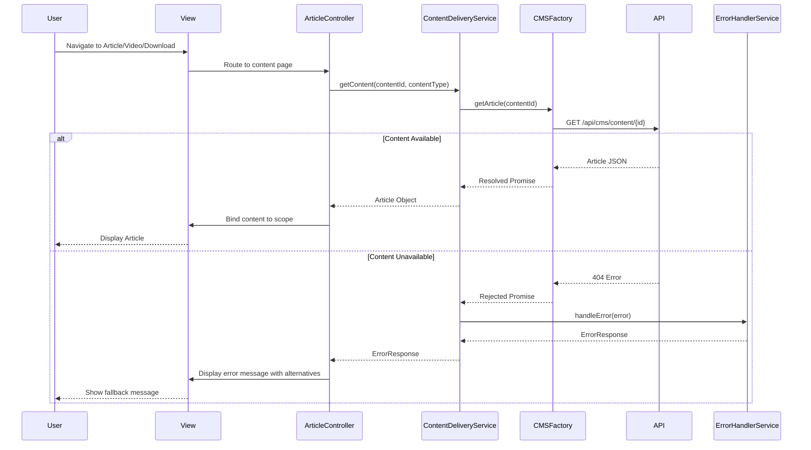

# Low-Level Design: Help Center Content Delivery

**Epic ID:** QE-5199

## a. Architecture Mapping

- **Content Delivery Service** → AngularJS Service (`ContentDeliveryService`) orchestrating content retrieval from multiple sources
- **Text Articles/FAQs** → AngularJS Controller (`ArticleController`) with Factory (`CMSFactory`) for CMS API integration
- **Video Tutorials** → AngularJS Directive (`videoPlayer`) with Service (`VideoService`) for video platform integration
- **Downloadable Materials** → AngularJS Service (`DownloadService`) with Factory (`FileStorageFactory`) for secure file retrieval
- **Error Handling** → AngularJS Service (`ErrorHandlerService`) with Directive (`errorFallback`) for user-facing error messages

**Recommended Folder Structure:**
```
app/
├── modules/
│   └── help-center/
│       ├── controllers/
│       │   └── article.controller.js
│       ├── services/
│       │   ├── content-delivery.service.js
│       │   ├── video.service.js
│       │   ├── download.service.js
│       │   └── error-handler.service.js
│       ├── factories/
│       │   ├── cms.factory.js
│       │   └── file-storage.factory.js
│       ├── directives/
│       │   ├── video-player.directive.js
│       │   └── error-fallback.directive.js
│       └── views/
│           ├── article-view.html
│           ├── video-view.html
│           └── download-view.html
```

## b. Component Specifications

| Component Name | Artifact Type | Responsibility | Key Dependencies |
|----------------|---------------|----------------|------------------|
| ContentDeliveryService | Service | Orchestrates content retrieval from CMS, video platform, and file storage | CMSFactory, VideoService, DownloadService, ErrorHandlerService |
| ArticleController | Controller | Manages article/FAQ display and rendering | ContentDeliveryService, $sce |
| VideoService | Service | Retrieves video metadata and streaming URLs | $http, $q |
| DownloadService | Service | Generates secure download links for PDFs/guides | FileStorageFactory, $q |
| ErrorHandlerService | Service | Provides fallback messages and alternative actions for unavailable content | $log |
| CMSFactory | Factory | REST API wrapper for CMS content retrieval | $http, $q |
| FileStorageFactory | Factory | REST API wrapper for secure file storage access | $http, $q |
| videoPlayer | Directive | Embeds video player with playback controls | VideoService |
| errorFallback | Directive | Displays user-friendly error messages with retry/alternative options | ErrorHandlerService |

## c. Data Model

**Article (JS Object):**
```javascript
{
  id: String,
  title: String,
  content: String, // HTML content
  contentType: String, // 'article' or 'faq'
  lastUpdated: Date,
  relatedLinks: Array<String>
}
```

**Video (JS Object):**
```javascript
{
  id: String,
  title: String,
  description: String,
  videoUrl: String, // HTTPS streaming URL
  thumbnailUrl: String,
  duration: Number, // seconds
  platform: String // 'vimeo', 'youtube', 'internal'
}
```

**DownloadMaterial (JS Object):**
```javascript
{
  id: String,
  title: String,
  description: String,
  fileType: String, // 'pdf', 'docx', 'zip'
  fileSize: Number, // bytes
  downloadUrl: String // Signed HTTPS URL
}
```

**ErrorResponse (JS Object):**
```javascript
{
  errorCode: String,
  message: String,
  fallbackAction: String, // 'retry', 'contact_support', 'browse_alternatives'
  alternativeContentIds: Array<String>
}
```

## d. Data Flow

User navigates to help article, video, or download page → Route resolves to `ArticleController` → Controller calls `ContentDeliveryService.getContent(contentId, contentType)` → Service determines content type and delegates to appropriate factory: `CMSFactory.getArticle()` for articles/FAQs (invokes `GET /api/cms/content/{id}`), `VideoService.getVideo()` for videos (invokes `GET /api/video/metadata/{id}`), or `DownloadService.getDownloadLink()` for materials (invokes `GET /api/files/download/{id}`) → If resource unavailable, API returns 404 and `ErrorHandlerService` generates fallback message with alternative actions → Content or error response returned to controller → Controller binds content to view using `$sce.trustAsHtml()` for articles, embeds video via `videoPlayer` directive, or provides download button → User views/plays/downloads content.

## e. Primary Sequence Diagram



## f. Implementation Notes

- Use `$sce.trustAsHtml()` to render CMS HTML content safely in article views; sanitize user-generated content if applicable
- Implement video embedding via `videoPlayer` directive using `<iframe>` for YouTube/Vimeo or `<video>` tag for internal CDN; ensure HTTPS URLs only
- Generate signed download URLs server-side with expiration; use `FileStorageFactory` to fetch pre-signed URLs via REST API
- Apply lazy loading for video thumbnails and defer video player initialization until user interaction to optimize page load time
- Use `$http` response interceptor to detect 404/500 errors and route to `ErrorHandlerService` for consistent error handling across all content types

## g. Error Handling

Use `$http` interceptor to catch API errors (404, 500, timeout); `ErrorHandlerService` generates user-friendly fallback messages with retry button or alternative content suggestions; errors logged to console.

## h. Security Notes

All content delivered over HTTPS; download URLs are pre-signed with expiration; standard input validation and secure API calls assumed.