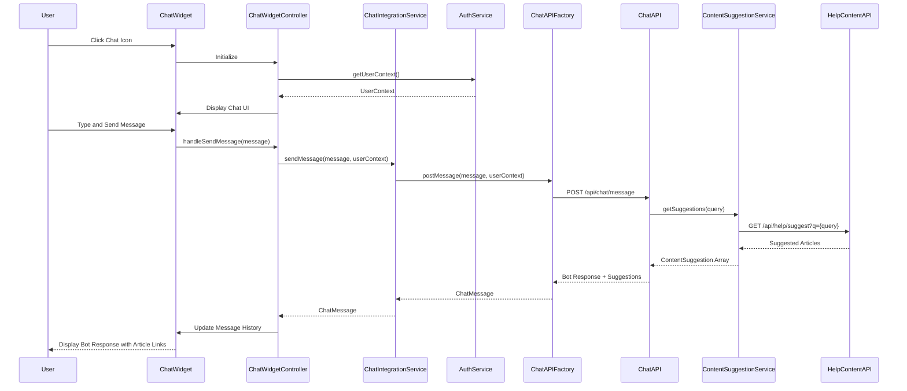

# Low-Level Design: Interactive Chat Assistant

**Epic ID:** QE-5200

## a. Architecture Mapping

- **Chat Widget UI** → AngularJS Directive (`chatWidget`) with Controller (`ChatWidgetController`) and Template (`chat-widget.html`)
- **Chat Integration Layer** → AngularJS Service (`ChatIntegrationService`) orchestrating API calls and message routing
- **Third-Party Chat API** → AngularJS Factory (`ChatAPIFactory`) for REST/WebSocket integration with external chat provider
- **Authentication Integration** → AngularJS Service (`AuthService`) providing user context securely
- **Help Content Linking** → AngularJS Service (`ContentSuggestionService`) querying help content index for relevant articles

**Recommended Folder Structure:**
```
app/
├── modules/
│   └── help-center/
│       ├── controllers/
│       │   └── chat-widget.controller.js
│       ├── services/
│       │   ├── chat-integration.service.js
│       │   ├── auth.service.js
│       │   └── content-suggestion.service.js
│       ├── factories/
│       │   └── chat-api.factory.js
│       ├── directives/
│       │   └── chat-widget.directive.js
│       └── views/
│           └── chat-widget.html
└── assets/
    └── css/
        └── chat-widget.css
```

## b. Component Specifications

| Component Name | Artifact Type | Responsibility | Key Dependencies |
|----------------|---------------|----------------|------------------|
| chatWidget | Directive | Renders chat UI with open/close toggle and message display | ChatWidgetController |
| ChatWidgetController | Controller | Manages chat state, user input, and message history | ChatIntegrationService, $scope |
| ChatIntegrationService | Service | Orchestrates message flow between UI, chat API, and content suggestions | ChatAPIFactory, AuthService, ContentSuggestionService |
| ChatAPIFactory | Factory | REST/WebSocket wrapper for third-party chat API communication | $http, $websocket (or equivalent), $q |
| AuthService | Service | Provides authenticated user context (user ID, session token) | $http, $window |
| ContentSuggestionService | Service | Queries help content index to suggest relevant articles based on chat context | $http, $q |

## c. Data Model

**ChatMessage (JS Object):**
```javascript
{
  id: String,
  sender: String, // 'user' or 'bot'
  content: String,
  timestamp: Date,
  suggestedArticles: Array<Object> // [{id, title, url}]
}
```

**ChatSession (JS Object):**
```javascript
{
  sessionId: String,
  userId: String,
  messages: Array<ChatMessage>,
  isActive: Boolean,
  startTime: Date
}
```

**UserContext (JS Object):**
```javascript
{
  userId: String,
  sessionToken: String,
  displayName: String
}
```

**ContentSuggestion (JS Object):**
```javascript
{
  articleId: String,
  title: String,
  url: String,
  relevanceScore: Number
}
```

## d. Data Flow

User clicks chat widget icon on Help Center landing page → `chatWidget` directive initializes and `ChatWidgetController` calls `AuthService.getUserContext()` to retrieve user ID and session token → User types message and clicks send → Controller invokes `ChatIntegrationService.sendMessage(message, userContext)` → Service calls `ChatAPIFactory.postMessage()` which sends `POST /api/chat/message` with message content and user context to third-party chat API → API processes query and optionally triggers `ContentSuggestionService.getSuggestions(query)` which invokes `GET /api/help/suggest?q={query}` → Chat API returns bot response with optional article suggestions → `ChatIntegrationService` receives response, formats as `ChatMessage`, and updates controller scope → `ChatWidgetController` appends message to chat history and binds to view → UI displays bot response with clickable article links within 2 seconds.

## e. Primary Sequence Diagram



## f. Implementation Notes

- Use AngularJS directive with isolated scope for `chatWidget` to ensure encapsulation and reusability across multiple pages
- Implement `ChatAPIFactory` using `$http` for REST API calls or `$websocket` (via angular-websocket library) for real-time WebSocket communication if supported by third-party chat provider
- Pass user context securely via `AuthService` using existing JWT token in Authorization header; avoid exposing PII in client-side JavaScript variables
- Use `ng-repeat` to render message history in chat UI; apply `ng-class` to differentiate user vs. bot messages with distinct styling
- Lazy-load chat widget on Help Center page using `ng-if` to defer initialization until user clicks icon, reducing initial page load time

## g. Error Handling

Use `$http` interceptor to catch chat API errors (timeout, 500); display inline error message in chat UI ("Unable to connect, please try again"); log errors to console and analytics.

## h. Security Notes

Requires token-based auth via existing SSO; all chat API calls include Authorization header with JWT token; no PII exposed in client-side code; HTTPS for all communication.