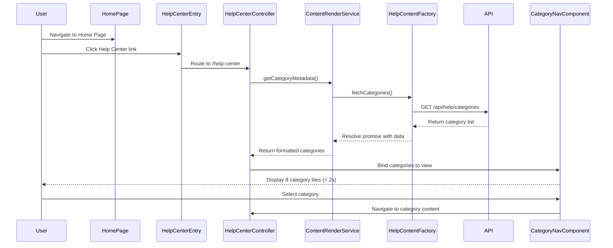

# Low-Level Design: Help Center Integration - Home Page

**Epic ID:** QE-5210

## a. Architecture Mapping

- **Home Page Entry Point**: Directive (`helpCenterEntryDirective`) embedded in existing home page template
- **Help Center Landing Page**: Module (`helpCenterModule`) with main controller (`HelpCenterLandingController`)
- **Category Navigation**: Component (`categoryNavComponent`) with controller (`CategoryNavController`)
- **Content Rendering Engine**: Service (`ContentRenderService`) for fetching and rendering categorized content
- **Responsive Layout**: Leverages Bootstrap grid system and custom CSS media queries
- **Content Database Integration**: Factory (`HelpContentFactory`) for REST API calls to content database

**Recommended Folder Structure:**
```
/app
  /modules
    /help-center
      /controllers
      /services
      /directives
      /components
      /views
  /assets
    /css
    /images
```

## b. Component Specifications

| Name | Artifact Type | Responsibility | Key Dependencies |
|------|---------------|----------------|------------------|
| helpCenterModule | Module | Root module for Help Center functionality | ngRoute, ngSanitize |
| HelpCenterLandingController | Controller | Manages landing page state and category data | ContentRenderService, $scope |
| CategoryNavController | Controller | Handles category selection and navigation | $location, ContentRenderService |
| categoryNavComponent | Component | Renders category tiles with icons and descriptions | CategoryNavController |
| helpCenterEntryDirective | Directive | Injects Help Center link/button into Home Page | $location |
| ContentRenderService | Service | Fetches categorized content metadata from API | HelpContentFactory, $q |
| HelpContentFactory | Factory | Executes REST API calls to help content database | $http |
| ResponsiveLayoutService | Service | Detects device type and applies adaptive layout logic | $window |

## c. Data Model

```javascript
// Category Model
const Category = {
  id: String,
  name: String,
  description: String,
  iconUrl: String,
  contentCount: Number
};

// HelpContent Model
const HelpContent = {
  id: String,
  categoryId: String,
  title: String,
  summary: String,
  contentType: String, // 'article' | 'faq'
  url: String,
  lastUpdated: Date
};
```

## d. Data Flow

User navigates to Home Page → clicks Help Center entry point (directive triggers route change) → HelpCenterLandingController initializes and calls ContentRenderService → ContentRenderService uses HelpContentFactory to fetch category metadata via REST API → API returns categorized content list → ResponsiveLayoutService adapts layout based on device breakpoint → categoryNavComponent renders 8 category tiles with accessible markup → user selects category → CategoryNavController updates route and fetches category-specific articles/FAQs → content displayed within 2-second performance target.

## e. Primary Sequence Diagram



## f. Implementation Notes

- Use AngularJS 1.x component-based architecture with ES6 classes for controllers and services
- Dependency Injection via `$inject` annotation for minification safety
- REST API integration using `$http` service with promise-based error handling and caching via `$cacheFactory` for category metadata
- Bootstrap 3.x grid system for responsive layout with custom CSS3 media queries for fine-tuned breakpoints
- Lazy-load category content on user interaction to optimize initial page load time

## g. Error Handling

HTTP interceptor (`httpErrorInterceptor`) catches API failures and displays user-friendly error messages via toast notifications; try/catch blocks in controllers handle client-side exceptions.

## h. Security Notes

All API calls use HTTPS; input sanitization via `ngSanitize` module; WCAG 2.1 AA compliance enforced through ARIA labels, keyboard navigation support, and screen reader compatibility.