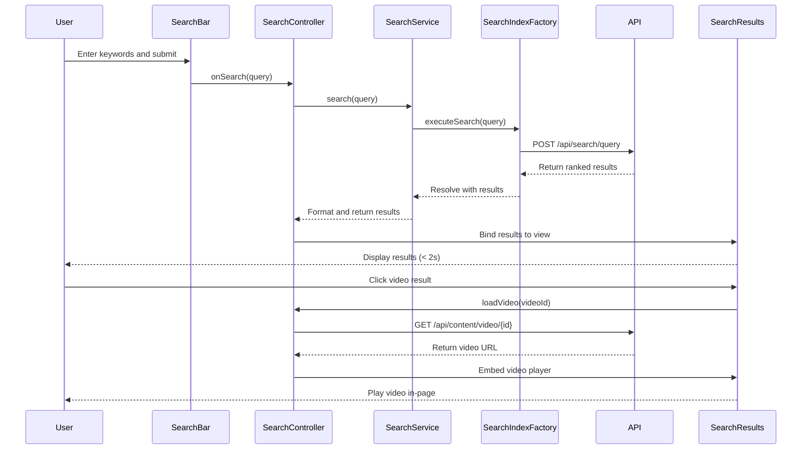

# Low-Level Design: Help Center Content Discovery

**Epic ID:** QE-5211

## a. Architecture Mapping

- **Search Interface**: Component (`searchBarComponent`) with controller (`SearchController`)
- **Search Service**: Service (`SearchService`) for query processing and result retrieval
- **Content Index Integration**: Factory (`SearchIndexFactory`) for REST API calls to search indexing service
- **Video Player**: Directive (`videoPlayerDirective`) for embedded HTML5 video playback
- **File Download Handler**: Service (`FileDownloadService`) for secure file retrieval and delivery
- **Content Database Integration**: Factory (`ContentFactory`) for fetching articles, videos, and documents

**Recommended Folder Structure:**
```
/app
  /modules
    /help-center
      /search
        /controllers
        /services
        /components
        /directives
      /video
      /downloads
  /assets
    /videos
    /documents
```

## b. Component Specifications

| Name | Artifact Type | Responsibility | Key Dependencies |
|------|---------------|----------------|------------------|
| searchBarComponent | Component | Renders search input and triggers search queries | SearchController |
| SearchController | Controller | Manages search state, query submission, and result display | SearchService, $scope |
| SearchService | Service | Processes search queries and formats results | SearchIndexFactory, $q |
| SearchIndexFactory | Factory | Executes REST API calls to search indexing service | $http |
| videoPlayerDirective | Directive | Embeds HTML5 video player with playback controls | FileDownloadService |
| FileDownloadService | Service | Handles secure file downloads over HTTPS | ContentFactory, $window |
| ContentFactory | Factory | Fetches content metadata and file URLs from content database | $http |
| SearchResultsComponent | Component | Renders search results with filtering options | SearchController |

## c. Data Model

```javascript
// SearchQuery Model
const SearchQuery = {
  keywords: String,
  contentType: String, // 'all' | 'article' | 'video' | 'document'
  filters: Object
};

// SearchResult Model
const SearchResult = {
  id: String,
  title: String,
  contentType: String,
  summary: String,
  url: String,
  thumbnailUrl: String,
  relevanceScore: Number
};

// VideoContent Model
const VideoContent = {
  id: String,
  title: String,
  videoUrl: String,
  format: String, // 'mp4' | 'webm'
  duration: Number,
  thumbnailUrl: String
};

// DownloadableFile Model
const DownloadableFile = {
  id: String,
  fileName: String,
  fileType: String, // 'pdf' | 'docx'
  fileSize: Number,
  downloadUrl: String
};
```

## d. Data Flow

User enters search keywords in searchBarComponent → SearchController captures input and calls SearchService.search() → SearchService sends query to SearchIndexFactory → SearchIndexFactory executes REST API call to search indexing service → search service queries content index and retrieves matching results from content database → results returned with relevance ranking within 2 seconds → SearchResultsComponent displays filtered results. For video playback: user clicks video result → videoPlayerDirective loads video URL from ContentFactory → HTML5 video player streams content in-page. For downloads: user clicks download link → FileDownloadService validates file availability via ContentFactory → file served over HTTPS to user's browser.

## e. Primary Sequence Diagram



## f. Implementation Notes

- Use AngularJS component-based architecture with ES6 arrow functions for concise callback handling
- Dependency Injection via `$inject` for all services and controllers
- REST API integration with `$http` service; implement debouncing on search input using `$timeout` to reduce API calls
- HTML5 `<video>` element for video playback with fallback to WebM format; use `ng-src` for dynamic video URL binding
- File downloads triggered via `$window.open()` with HTTPS URLs; validate file availability before initiating download

## g. Error Handling

HTTP interceptor catches search API failures and displays "No results found" or error messages; video playback errors handled via `<video>` element error events with user notification.

## h. Security Notes

All search queries sanitized via `ngSanitize`; video and file URLs served over HTTPS; no sensitive user data exposed in search queries or results.