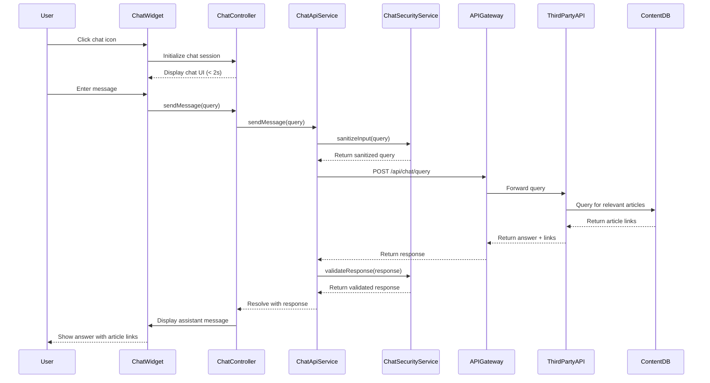

# Low-Level Design: Help Center Chat Assistant

**Epic ID:** QE-5212

## a. Architecture Mapping

- **Chat Widget UI**: Component (`chatWidgetComponent`) with controller (`ChatWidgetController`)
- **API Gateway Integration**: Service (`ChatApiService`) for routing requests to third-party chat API
- **Third-Party Chat API**: External service integration via REST API calls
- **Security Layer**: Service (`ChatSecurityService`) for request validation and data sanitization
- **Help Content Linking**: Factory (`HelpContentLinkFactory`) for fetching article links from content database
- **Chat Session Management**: Service (`ChatSessionService`) for managing ephemeral session state

**Recommended Folder Structure:**
```
/app
  /modules
    /help-center
      /chat
        /controllers
        /services
        /components
        /directives
  /assets
    /css
    /images
```

## b. Component Specifications

| Name | Artifact Type | Responsibility | Key Dependencies |
|------|---------------|----------------|------------------|
| chatWidgetComponent | Component | Renders chat UI with message display and input field | ChatWidgetController |
| ChatWidgetController | Controller | Manages chat state, user input, and message flow | ChatApiService, ChatSessionService, $scope |
| ChatApiService | Service | Routes chat queries to third-party API via API Gateway | ChatSecurityService, $http, $q |
| ChatSecurityService | Service | Validates and sanitizes user input and API responses | $sanitize |
| ChatSessionService | Service | Manages ephemeral chat session data (messages, state) | $window.sessionStorage |
| HelpContentLinkFactory | Factory | Fetches article links from Help Center content database | $http |
| chatToggleDirective | Directive | Provides chat widget open/close functionality | ChatWidgetController |

## c. Data Model

```javascript
// ChatMessage Model
const ChatMessage = {
  id: String,
  sender: String, // 'user' | 'assistant'
  text: String,
  timestamp: Date,
  articleLinks: Array // Array of {title: String, url: String}
};

// ChatSession Model
const ChatSession = {
  sessionId: String,
  messages: Array, // Array of ChatMessage
  isActive: Boolean,
  startTime: Date
};

// ChatApiRequest Model
const ChatApiRequest = {
  query: String,
  sessionId: String,
  context: Object
};

// ChatApiResponse Model
const ChatApiResponse = {
  answer: String,
  articleLinks: Array,
  confidence: Number
};
```

## d. Data Flow

User clicks chat icon on Help Center landing page → chatToggleDirective opens chatWidgetComponent (loads within 2 seconds) → user enters message → ChatWidgetController captures input and calls ChatApiService.sendMessage() → ChatSecurityService validates and sanitizes query → ChatApiService sends request to API Gateway → API Gateway routes to third-party chat API → third-party API processes query using NLP and queries Help Center content database via HelpContentLinkFactory → API returns answer with article links → response flows back through ChatSecurityService → ChatWidgetController updates chat UI with assistant response and article links → ChatSessionService stores message in sessionStorage for current session → bidirectional messaging continues until user closes widget.

## e. Primary Sequence Diagram



## f. Implementation Notes

- Use AngularJS component-based architecture with ES6 classes for controllers and services
- Dependency Injection via `$inject` annotation for all artifacts
- REST API integration using `$http` with promise chaining for sequential API calls; implement retry logic for transient failures
- Chat session data stored in `sessionStorage` (ephemeral, cleared on tab close) using ChatSessionService
- HTTPS enforced for all API calls; WCAG 2.1 AA compliance via ARIA live regions for screen reader announcements of new messages

## g. Error Handling

HTTP interceptor catches API Gateway failures and displays "Chat unavailable" message; try/catch in ChatWidgetController handles client-side exceptions with user-friendly notifications.

## h. Security Notes

Requires token-based auth via existing SSO; all user input sanitized via `ngSanitize`; no sensitive user data sent to third-party API; HTTPS-only communication.