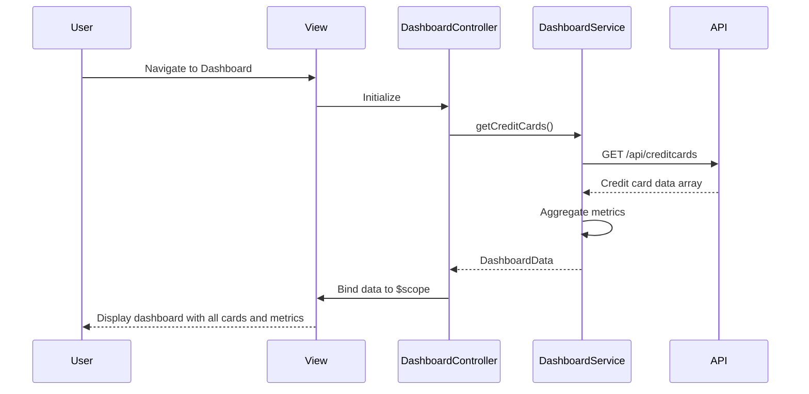

# Low-Level Design: QE-5219 - Credit Card Dashboard and Overview

## a. Architecture Mapping

**Component to Artifact Mapping:**
- User Interface Layer → DashboardController + dashboard.html view
- Dashboard Service → DashboardService (Factory for API calls and data aggregation)
- Credit Card Data API → RESTful endpoints consumed via $http in DashboardService
- Data Aggregation Engine → DashboardService methods for consolidating multi-card metrics
- Credit Card Data Sources → External REST API integration

**Recommended Folder Structure:**
```
app/
  dashboard/
    dashboard.module.js
    dashboard.controller.js
    dashboard.service.js
    dashboard.routes.js
    views/dashboard.html
  shared/
    services/
    directives/
    interceptors/
```

## b. Component Specifications

| Name | Artifact Type | Responsibility | Key Dependencies |
|------|---------------|----------------|------------------|
| DashboardModule | Module | Groups dashboard feature components | ui-router |
| DashboardController | Controller | Manages dashboard view state and user interactions | DashboardService, $scope |
| DashboardService | Factory | Fetches credit card data, aggregates financial metrics | $http, $q |
| dashboard.html | View | Displays credit cards with monthly spend, credit limit, available credit, outstanding amounts | Bootstrap for responsive layout |
| DashboardRoutes | Config | Defines routing for dashboard view | ui-router |

## c. Data Model

```js
CreditCard = {
  id: String,
  cardNumber: String,
  cardHolderName: String,
  cardType: String,
  monthlySpend: Number,
  totalCreditLimit: Number,
  availableCredit: Number,
  outstandingAmount: Number,
  expiryDate: String,
  isActive: Boolean
}

DashboardData = {
  cards: Array<CreditCard>,
  totalMonthlySpend: Number,
  totalCreditLimit: Number,
  totalAvailableCredit: Number,
  totalOutstanding: Number
}
```

## d. Data Flow

User navigates to the dashboard view, triggering DashboardController initialization. The controller invokes DashboardService.getCreditCards() which makes an HTTP GET request to the Credit Card Data API. The API returns an array of credit card objects with financial metrics. DashboardService aggregates the data (calculating totals across all cards) and returns a DashboardData object to the controller. The controller binds this data to $scope, and the dashboard.html view renders the consolidated credit card information using Bootstrap responsive grid layout, displaying each card with its monthly spend, total credit limit, available credit, and outstanding amount.

## e. Primary Sequence Diagram



## f. Implementation Notes

- Use constructor injection with $inject array annotation for DashboardController and DashboardService (minification-safe)
- Implement DashboardService as a Factory singleton to cache dashboard data and reduce API calls
- Use $q promises for asynchronous API calls; handle success/error callbacks in controller
- Apply Bootstrap responsive grid (col-xs, col-sm, col-md, col-lg) for mobile/tablet/desktop layouts
- Implement loading spinner directive while fetching credit card data to improve UX

## g. Error Handling

HTTP interceptor captures API errors; DashboardController displays user-friendly error messages via Bootstrap alert component for failed data retrieval.

## h. Security Notes

Standard input validation and secure API calls assumed; credit card data transmitted over HTTPS with token-based authentication.