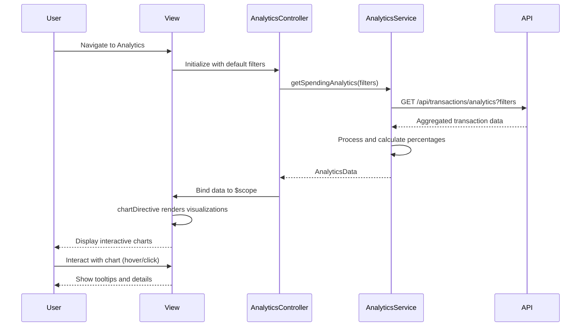

# Low-Level Design: QE-5220 - Spending Analytics and Insights

## a. Architecture Mapping

**Component to Artifact Mapping:**
- Analytics UI → AnalyticsController + analytics.html view
- Visualization Engine → Chart.js library integrated via custom chartDirective
- Analytics Service → AnalyticsService (Factory for fetching and aggregating transaction data)
- Transaction Data Feed → RESTful API consumed via $http in AnalyticsService
- Categorization Engine → Backend service providing pre-categorized transaction data

**Recommended Folder Structure:**
```
app/
  analytics/
    analytics.module.js
    analytics.controller.js
    analytics.service.js
    analytics.routes.js
    views/analytics.html
  shared/
    directives/chartDirective.js
    services/
```

## b. Component Specifications

| Name | Artifact Type | Responsibility | Key Dependencies |
|------|---------------|----------------|------------------|
| AnalyticsModule | Module | Groups analytics feature components | ui-router, Chart.js |
| AnalyticsController | Controller | Manages analytics view state, filters, and chart interactions | AnalyticsService, $scope |
| AnalyticsService | Factory | Fetches transaction data, aggregates by category/month/card | $http, $q |
| chartDirective | Directive | Renders interactive charts using Chart.js | Chart.js library |
| analytics.html | View | Displays category-wise, monthly, and card-wise spending visualizations | Bootstrap, chartDirective |
| AnalyticsRoutes | Config | Defines routing for analytics view | ui-router |

## c. Data Model

```js
Transaction = {
  id: String,
  cardId: String,
  amount: Number,
  category: String,
  date: String,
  merchantName: String,
  description: String
}

CategorySpend = {
  category: String,
  totalAmount: Number,
  transactionCount: Number,
  percentage: Number
}

MonthlySpend = {
  month: String,
  totalAmount: Number,
  categoryBreakdown: Array<CategorySpend>
}

CardSpend = {
  cardId: String,
  cardName: String,
  totalSpend: Number,
  categoryBreakdown: Array<CategorySpend>
}

AnalyticsData = {
  categorySpending: Array<CategorySpend>,
  monthlyTrends: Array<MonthlySpend>,
  cardWiseSpending: Array<CardSpend>,
  categories: Array<String>
}
```

## d. Data Flow

User navigates to the analytics view and selects filters (date range, card selection). AnalyticsController invokes AnalyticsService.getSpendingAnalytics(filters) which makes HTTP GET requests to the Transaction Data API with query parameters. The API returns pre-categorized transaction data aggregated by category, month, and card. AnalyticsService processes the response into AnalyticsData structure with percentage calculations and sorting. The controller binds this data to $scope and passes it to chartDirective instances. The directive uses Chart.js to render interactive pie charts for category-wise spending, line charts for monthly trends, and bar charts for card-wise comparison. User interactions (hover, click) trigger chart tooltips and detail views, updating the UI reactively.

## e. Primary Sequence Diagram



## f. Implementation Notes

- Use Chart.js for all visualizations (pie for categories, line for trends, bar for card comparison)
- Implement chartDirective with isolated scope accepting data and config objects; use Chart.js API in directive's link function
- AnalyticsService caches aggregated data for 5 minutes to optimize performance; use $cacheFactory or service-level variable
- Support 9 spending categories: Food & Dining, Fuel, Shopping, Travel, Entertainment, Utilities, Healthcare, Education, Miscellaneous
- Apply debouncing on filter changes to reduce API calls when user adjusts date range or card selection

## g. Error Handling

HTTP interceptor handles API failures; AnalyticsController displays error messages and shows empty state with retry option when data aggregation fails.

## h. Security Notes

Standard input validation and secure API calls assumed; transaction data access restricted to authenticated users with valid session tokens.