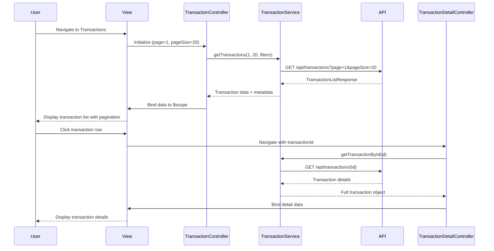

# Low-Level Design: QE-5221 - Transaction Management

## a. Architecture Mapping

**Component to Artifact Mapping:**
- Transaction UI → TransactionController + transactions.html view
- Transaction Management Service → TransactionService (Factory for fetching and managing transaction data)
- Transaction Repository → Backend REST API providing transaction CRUD operations
- Transaction Data Sources → External data sources synchronized via backend
- Data Synchronization Service → Backend service (not implemented in frontend)

**Recommended Folder Structure:**
```
app/
  transactions/
    transactions.module.js
    transactions.controller.js
    transaction-detail.controller.js
    transactions.service.js
    transactions.routes.js
    views/transactions.html
    views/transaction-detail.html
  shared/
    directives/paginationDirective.js
    services/
```

## b. Component Specifications

| Name | Artifact Type | Responsibility | Key Dependencies |
|------|---------------|----------------|------------------|
| TransactionsModule | Module | Groups transaction feature components | ui-router |
| TransactionController | Controller | Manages transaction list view, pagination, filtering | TransactionService, $scope |
| TransactionDetailController | Controller | Manages single transaction detail view | TransactionService, $stateParams |
| TransactionService | Factory | Fetches transaction data with pagination and filtering support | $http, $q |
| transactions.html | View | Displays paginated transaction list with filters | Bootstrap, paginationDirective |
| transaction-detail.html | View | Displays detailed information for a single transaction | Bootstrap |
| paginationDirective | Directive | Reusable pagination control for large transaction lists | None |
| TransactionRoutes | Config | Defines routing for transaction list and detail views | ui-router |

## c. Data Model

```js
Transaction = {
  id: String,
  cardId: String,
  cardName: String,
  amount: Number,
  category: String,
  date: String,
  merchantName: String,
  merchantLocation: String,
  description: String,
  status: String,
  transactionType: String
}

TransactionListResponse = {
  transactions: Array<Transaction>,
  totalCount: Number,
  pageSize: Number,
  currentPage: Number,
  totalPages: Number
}

TransactionFilters = {
  cardId: String,
  category: String,
  startDate: String,
  endDate: String,
  minAmount: Number,
  maxAmount: Number
}
```

## d. Data Flow

User navigates to the transactions view. TransactionController initializes with default pagination settings (page 1, 20 items per page) and invokes TransactionService.getTransactions(page, pageSize, filters). The service makes an HTTP GET request to /api/transactions with query parameters for pagination and filtering. The API returns a TransactionListResponse containing the transaction array and pagination metadata. The controller binds this data to $scope, and transactions.html renders the list using ng-repeat with Bootstrap table styling. The paginationDirective displays page controls at the bottom. When the user clicks a transaction row, ui-router navigates to the transaction detail view, passing the transaction ID via $stateParams. TransactionDetailController fetches the full transaction details via TransactionService.getTransactionById(id) and displays it in transaction-detail.html.

## e. Primary Sequence Diagram



## f. Implementation Notes

- Implement server-side pagination in TransactionService; send page, pageSize, and filter parameters as query strings
- Use $stateProvider to define routes: /transactions (list) and /transactions/:id (detail)
- Apply Bootstrap table-responsive class for mobile-friendly transaction list display
- Implement paginationDirective with isolated scope accepting totalPages, currentPage, and onPageChange callback
- Cache transaction detail data in TransactionService for 2 minutes to avoid redundant API calls when user navigates back

## g. Error Handling

HTTP interceptor captures API errors; TransactionController displays user-friendly error messages for failed requests and provides retry button.

## h. Security Notes

Standard input validation and secure API calls assumed; transaction data access requires valid authentication token and user authorization.