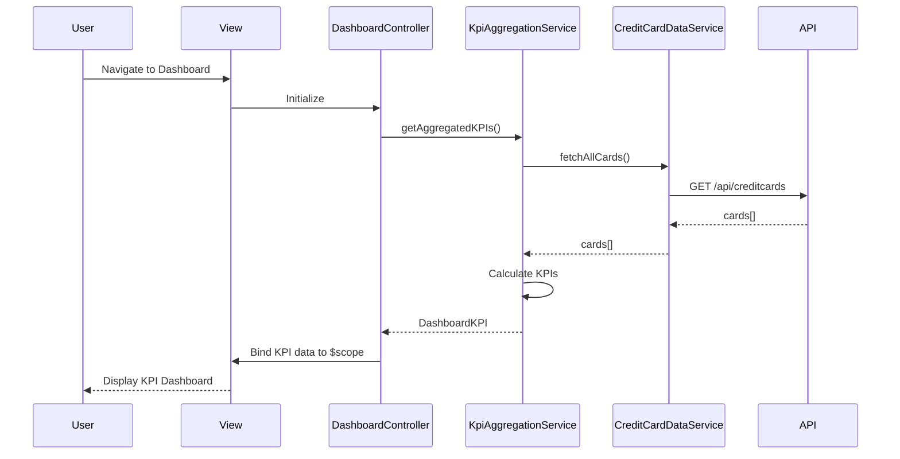

# Low-Level Design: QE-5222 - Credit Card Dashboard and KPI Monitoring

## a. Architecture Mapping

**Component to Artifact Mapping:**
- User Interface → DashboardView (`dashboard.html`) + DashboardController
- Dashboard Controller → `DashboardController` (handles UI logic and orchestration)
- KPI Aggregation Service → `KpiAggregationService` (calculates and aggregates KPIs)
- Credit Card Data Service → `CreditCardDataService` (fetches card details, balances, transactions)
- Data Store → Backend REST API endpoints

**Folder Structure:**
```
app/
  dashboard/
    dashboard.module.js
    dashboard.controller.js
    dashboard.service.js
    dashboard.routes.js
    views/dashboard.html
  shared/
    services/
      kpi-aggregation.service.js
      credit-card-data.service.js
    interceptors/
      http-interceptor.js
```

## b. Component Specifications

| Name | Artifact Type | Responsibility | Key Dependencies |
|------|---------------|----------------|------------------|
| DashboardController | Controller | Orchestrates dashboard view, binds KPI data to UI, handles user interactions | KpiAggregationService, CreditCardDataService, $scope |
| KpiAggregationService | Service | Aggregates KPIs (monthly spend, total credit limit, available credit, outstanding amounts) across multiple cards | CreditCardDataService, $http, $q |
| CreditCardDataService | Service | Fetches credit card details, balances, and transaction data from backend API | $http, $q |
| DashboardView | View (HTML) | Renders KPI cards, responsive layout using Bootstrap grid, displays real-time data | DashboardController |
| dashboard.module | Module | Encapsulates dashboard feature components and dependencies | ui-router, shared services |

## c. Data Model

```js
CreditCard = {
  id: String,
  cardNumber: String,
  cardHolderName: String,
  totalCreditLimit: Number,
  availableCredit: Number,
  outstandingAmount: Number,
  monthlySpend: Number,
  cardType: String,
  expiryDate: String
}

DashboardKPI = {
  totalCards: Number,
  aggregatedMonthlySpend: Number,
  aggregatedCreditLimit: Number,
  aggregatedAvailableCredit: Number,
  aggregatedOutstandingAmount: Number,
  utilizationPercentage: Number,
  cards: Array<CreditCard>
}
```

## d. Data Flow

User navigates to the dashboard view, triggering DashboardController initialization. The controller calls KpiAggregationService.getAggregatedKPIs(), which internally invokes CreditCardDataService.fetchAllCards() to retrieve card data via REST API ($http GET /api/creditcards). The service aggregates KPIs (sum monthly spend, total limits, calculate utilization) and returns a DashboardKPI object. DashboardController binds this data to $scope, and the view renders KPI cards with real-time metrics using Bootstrap responsive layout, completing within the 2-second load requirement.

## e. Primary Sequence Diagram



## f. Implementation Notes

- Use constructor injection with `$inject` array for DI (minification-safe): `DashboardController.$inject = ['$scope', 'KpiAggregationService']`
- All API calls centralized in CreditCardDataService using $http, returning $q promises for async handling
- Implement caching in CreditCardDataService (e.g., $cacheFactory) to meet 2-second load requirement on repeat visits
- Use Bootstrap grid (col-md-3, col-sm-6, col-xs-12) for responsive KPI card layout across devices
- Leverage ES6: arrow functions for promise chains, const/let for variable declarations, template literals for dynamic strings

## g. Error Handling

HTTP interceptor captures API errors, displays user-friendly notifications via toastr/alert service, and logs errors to console; controllers use try/catch with promise rejection handlers.

## h. Security Notes

Standard input validation and secure API calls assumed; token-based authentication via existing SSO integrated through HTTP interceptor.