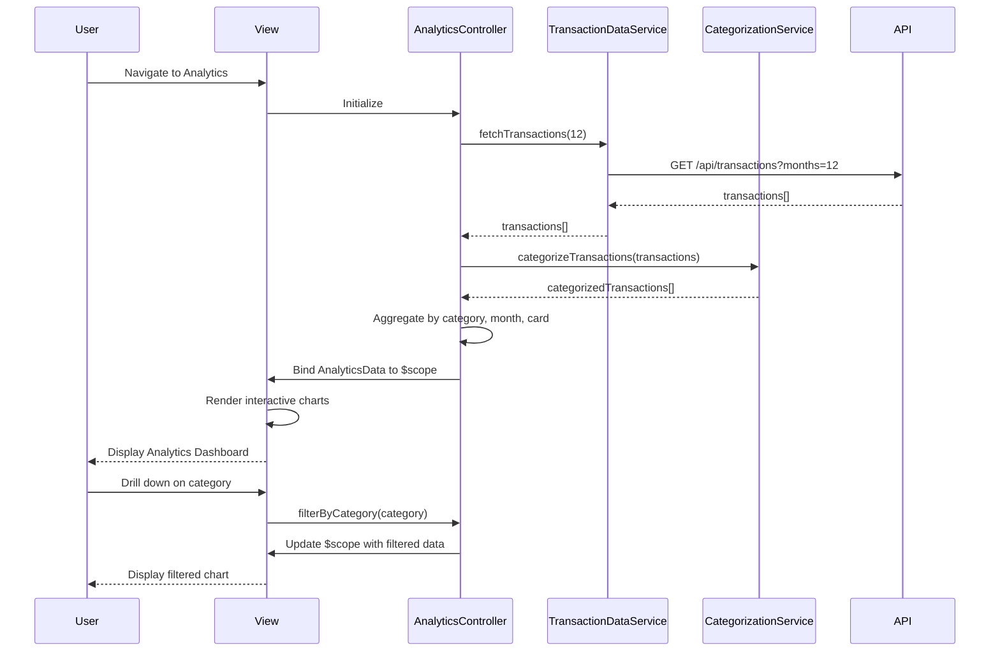

# Low-Level Design: QE-5223 - Spending Analytics and Visualization

## a. Architecture Mapping

**Component to Artifact Mapping:**
- User Interface → AnalyticsView (`analytics.html`) + AnalyticsController
- Analytics Controller → `AnalyticsController` (manages analytics view state and user interactions)
- Visualization Engine → `ChartDirective` (renders interactive charts using charting library)
- Transaction Data Service → `TransactionDataService` (fetches historical transaction data)
- Categorization Service → `CategorizationService` (classifies transactions into 9 predefined categories)
- Data Store → Backend REST API endpoints

**Folder Structure:**
```
app/
  analytics/
    analytics.module.js
    analytics.controller.js
    analytics.service.js
    analytics.routes.js
    views/analytics.html
  shared/
    services/
      transaction-data.service.js
      categorization.service.js
    directives/
      chart.directive.js
```

## b. Component Specifications

| Name | Artifact Type | Responsibility | Key Dependencies |
|------|---------------|----------------|------------------|
| AnalyticsController | Controller | Orchestrates analytics view, processes spending data, handles drill-down interactions | TransactionDataService, CategorizationService, $scope |
| TransactionDataService | Service | Fetches 12 months of historical transaction data from backend API | $http, $q, $cacheFactory |
| CategorizationService | Service | Categorizes transactions into 9 predefined categories (Food & Dining, Fuel, Shopping, Travel, Entertainment, Utilities, Healthcare, Education, Miscellaneous) | $http, $q |
| ChartDirective | Directive | Renders interactive charts (category-wise, monthly trends, card-wise) using charting library (e.g., Chart.js, D3) | AnalyticsController scope |
| AnalyticsView | View (HTML) | Displays category breakdown, monthly trends, card-wise spend with interactive charts | AnalyticsController, ChartDirective |
| analytics.module | Module | Encapsulates analytics feature components and dependencies | ui-router, shared services, charting library |

## c. Data Model

```js
Transaction = {
  id: String,
  cardId: String,
  merchant: String,
  amount: Number,
  date: String,
  category: String,
  description: String
}

CategorySpend = {
  category: String,
  totalAmount: Number,
  transactionCount: Number,
  percentage: Number
}

MonthlyTrend = {
  month: String,
  totalSpend: Number,
  categoryBreakdown: Array<CategorySpend>
}

CardWiseSpend = {
  cardId: String,
  cardName: String,
  totalSpend: Number,
  categoryBreakdown: Array<CategorySpend>
}

AnalyticsData = {
  categorySpends: Array<CategorySpend>,
  monthlyTrends: Array<MonthlyTrend>,
  cardWiseSpends: Array<CardWiseSpend>,
  totalSpend: Number
}
```

## d. Data Flow

User navigates to analytics view, triggering AnalyticsController initialization. Controller calls TransactionDataService.fetchTransactions(12) to retrieve 12 months of transaction history via REST API ($http GET /api/transactions?months=12). CategorizationService.categorizeTransactions(transactions) processes the data and assigns each transaction to one of 9 predefined categories. Controller aggregates data into category-wise, monthly trend, and card-wise structures, then binds AnalyticsData to $scope. ChartDirective watches scope data and renders interactive charts (pie, line, bar) using the charting library, completing within 1 second of data load. User interactions (drill-down, filter) trigger controller methods that update scope, causing directive to re-render charts.

## e. Primary Sequence Diagram



## f. Implementation Notes

- Use constructor injection with `$inject` array: `AnalyticsController.$inject = ['$scope', 'TransactionDataService', 'CategorizationService']`
- Implement client-side caching in TransactionDataService to avoid redundant API calls for the same 12-month period
- ChartDirective uses isolate scope with two-way binding to chart data; leverages Chart.js or D3.js for rendering with drill-down support
- Pre-aggregate data in controller to minimize chart rendering time (target: <1 second)
- Use ES6 features: arrow functions in promise chains, const/let, Array.map/filter/reduce for data transformation

## g. Error Handling

HTTP interceptor handles API failures with user notifications; controller wraps service calls in try/catch with $q promise rejection handlers for graceful degradation.

## h. Security Notes

Standard input validation and secure API calls assumed; requires token-based auth via existing SSO.