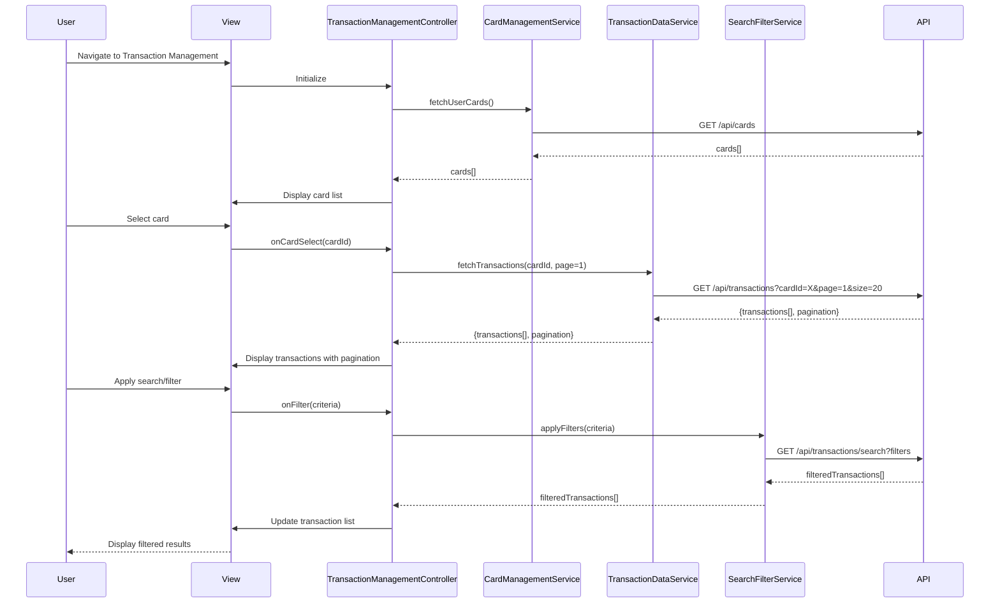

# Low-Level Design: QE-5224 - Credit Card and Transaction Management

## a. Architecture Mapping

**Component to Artifact Mapping:**
- User Interface → TransactionManagementView (`transaction-management.html`) + TransactionManagementController
- Transaction Management Controller → `TransactionManagementController` (orchestrates card and transaction views)
- Card Management Service → `CardManagementService` (manages CRUD operations for credit cards)
- Transaction Data Service → `TransactionDataService` (fetches and manages transaction records)
- Search and Filter Engine → `SearchFilterService` (handles search, filter, sort operations with <500ms response)
- Data Store → Backend REST API endpoints

**Folder Structure:**
```
app/
  transaction-management/
    transaction-management.module.js
    transaction-management.controller.js
    card-management.service.js
    transaction-data.service.js
    search-filter.service.js
    transaction-management.routes.js
    views/transaction-management.html
    views/transaction-detail.html
  shared/
    services/
    directives/
      pagination.directive.js
```

## b. Component Specifications

| Name | Artifact Type | Responsibility | Key Dependencies |
|------|---------------|----------------|------------------|
| TransactionManagementController | Controller | Manages card list, transaction list, search/filter state, pagination | CardManagementService, TransactionDataService, SearchFilterService, $scope |
| CardManagementService | Service | Fetches and manages up to 10 credit cards per user (add, view, organize) | $http, $q |
| TransactionDataService | Service | Retrieves transaction records for selected card(s), supports pagination | $http, $q, $cacheFactory |
| SearchFilterService | Service | Executes search, filter, sort operations on transactions with <500ms performance | $filter, $q |
| PaginationDirective | Directive | Renders pagination controls, handles page navigation for large transaction datasets | TransactionManagementController scope |
| TransactionManagementView | View (HTML) | Displays card list, transaction table with search/filter controls, pagination | TransactionManagementController, PaginationDirective |
| TransactionDetailView | View (HTML) | Shows detailed transaction information (merchant, amount, date, category) | TransactionManagementController |
| transaction-management.module | Module | Encapsulates transaction management feature components | ui-router, shared services |

## c. Data Model

```js
CreditCard = {
  id: String,
  cardNumber: String,
  cardHolderName: String,
  cardType: String,
  expiryDate: String,
  status: String
}

Transaction = {
  id: String,
  cardId: String,
  merchant: String,
  amount: Number,
  date: String,
  category: String,
  description: String,
  status: String
}

PaginationConfig = {
  currentPage: Number,
  pageSize: Number,
  totalItems: Number,
  totalPages: Number
}

SearchFilterCriteria = {
  cardId: String,
  dateFrom: String,
  dateTo: String,
  category: String,
  merchant: String,
  minAmount: Number,
  maxAmount: Number,
  sortBy: String,
  sortOrder: String
}
```

## d. Data Flow

User navigates to transaction management view, triggering TransactionManagementController initialization. Controller calls CardManagementService.fetchUserCards() to retrieve up to 10 credit cards via REST API ($http GET /api/cards). User selects a card, triggering controller method that calls TransactionDataService.fetchTransactions(cardId, paginationConfig) to retrieve paginated transactions ($http GET /api/transactions?cardId=X&page=1&size=20). User applies search/filter criteria, invoking SearchFilterService.applyFilters(criteria) which executes client-side or server-side filtering (completing <500ms) and returns filtered results. Controller updates $scope with filtered transactions and pagination metadata. PaginationDirective renders page controls; user clicks page number, controller fetches next page. User clicks transaction row to view details, controller navigates to TransactionDetailView with transaction data.

## e. Primary Sequence Diagram



## f. Implementation Notes

- Use constructor injection with `$inject`: `TransactionManagementController.$inject = ['$scope', 'CardManagementService', 'TransactionDataService', 'SearchFilterService']`
- Implement server-side pagination to handle large transaction datasets efficiently; client receives only current page data
- SearchFilterService uses debouncing (300ms) on search input to minimize API calls while maintaining <500ms response requirement
- Cache card list in CardManagementService (max 10 cards) to avoid redundant fetches
- Use ES6: arrow functions, const/let, template literals for dynamic query string construction

## g. Error Handling

HTTP interceptor captures API errors and displays user-friendly messages; controller uses try/catch with promise rejection handlers for graceful error recovery.

## h. Security Notes

Requires token-based auth via existing SSO; standard input validation and secure API calls assumed.