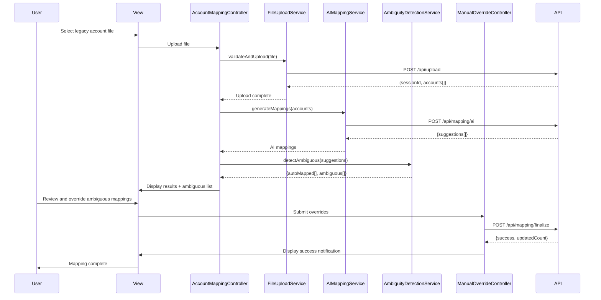

# Low-Level Design: QE-5225 - Automated Legacy Account Mapping and AI-Driven Suggestions

## a. Architecture Mapping

**HLD Component → AngularJS Artifact:**
- User Interface → Module (`app.accountMapping`) + Controller (`AccountMappingController`) + View (`account-mapping.html`)
- File Upload Service → Service (`FileUploadService`)
- File Validation Engine → Service (`FileValidationService`)
- AI Mapping Engine → Service (`AIMappingService`)
- Rule-Based Mapping Engine → Service (`RuleBasedMappingService`)
- Ambiguity Detection Module → Service (`AmbiguityDetectionService`)
- Manual Override Interface → Controller (`ManualOverrideController`) + View (`manual-override.html`) + Directive (`appMappingOverride`)
- Master Ledger Database → Factory (`MasterLedgerCache`)

**Folder Structure:**
```
app/
  accountMapping/
    accountMapping.module.js
    accountMapping.controller.js
    accountMapping.service.js
    manualOverride.controller.js
    fileUpload.service.js
    fileValidation.service.js
    aiMapping.service.js
    ruleBasedMapping.service.js
    ambiguityDetection.service.js
    accountMapping.routes.js
    views/account-mapping.html
    views/manual-override.html
  shared/
    services/masterLedger.factory.js
    directives/mappingOverride.directive.js
    interceptors/auth.interceptor.js
```

## b. Component Specifications

| Name | Artifact Type | Responsibility | Key Dependencies |
|------|---------------|----------------|------------------|
| AccountMappingController | Controller | Orchestrates file upload, initiates mapping process, displays results and ambiguous mappings | FileUploadService, AIMappingService, RuleBasedMappingService, AmbiguityDetectionService |
| ManualOverrideController | Controller | Manages user review and override of ambiguous mappings, submits final mappings to ledger | MasterLedgerCache, AmbiguityDetectionService |
| FileUploadService | Service | Handles file selection, validates format (CSV/XLSX/XML), uploads to backend for processing | $http, FileValidationService |
| FileValidationService | Service | Validates file format, structure, column headers, size constraints (up to 10,000 accounts) | None |
| AIMappingService | Service | Calls AI mapping API with legacy account data, returns suggested mappings with confidence scores | $http |
| RuleBasedMappingService | Service | Applies rule-based mapping logic for deterministic account code mappings | $http |
| AmbiguityDetectionService | Service | Identifies mappings with low confidence or conflicts, flags for manual review | None |
| MasterLedgerCache | Factory | Singleton cache for master ledger structure, provides lookup and update methods | $http |
| appMappingOverride | Directive | Reusable UI component for displaying and editing individual account mapping overrides | None |
| AuthInterceptor | Interceptor | Attaches authentication tokens to API requests, handles 401/403 responses | $q, $injector |

## c. Data Model

```js
LegacyAccount = {
  id: String,
  accountCode: String,
  accountName: String,
  description: String,
  firmId: String
}

MappingSuggestion = {
  legacyAccountId: String,
  suggestedMasterCode: String,
  suggestedMasterName: String,
  confidenceScore: Number,
  mappingSource: String,
  isAmbiguous: Boolean
}

MappingOverride = {
  legacyAccountId: String,
  originalSuggestion: String,
  userSelectedCode: String,
  userId: String,
  timestamp: Date,
  reason: String
}

MasterLedgerAccount = {
  code: String,
  name: String,
  category: String,
  active: Boolean
}

UploadSession = {
  sessionId: String,
  firmId: String,
  fileName: String,
  uploadTimestamp: Date,
  totalAccounts: Number,
  mappedAccounts: Number,
  ambiguousAccounts: Number,
  status: String
}
```

## d. Data Flow

User selects legacy account file (CSV/XLSX/XML) via the account mapping view, triggering AccountMappingController to invoke FileUploadService which validates format via FileValidationService and uploads to backend REST API. Backend processes file and returns legacy account list; controller then calls AIMappingService and RuleBasedMappingService concurrently to generate mapping suggestions. AmbiguityDetectionService evaluates confidence scores and flags low-confidence mappings. Controller displays auto-mapped accounts and routes ambiguous mappings to ManualOverrideController view. User reviews flagged mappings, selects correct master codes via appMappingOverride directive, and submits. ManualOverrideController posts final mappings (auto + overrides) to backend API, which updates MasterLedgerCache and returns success/error notifications displayed in the UI.

## e. Primary Sequence Diagram



## f. Implementation Notes

- DI: Use constructor injection with `$inject` array annotation for all controllers and services to ensure minification safety
- API calls: Centralize all REST API interactions in dedicated services; controllers never call `$http` directly
- File parsing: Leverage backend API for CSV/XLSX/XML parsing; frontend validates format and size only
- Concurrent mapping: Use `$q.all()` to invoke AI and rule-based services in parallel for performance
- ES6: Apply arrow functions, `let`/`const`, and template literals throughout; assume Babel transpilation

## g. Error Handling

Centralized `$http` interceptor catches API failures (network, timeout, 4xx/5xx); user-facing errors surfaced via shared notification service with retry option for transient failures.

## h. Security Notes

Requires token-based authentication via existing SSO; all file uploads and API calls use TLS 1.2+ encryption; GDPR-compliant data handling enforced at API layer.