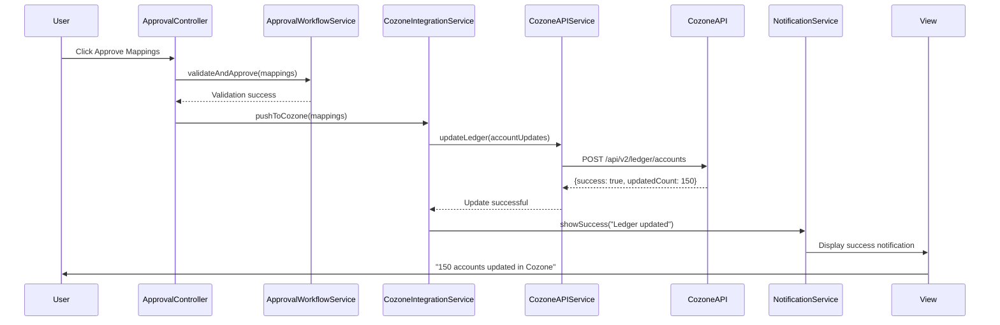

# Low-Level Design: QE-5226 - Cozone Integration and Real-Time Ledger Updates

## a. Architecture Mapping

**HLD Component → AngularJS Artifact:**
- Mapping Tool → Module (`app.cozoneIntegration`) + Controller (`CozoneIntegrationController`)
- Approval Workflow → Service (`ApprovalWorkflowService`) + Controller (`ApprovalController`) + View (`approval-workflow.html`)
- Integration Service → Service (`CozoneIntegrationService`)
- Cozone API Gateway → Service (`CozoneAPIService`)
- Cozone Master Ledger → Factory (`CozoneLedgerCache`)
- Notification Service → Service (`NotificationService`)
- API Monitoring → Service (`APIMonitoringService`)

**Folder Structure:**
```
app/
  cozoneIntegration/
    cozoneIntegration.module.js
    cozoneIntegration.controller.js
    approval.controller.js
    approvalWorkflow.service.js
    cozoneIntegration.service.js
    cozoneAPI.service.js
    apiMonitoring.service.js
    cozoneIntegration.routes.js
    views/approval-workflow.html
  shared/
    services/notification.service.js
    factories/cozoneLedger.factory.js
    interceptors/cozoneAuth.interceptor.js
```

## b. Component Specifications

| Name | Artifact Type | Responsibility | Key Dependencies |
|------|---------------|----------------|------------------|
| CozoneIntegrationController | Controller | Manages integration status display, triggers manual sync, displays sync history | CozoneIntegrationService, NotificationService |
| ApprovalController | Controller | Presents finalized mappings for user approval, initiates Cozone push on approval | ApprovalWorkflowService, CozoneIntegrationService |
| ApprovalWorkflowService | Service | Validates mapping completeness, manages approval state, triggers integration on approval | $http |
| CozoneIntegrationService | Service | Orchestrates Cozone ledger updates, handles success/error responses, manages retry logic | CozoneAPIService, NotificationService, APIMonitoringService |
| CozoneAPIService | Service | Direct REST API wrapper for Cozone endpoints (POST/PUT account codes), handles versioning | $http, CozoneLedgerCache |
| APIMonitoringService | Service | Monitors Cozone API health, logs response times, detects version changes, triggers alerts | $http, $interval |
| NotificationService | Service | Displays success/error notifications to users, manages notification queue and dismissal | None |
| CozoneLedgerCache | Factory | Singleton cache for Cozone ledger state, provides optimistic update and rollback methods | $http |
| CozoneAuthInterceptor | Interceptor | Attaches Cozone-specific auth tokens to API requests, handles token refresh and 401 responses | $q, $injector |

## c. Data Model

```js
ApprovalRequest = {
  sessionId: String,
  firmId: String,
  mappings: Array<FinalizedMapping>,
  submittedBy: String,
  submittedAt: Date,
  status: String
}

FinalizedMapping = {
  legacyAccountCode: String,
  masterAccountCode: String,
  mappingType: String,
  overridden: Boolean
}

CozoneUpdateRequest = {
  firmId: String,
  accountUpdates: Array<AccountUpdate>,
  requestTimestamp: Date
}

AccountUpdate = {
  legacyCode: String,
  masterCode: String,
  effectiveDate: Date
}

CozoneResponse = {
  success: Boolean,
  updatedCount: Number,
  failedAccounts: Array<String>,
  errorMessage: String,
  apiVersion: String
}

APIHealthStatus = {
  endpoint: String,
  status: String,
  lastChecked: Date,
  responseTime: Number,
  apiVersion: String
}
```

## d. Data Flow

User completes mapping process and navigates to approval workflow view, where ApprovalController retrieves finalized mappings via ApprovalWorkflowService. User reviews mappings and clicks approve, triggering ApprovalController to call CozoneIntegrationService with approved mappings. CozoneIntegrationService invokes CozoneAPIService to POST account updates to Cozone REST API with authentication via CozoneAuthInterceptor. Cozone API processes updates and returns success/failure response. CozoneIntegrationService updates CozoneLedgerCache optimistically, then calls NotificationService to display success message or error details to user. APIMonitoringService runs periodic health checks via `$interval` to detect Cozone API availability and version changes, logging results and alerting on failures.

## e. Primary Sequence Diagram



## f. Implementation Notes

- DI: Use `$inject` array annotation for all services and controllers to ensure minification compatibility
- API versioning: CozoneAPIService maintains version-specific endpoint mappings; gracefully handles version mismatches with fallback logic
- Retry logic: CozoneIntegrationService implements exponential backoff for transient failures (network timeout, 503) with max 3 retries
- Optimistic updates: CozoneLedgerCache updates immediately on API call, rolls back on failure response
- Health monitoring: APIMonitoringService uses `$interval` to poll Cozone health endpoint every 60 seconds, logs to backend analytics

## g. Error Handling

Centralized `$http` interceptor catches Cozone API failures; transient errors (timeout, 503) trigger automatic retry via CozoneIntegrationService; permanent failures (400, 404, 500) surface via NotificationService with detailed error message.

## h. Security Notes

Requires token-based authentication via Cozone SSO integration; all API communications use TLS 1.2+ encryption; access controls enforced at Cozone API layer per Azets internal security policies.