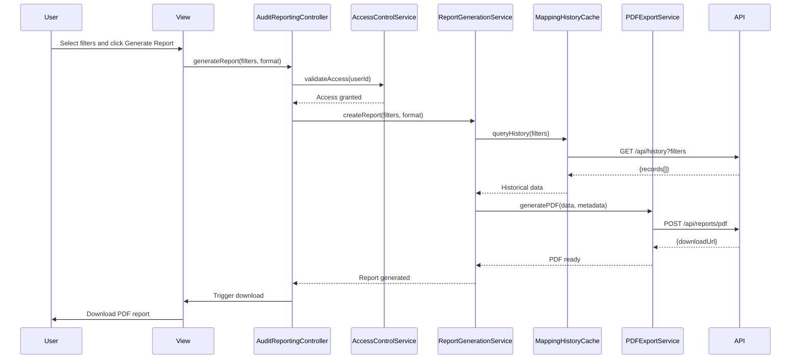

# Low-Level Design: QE-5227 - Audit-Ready Reporting and Compliance Documentation

## a. Architecture Mapping

**HLD Component → AngularJS Artifact:**
- User Interface → Module (`app.auditReporting`) + Controller (`AuditReportingController`) + View (`audit-reporting.html`)
- Report Generation Service → Service (`ReportGenerationService`)
- Mapping History Database → Factory (`MappingHistoryCache`)
- Document Generation Engine → Service (`DocumentGenerationService`)
- PDF Export Module → Service (`PDFExportService`)
- CSV Export Module → Service (`CSVExportService`)
- Access Control Service → Service (`AccessControlService`)
- Secure Storage → Factory (`SecureStorageFactory`)

**Folder Structure:**
```
app/
  auditReporting/
    auditReporting.module.js
    auditReporting.controller.js
    reportGeneration.service.js
    documentGeneration.service.js
    pdfExport.service.js
    csvExport.service.js
    accessControl.service.js
    auditReporting.routes.js
    views/audit-reporting.html
  shared/
    factories/mappingHistory.factory.js
    factories/secureStorage.factory.js
    directives/reportFilter.directive.js
    interceptors/audit.interceptor.js
```

## b. Component Specifications

| Name | Artifact Type | Responsibility | Key Dependencies |
|------|---------------|----------------|------------------|
| AuditReportingController | Controller | Manages report request UI, filters (date range, firm, user), initiates report generation, handles downloads | ReportGenerationService, AccessControlService |
| ReportGenerationService | Service | Orchestrates report creation, retrieves mapping history, invokes format-specific export services | MappingHistoryCache, DocumentGenerationService, PDFExportService, CSVExportService |
| DocumentGenerationService | Service | Aggregates mapping data, applies audit trail formatting, prepares data structure for PDF/CSV export | MappingHistoryCache |
| PDFExportService | Service | Generates PDF reports with complete audit trail (mappings, overrides, timestamps), triggers browser download | $http |
| CSVExportService | Service | Generates CSV reports with tabular mapping data and audit metadata, triggers browser download | None |
| AccessControlService | Service | Validates user permissions for report access, enforces role-based access to historical data | $http |
| MappingHistoryCache | Factory | Singleton cache for mapping history queries, provides filtering and pagination methods | $http |
| SecureStorageFactory | Factory | Abstraction for secure storage API interactions (7-year retention), handles encryption metadata | $http |
| appReportFilter | Directive | Reusable UI component for date range, firm, and user filtering with accessibility support (WCAG 2.1 AA) | None |
| AuditInterceptor | Interceptor | Logs all report generation requests with user ID and timestamp for compliance audit trail | $q |

## c. Data Model

```js
MappingHistoryRecord = {
  id: String,
  sessionId: String,
  firmId: String,
  legacyAccountCode: String,
  masterAccountCode: String,
  mappingType: String,
  confidenceScore: Number,
  overridden: Boolean,
  overrideReason: String,
  userId: String,
  timestamp: Date
}

AuditReport = {
  reportId: String,
  generatedBy: String,
  generatedAt: Date,
  filters: ReportFilters,
  totalRecords: Number,
  format: String,
  downloadUrl: String
}

ReportFilters = {
  startDate: Date,
  endDate: Date,
  firmIds: Array<String>,
  userIds: Array<String>,
  includeOverrides: Boolean
}

ReportMetadata = {
  reportTitle: String,
  generatedBy: String,
  generatedAt: Date,
  dataRetentionPolicy: String,
  complianceStandards: Array<String>
}
```

## d. Data Flow

User navigates to audit reporting view and selects report filters (date range, firm, user) via appReportFilter directive. AuditReportingController validates user permissions via AccessControlService, then calls ReportGenerationService with filter parameters. ReportGenerationService queries MappingHistoryCache to retrieve historical mapping records matching filters. DocumentGenerationService aggregates records, applies audit trail formatting (timestamps, user IDs, override reasons), and prepares structured data. User selects export format (PDF or CSV); controller invokes PDFExportService or CSVExportService accordingly. Export service calls backend API to generate document, receives download URL, and triggers browser download. AuditInterceptor logs report generation request with user ID and timestamp for compliance audit trail. Generated report includes complete mapping history with 7-year retention metadata from SecureStorageFactory.

## e. Primary Sequence Diagram



## f. Implementation Notes

- DI: Use `$inject` array annotation for all controllers and services to ensure minification safety
- Accessibility: appReportFilter directive implements WCAG 2.1 AA standards with keyboard navigation, ARIA labels, and screen reader support
- Large datasets: MappingHistoryCache implements pagination for queries returning >1000 records to maintain 60-second report generation SLA
- Browser download: Export services use HTML5 `download` attribute with Blob URLs for client-side file download without page navigation
- ES6: Apply `const`/`let`, arrow functions, and template literals throughout; assume Babel transpilation

## g. Error Handling

Centralized `$http` interceptor catches API failures during report generation; user-facing errors surfaced via shared notification service with option to retry or contact support.

## h. Security Notes

Requires role-based access control via AccessControlService; all report data transfers use TLS 1.2+ encryption; 7-year data retention with AES-256 encryption enforced at SecureStorageFactory layer; GDPR-compliant audit trail.