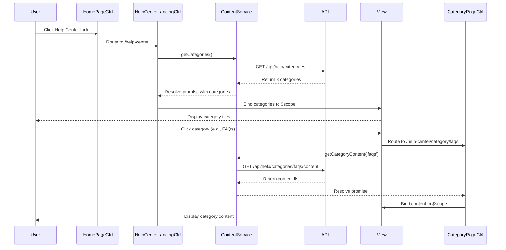

# Low-Level Design: Help Center Integration - Home Page

**Epic ID:** QE-5228

## a. Architecture Mapping

- **Home Page Module** → AngularJS Module (`app.homePage`) - Hosts Help Center entry point button/link
- **Help Center Landing Module** → AngularJS Module (`app.helpCenter`) - Main Help Center container
- **Category Navigation Component** → AngularJS Directive (`helpCategoryNav`) - Renders category menu with routing
- **Category Page Controller** → AngularJS Controller (`CategoryPageCtrl`) - Manages category content display
- **Content Service** → AngularJS Service (`ContentService`) - Fetches category and content data from REST API
- **Responsive Layout Directive** → AngularJS Directive (`responsiveLayout`) - Applies device-specific CSS classes

**Recommended Folder Structure:**
```
/app
  /modules
    /home-page
    /help-center
      /controllers
      /services
      /directives
      /views
  /assets
    /css
    /images
```

## b. Component Specifications

| Name | Artifact Type | Responsibility | Key Dependencies |
|------|---------------|----------------|------------------|
| `app.homePage` | Module | Registers home page components and routes | `ngRoute`, `app.helpCenter` |
| `HomePageCtrl` | Controller | Manages home page state and Help Center link navigation | `$location`, `$scope` |
| `app.helpCenter` | Module | Main Help Center module with routing config | `ngRoute`, `ContentService` |
| `HelpCenterLandingCtrl` | Controller | Loads and displays 8 category tiles on landing page | `ContentService`, `$scope` |
| `CategoryPageCtrl` | Controller | Fetches and renders content for selected category | `ContentService`, `$routeParams`, `$scope` |
| `ContentService` | Service | REST API calls to fetch categories and content metadata | `$http`, `$q` |
| `helpCategoryNav` | Directive | Renders category navigation menu with active state | `$location` |
| `responsiveLayout` | Directive | Detects device type and applies responsive CSS classes | `$window` |

## c. Data Model

**Category Object:**
```javascript
{
  id: String,
  name: String, // e.g., "Getting Started", "FAQs"
  description: String,
  iconUrl: String,
  contentCount: Number
}
```

**Content Metadata Object:**
```javascript
{
  id: String,
  categoryId: String,
  title: String,
  type: String, // "article", "faq", "video", "download"
  url: String,
  lastUpdated: Date
}
```

## d. Data Flow

User clicks Help Center link on Home Page → `HomePageCtrl` uses `$location` to route to `/help-center` → `HelpCenterLandingCtrl` initializes and calls `ContentService.getCategories()` → Service makes GET request to `/api/help/categories` → API returns 8 category objects → Controller binds categories to `$scope` → View renders category tiles using `ng-repeat` → User clicks category → `helpCategoryNav` directive routes to `/help-center/category/:id` → `CategoryPageCtrl` calls `ContentService.getCategoryContent(id)` → API returns content list → View displays content with responsive layout applied by `responsiveLayout` directive.

## e. Primary Sequence Diagram



## f. Implementation Notes

- Use AngularJS 1.x `ngRoute` for client-side routing between Home Page, Landing Page, and Category Pages
- Implement Dependency Injection for all services and controllers using explicit array annotation to avoid minification issues
- Use `$http` service with promise-based pattern for all REST API calls to `/api/help/*` endpoints
- Apply Bootstrap grid system (col-xs/sm/md/lg) in templates for responsive layout across desktop/tablet/mobile
- Implement `$routeProvider` with `resolve` property to pre-fetch category data before controller initialization for faster rendering

## g. Error Handling

HTTP interceptor (`$httpProvider.interceptors`) captures API failures and displays user-friendly error messages via a global notification service.

## h. Security Notes

Requires token-based auth via existing SSO; all API calls over HTTPS with WCAG 2.1 AA compliance enforced in templates.