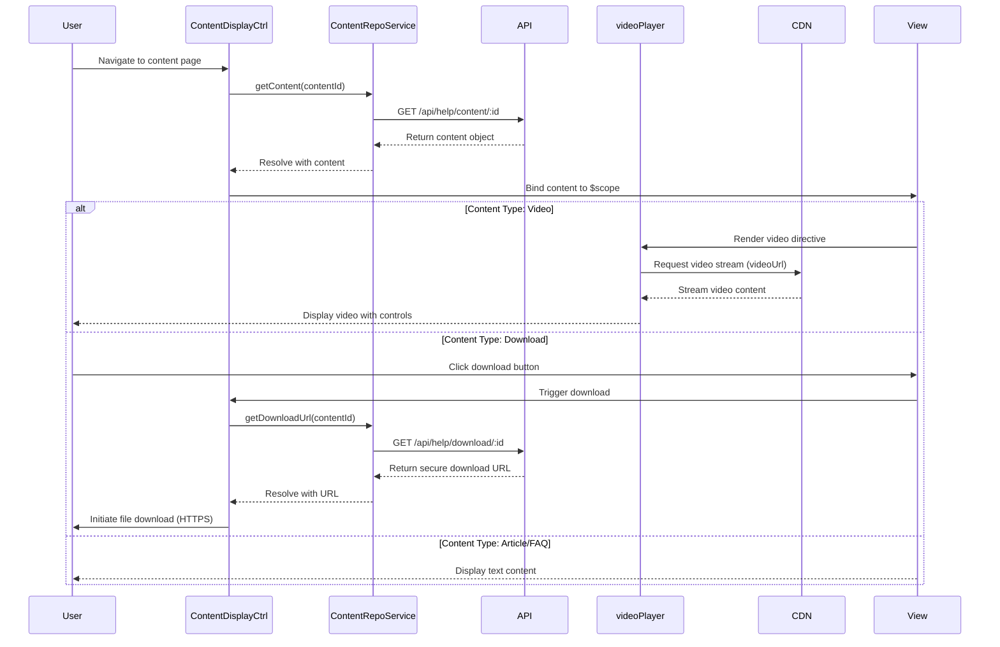

# Low-Level Design: Multi-Format Content Delivery System

**Epic ID:** QE-5229

## a. Architecture Mapping

- **Content Display Module** → AngularJS Module (`app.helpContent`) - Manages multi-format content rendering
- **Content Controller** → AngularJS Controller (`ContentDisplayCtrl`) - Orchestrates content loading and display logic
- **Video Player Directive** → AngularJS Directive (`videoPlayer`) - Embeds and controls video playback
- **Download Manager Service** → AngularJS Service (`DownloadService`) - Generates secure download links and handles file downloads
- **Content Filter Service** → AngularJS Service (`ContentFilterService`) - Filters content by category, popularity, recency
- **Content Repository Service** → AngularJS Service (`ContentRepoService`) - Fetches content metadata and URLs from REST API

**Recommended Folder Structure:**
```
/app
  /modules
    /help-content
      /controllers
      /services
      /directives
      /views
      /filters
  /assets
    /video-player
```

## b. Component Specifications

| Name | Artifact Type | Responsibility | Key Dependencies |
|------|---------------|----------------|------------------|
| `app.helpContent` | Module | Registers content display components and routing | `ngRoute`, `ngSanitize` |
| `ContentDisplayCtrl` | Controller | Loads content based on type and handles display state | `ContentRepoService`, `$routeParams`, `$scope` |
| `ContentRepoService` | Service | REST API calls to fetch articles, FAQs, video URLs, download links | `$http`, `$q` |
| `videoPlayer` | Directive | Embeds video player with adaptive streaming and playback controls | `$sce` (for trusted URLs) |
| `DownloadService` | Service | Generates tokenized download URLs and triggers file downloads | `$http`, `$window` |
| `ContentFilterService` | Service | Applies filters (category, popularity, recency) to content lists | None (pure JS logic) |
| `contentTypeRenderer` | Directive | Conditionally renders text, video, or download UI based on content type | `$compile` |
| `errorFallback` | Directive | Displays error message and alternative suggestions when content unavailable | `ContentRepoService` |

## c. Data Model

**Content Object:**
```javascript
{
  id: String,
  type: String, // "article", "faq", "video", "download"
  title: String,
  categoryId: String,
  body: String, // for articles/FAQs
  videoUrl: String, // for videos
  downloadUrl: String, // for downloads
  fileSize: Number, // in bytes
  mimeType: String,
  popularity: Number,
  createdAt: Date,
  updatedAt: Date
}
```

**Filter Criteria Object:**
```javascript
{
  category: String,
  sortBy: String, // "popularity", "recency"
  contentType: String // "article", "video", "download", "all"
}
```

## d. Data Flow

User navigates to content page → `ContentDisplayCtrl` retrieves content ID from `$routeParams` and calls `ContentRepoService.getContent(id)` → Service makes GET request to `/api/help/content/:id` → API returns content object with type, metadata, and URLs → Controller determines content type and binds to `$scope` → For videos: `videoPlayer` directive embeds player using `$sce.trustAsResourceUrl()` with CDN stream URL → Video streams to user. For downloads: User clicks download button → `DownloadService.initiateDownload(id)` calls `/api/help/download/:id` to get secure tokenized URL → Service triggers download via `$window.open()`. For text: Content body rendered directly in view. If content unavailable: `errorFallback` directive displays error and calls `ContentRepoService.getSuggestions()` for alternatives.

## e. Primary Sequence Diagram



## f. Implementation Notes

- Use `$sce.trustAsResourceUrl()` in `videoPlayer` directive to whitelist CDN video URLs for iframe embedding
- Implement `ContentFilterService` as a stateless factory with pure functions for client-side filtering and sorting
- Use `$http` interceptor to add authentication tokens to all `/api/help/*` requests
- Apply `ng-if` and `ng-switch` in templates to conditionally render content based on type (article/video/download)
- Cache content metadata in `ContentRepoService` using `$cacheFactory` to reduce redundant API calls

## g. Error Handling

HTTP interceptor catches 404/500 errors; `errorFallback` directive displays user-friendly message with try/catch wrapping video player initialization.

## h. Security Notes

Tokenized download URLs with expiration; video URLs served over HTTPS from trusted CDN; standard XSS prevention via `ngSanitize`.