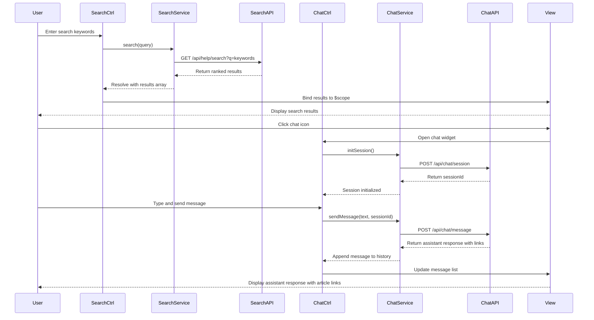

# Low-Level Design: Search and Chat Support System

**Epic ID:** QE-5230

## a. Architecture Mapping

- **Search Module** → AngularJS Module (`app.helpSearch`) - Manages keyword search functionality
- **Search Controller** → AngularJS Controller (`SearchCtrl`) - Handles search input and results display
- **Search Service** → AngularJS Service (`SearchService`) - Communicates with search indexing API
- **Chat Module** → AngularJS Module (`app.helpChat`) - Manages chat assistant integration
- **Chat Controller** → AngularJS Controller (`ChatCtrl`) - Manages chat state and message exchange
- **Chat Service** → AngularJS Service (`ChatService`) - Integrates with third-party chat assistant API
- **Search Results Directive** → AngularJS Directive (`searchResults`) - Renders ranked search results
- **Chat Widget Directive** → AngularJS Directive (`chatWidget`) - Embeds chat interface with real-time messaging

**Recommended Folder Structure:**
```
/app
  /modules
    /help-search
      /controllers
      /services
      /directives
      /views
    /help-chat
      /controllers
      /services
      /directives
      /views
```

## b. Component Specifications

| Name | Artifact Type | Responsibility | Key Dependencies |
|------|---------------|----------------|------------------|
| `app.helpSearch` | Module | Registers search components and configures search routing | `ngRoute` |
| `SearchCtrl` | Controller | Captures user search input and displays results | `SearchService`, `$scope`, `$timeout` |
| `SearchService` | Service | REST API calls to search index for keyword queries | `$http`, `$q` |
| `searchResults` | Directive | Renders search results list with ranking and highlighting | None |
| `app.helpChat` | Module | Registers chat components and initializes chat API connection | `ngWebSocket` (optional) |
| `ChatCtrl` | Controller | Manages chat message history and user input | `ChatService`, `$scope` |
| `ChatService` | Service | Integrates with third-party chat assistant API for real-time messaging | `$http`, `$interval` |
| `chatWidget` | Directive | Embeds floating chat window with open/close toggle and message display | `$document` |

## c. Data Model

**Search Query Object:**
```javascript
{
  keywords: String,
  filters: {
    contentType: String, // "all", "article", "video", "download"
    category: String
  }
}
```

**Search Result Object:**
```javascript
{
  id: String,
  title: String,
  snippet: String,
  contentType: String,
  url: String,
  relevanceScore: Number,
  category: String
}
```

**Chat Message Object:**
```javascript
{
  id: String,
  sender: String, // "user" or "assistant"
  text: String,
  timestamp: Date,
  links: Array // [{title: String, url: String}]
}
```

**Chat Session Object:**
```javascript
{
  sessionId: String,
  messages: Array, // Array of Chat Message Objects
  isActive: Boolean
}
```

## d. Data Flow

User enters search keywords in search bar → `SearchCtrl` captures input with debounce using `$timeout` → Controller calls `SearchService.search(query)` → Service makes GET request to `/api/help/search?q=keywords` → Search API queries index and returns ranked results → Service resolves promise with results array → Controller binds results to `$scope` → `searchResults` directive renders list with highlighting. For chat: User clicks chat icon → `chatWidget` directive opens chat window → `ChatCtrl` initializes session and calls `ChatService.initSession()` → User types message → Controller calls `ChatService.sendMessage(text)` → Service POSTs to third-party chat API `/api/chat/message` → API processes with NLP and returns response with article links from content repository → Service appends response to message history → View updates in real-time displaying assistant response with clickable links.

## e. Primary Sequence Diagram



## f. Implementation Notes

- Use `$timeout` with 300ms debounce in `SearchCtrl` to prevent excessive API calls during typing
- Implement `ChatService` with polling using `$interval` (if WebSocket unavailable) to check for new messages every 2 seconds
- Use `ng-model` for two-way binding of search input and chat message input fields
- Apply Bootstrap modal or custom CSS for `chatWidget` directive to create floating, draggable chat window
- Store chat session in `$sessionStorage` (via ngStorage) to persist across page navigation within Help Center

## g. Error Handling

HTTP interceptor handles API timeouts and failures; search displays "No results found" message; chat shows "Assistant unavailable" with retry option.

## h. Security Notes

Requires token-based auth via existing SSO; no PII sent to chat API; all requests over HTTPS with input sanitization via `ngSanitize`.