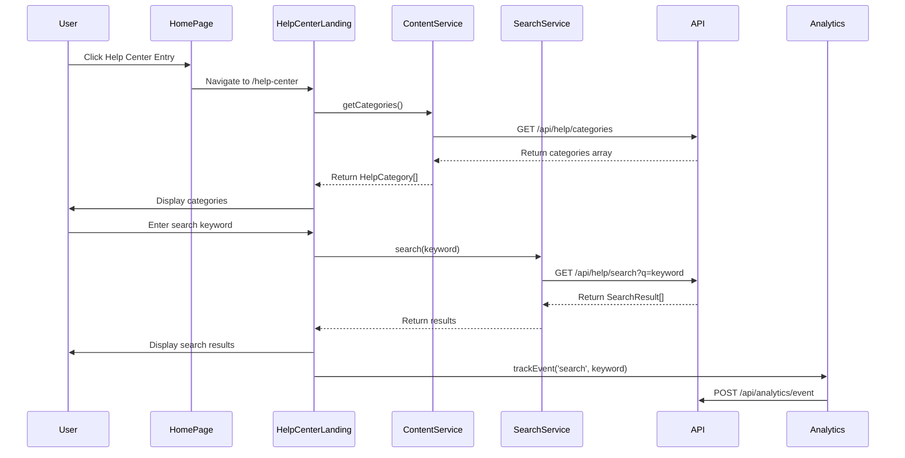

# Low-Level Design: Help Center Integration on Home Page

**Epic ID:** QE-5243

---

## a. Architecture Mapping

- **Home Page Entry Point** → Directive (`helpCenterEntryDirective`) embedded in existing Home Page template
- **Help Center Landing Page** → Module (`helpCenterModule`) with Controller (`HelpCenterLandingController`) and View (`help-center-landing.html`)
- **Category Browser** → Component (`categoryBrowserComponent`) with Controller (`CategoryBrowserController`)
- **Search Component** → Component (`searchComponent`) with Controller (`SearchController`) and Service (`SearchService`)
- **Content Repository** → Service (`ContentRepositoryService`) for API interaction
- **Search Indexing Service** → Service (`SearchIndexingService`) for keyword-based queries
- **Analytics Platform** → Service (`AnalyticsService`) for tracking user interactions

**Recommended Folder Structure:**
```
app/
├── modules/
│   └── help-center/
│       ├── controllers/
│       ├── services/
│       ├── components/
│       ├── directives/
│       └── views/
├── shared/
│   └── services/
└── assets/
```

---

## b. Component Specifications

| Name | Artifact Type | Responsibility | Key Dependencies |
|------|---------------|----------------|------------------|
| helpCenterModule | Module | Root module for Help Center functionality | angular, ui.router |
| helpCenterEntryDirective | Directive | Renders Help Center entry point on Home Page | helpCenterModule |
| HelpCenterLandingController | Controller | Manages landing page state and category display | ContentRepositoryService, AnalyticsService |
| CategoryBrowserController | Controller | Handles category selection and navigation | ContentRepositoryService |
| categoryBrowserComponent | Component | Displays categorized content navigation UI | CategoryBrowserController |
| SearchController | Controller | Manages search input and results display | SearchService, SearchIndexingService |
| searchComponent | Component | Renders search interface and results | SearchController |
| ContentRepositoryService | Service | Fetches help content from backend API | $http, $q |
| SearchIndexingService | Service | Queries search index for keyword matches | $http, $q |
| AnalyticsService | Service | Tracks user interactions and sends to analytics platform | $http |

---

## c. Data Model

**HelpCategory**
```javascript
{
  id: String,
  name: String,
  description: String,
  icon: String,
  contentCount: Number
}
```

**HelpContent**
```javascript
{
  id: String,
  categoryId: String,
  title: String,
  body: String,
  keywords: Array<String>,
  lastUpdated: Date
}
```

**SearchResult**
```javascript
{
  contentId: String,
  title: String,
  snippet: String,
  relevanceScore: Number,
  categoryName: String
}
```

---

## d. Data Flow

User visits Home Page and clicks Help Center entry point → helpCenterEntryDirective triggers state transition to Help Center Landing Page → HelpCenterLandingController initializes and calls ContentRepositoryService to fetch all categories → Landing view displays category tiles via categoryBrowserComponent → User either selects a category (CategoryBrowserController queries ContentRepositoryService with categoryId) or enters search term (SearchController calls SearchIndexingService with keyword) → Service returns matching HelpContent or SearchResult array → Controller updates view model → AngularJS data binding refreshes UI → AnalyticsService tracks interaction and sends event to backend analytics API.

---

## e. Primary Sequence Diagram



---

## f. Implementation Notes

- Use AngularJS 1.x component architecture with one-way data binding for category and search components
- Implement dependency injection for all services using ES6 class syntax with $inject annotation
- Use ui-router for state management with lazy-loaded templates for Help Center views
- Apply Bootstrap grid system for responsive layout with mobile-first breakpoints
- Integrate REST API calls via $http service with promise-based error handling and loading states

---

## g. Error Handling

HTTP interceptor captures API errors, displays user-friendly toast notifications via shared NotificationService, and logs errors to console for debugging.

---

## h. Security Notes

Standard input validation and secure API calls assumed; HTTPS enforced for all Help Center API endpoints.