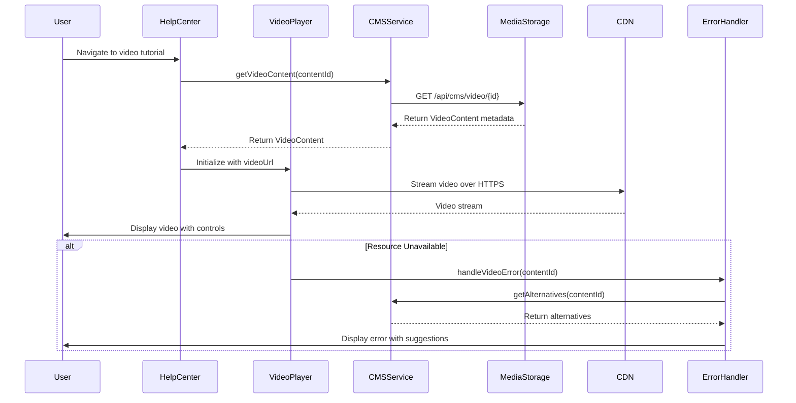

# Low-Level Design: Multimedia Content in Help Center

**Epic ID:** QE-5244

---

## a. Architecture Mapping

- **Video Player Component** → Component (`videoPlayerComponent`) with Controller (`VideoPlayerController`)
- **Download Manager Component** → Component (`downloadManagerComponent`) with Controller (`DownloadManagerController`)
- **Content Management System Integration** → Service (`CMSService`) for content metadata and URLs
- **CDN/Storage Layer** → Service (`MediaStorageService`) for secure content delivery
- **Link Checking System** → Service (`LinkValidationService`) for resource availability monitoring
- **Error Handling** → Service (`ErrorHandlerService`) for meaningful error messages with alternatives

**Recommended Folder Structure:**
```
app/
├── modules/
│   └── help-center/
│       ├── components/
│       │   ├── video-player/
│       │   └── download-manager/
│       ├── services/
│       └── views/
└── shared/
    └── services/
```

---

## b. Component Specifications

| Name | Artifact Type | Responsibility | Key Dependencies |
|------|---------------|----------------|------------------|
| videoPlayerComponent | Component | Renders HTML5 video player with playback controls | VideoPlayerController, CMSService |
| VideoPlayerController | Controller | Manages video state, playback, and error handling | MediaStorageService, ErrorHandlerService |
| downloadManagerComponent | Component | Displays downloadable resources with download buttons | DownloadManagerController, CMSService |
| DownloadManagerController | Controller | Handles file download initiation and error states | MediaStorageService, ErrorHandlerService |
| CMSService | Service | Fetches content metadata and URLs from CMS API | $http, $q |
| MediaStorageService | Service | Retrieves secure HTTPS URLs for video streaming and downloads | $http |
| LinkValidationService | Service | Checks resource availability and returns status | $http, $interval |
| ErrorHandlerService | Service | Generates user-friendly error messages with alternatives | None |

---

## c. Data Model

**VideoContent**
```javascript
{
  id: String,
  title: String,
  description: String,
  videoUrl: String,
  thumbnailUrl: String,
  duration: Number,
  format: String,
  isAvailable: Boolean
}
```

**DownloadableResource**
```javascript
{
  id: String,
  title: String,
  description: String,
  fileUrl: String,
  fileType: String,
  fileSize: Number,
  isAvailable: Boolean,
  lastUpdated: Date
}
```

**ErrorResponse**
```javascript
{
  resourceId: String,
  errorMessage: String,
  alternativeSuggestions: Array<String>
}
```

---

## d. Data Flow

User navigates to multimedia content page in Help Center → HelpCenterController requests content metadata from CMSService → CMSService calls CMS API to retrieve VideoContent and DownloadableResource objects → For video playback, VideoPlayerController receives videoUrl from MediaStorageService (HTTPS CDN link) and initializes HTML5 video element → For downloads, user clicks download button triggering DownloadManagerController to fetch fileUrl from MediaStorageService and initiate browser download via anchor element → LinkValidationService continuously monitors resource availability → If resource unavailable, CMSService returns ErrorResponse → ErrorHandlerService displays meaningful error message with alternative suggestions to user.

---

## e. Primary Sequence Diagram



---

## f. Implementation Notes

- Use HTML5 `<video>` element with AngularJS directives for custom playback controls and event handling
- Implement ES6 classes for all services with promise-based API calls using $http
- Use ng-src for secure HTTPS video URLs and ng-href for download links with target="_blank"
- Apply Bootstrap responsive utilities for video player sizing across devices
- Implement file download via programmatic anchor element creation with download attribute

---

## g. Error Handling

HTTP interceptor with try/catch blocks in controllers; video load errors trigger ErrorHandlerService to display toast notification with alternative content suggestions.

---

## h. Security Notes

HTTPS mandatory for all video streaming and file downloads; CMS API enforces token-based authentication for content access.