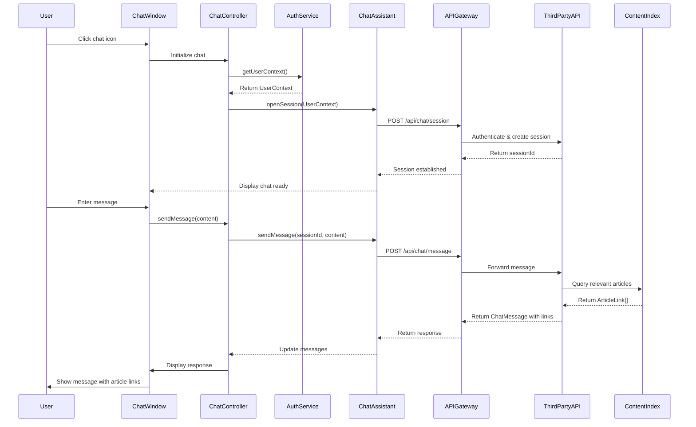

# Low-Level Design: Interactive Chat Assistant in Help Center

**Epic ID:** QE-5245

---

## a. Architecture Mapping

- **Chat Window Component** → Component (`chatWindowComponent`) with Controller (`ChatWindowController`)
- **Chat Assistant API Integration** → Service (`ChatAssistantService`) for third-party API communication
- **Authentication System** → Service (`AuthService`) for user context and session management
- **Help Content Indexing** → Service (`ContentIndexingService`) for article recommendations
- **API Gateway** → Service (`APIGatewayService`) for secure HTTPS routing
- **Real-time Messaging** → Factory (`ChatSocketFactory`) for WebSocket or polling-based communication

**Recommended Folder Structure:**
```
app/
├── modules/
│   └── help-center/
│       ├── components/
│       │   └── chat-window/
│       ├── services/
│       ├── factories/
│       └── views/
└── shared/
    └── services/
```

---

## b. Component Specifications

| Name | Artifact Type | Responsibility | Key Dependencies |
|------|---------------|----------------|------------------|
| chatWindowComponent | Component | Renders chat interface with message history and input field | ChatWindowController, ChatAssistantService |
| ChatWindowController | Controller | Manages chat state, user input, and message display | ChatAssistantService, AuthService |
| ChatAssistantService | Service | Communicates with third-party chat API for conversational AI | APIGatewayService, $http, $q |
| AuthService | Service | Provides user authentication context and session tokens | $http |
| ContentIndexingService | Service | Queries help content index for article recommendations | $http |
| APIGatewayService | Service | Routes all chat requests through secure HTTPS gateway | $http |
| ChatSocketFactory | Factory | Establishes and manages WebSocket connection for real-time messaging | $websocket or polling fallback |

---

## c. Data Model

**ChatMessage**
```javascript
{
  id: String,
  sender: String,
  content: String,
  timestamp: Date,
  type: String,
  articleLinks: Array<ArticleLink>
}
```

**ArticleLink**
```javascript
{
  articleId: String,
  title: String,
  url: String,
  relevanceScore: Number
}
```

**ChatSession**
```javascript
{
  sessionId: String,
  userId: String,
  startTime: Date,
  messages: Array<ChatMessage>,
  isActive: Boolean
}
```

**UserContext**
```javascript
{
  userId: String,
  sessionToken: String,
  displayName: String
}
```

---

## d. Data Flow

User clicks chat icon in Help Center → chatWindowComponent opens and ChatWindowController initializes → AuthService retrieves UserContext (userId, sessionToken) → ChatAssistantService establishes secure connection via APIGatewayService to third-party chat API over HTTPS → User types message and submits → ChatWindowController sends message to ChatAssistantService → Service forwards to API Gateway with user context → Third-party API processes query and calls ContentIndexingService for relevant articles → API returns ChatMessage with answer and ArticleLink array → ChatWindowController updates view model with new message → AngularJS data binding displays response in chat window in real-time.

---

## e. Primary Sequence Diagram



---

## f. Implementation Notes

- Use AngularJS component with isolated scope for chat window to ensure encapsulation and reusability
- Implement dependency injection for all services using ES6 classes with static $inject property
- Use WebSocket via angular-websocket library for real-time messaging with long-polling fallback
- Apply Bootstrap modal or fixed-position chat widget with responsive design for mobile devices
- Integrate third-party chat API via RESTful endpoints with JWT token authentication passed in headers

---

## g. Error Handling

HTTP interceptor captures API errors; ChatAssistantService implements try/catch with fallback to offline mode and displays user notification via toast service.

---

## h. Security Notes

Requires token-based auth via existing SSO; all chat communication over HTTPS; no sensitive user data stored in chat logs.