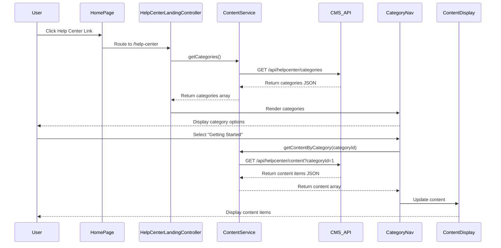

# Low-Level Design: Help Center Integration - Home Page Entry Point and Landing Page

**Epic ID:** QE-5264

---

## a. Architecture Mapping

- **Home Page Entry Point** → AngularJS Directive (`helpCenterLink`) integrated into existing Home Page module
- **Help Center Landing Page** → AngularJS Module (`helpCenter`) with dedicated Controller (`HelpCenterLandingController`)
- **Category Navigation** → AngularJS Component (`categoryNav`) with Controller (`CategoryNavController`)
- **Content Display Area** → AngularJS Component (`contentDisplay`) with Service (`ContentService`) for API calls
- **Error Handling** → AngularJS Interceptor (`httpErrorInterceptor`) for centralized error management

**Recommended Folder Structure:**
```
/app
  /modules
    /helpCenter
      /controllers
        helpCenterLandingController.js
        categoryNavController.js
      /services
        contentService.js
      /directives
        helpCenterLink.js
      /components
        categoryNav.js
        contentDisplay.js
      /views
        landing.html
        categoryNav.html
        contentDisplay.html
      helpCenter.module.js
```

---

## b. Component Specifications

| Name | Artifact Type | Responsibility | Key Dependencies |
|------|---------------|----------------|------------------|
| `helpCenter` | Module | Root module for Help Center functionality | `ngRoute`, `ui.bootstrap` |
| `helpCenterLink` | Directive | Renders Help Center entry point on Home Page | None |
| `HelpCenterLandingController` | Controller | Manages landing page state and category initialization | `ContentService`, `$scope` |
| `CategoryNavController` | Controller | Handles category selection and filtering logic | `ContentService`, `$scope` |
| `categoryNav` | Component | Displays category navigation UI (Getting Started, FAQs, Troubleshooting) | `CategoryNavController` |
| `contentDisplay` | Component | Renders content based on selected category | `ContentService` |
| `ContentService` | Service | Fetches categorized content from CMS via REST API | `$http`, `$q` |
| `httpErrorInterceptor` | Interceptor | Intercepts HTTP errors and displays user-friendly messages | `$q`, `$window` |

---

## c. Data Model

**Category Object:**
```javascript
{
  id: String,
  name: String, // e.g., "Getting Started", "FAQs", "Troubleshooting"
  description: String,
  iconClass: String // CSS class for category icon
}
```

**Content Object:**
```javascript
{
  id: String,
  categoryId: String,
  title: String,
  summary: String,
  contentType: String, // "article", "faq", "video", "download"
  url: String,
  lastUpdated: Date
}
```

---

## d. Data Flow

User navigates to Home Page and clicks the Help Center entry point (directive) → Angular routes to Help Center Landing Page → `HelpCenterLandingController` initializes and calls `ContentService.getCategories()` → Service makes GET request to `/api/helpcenter/categories` → Categories rendered via `categoryNav` component → User selects a category → `CategoryNavController` calls `ContentService.getContentByCategory(categoryId)` → Service makes GET request to `/api/helpcenter/content?categoryId={id}` → Content items displayed in `contentDisplay` component → If API fails, `httpErrorInterceptor` catches error and displays meaningful message to user.

---

## e. Primary Sequence Diagram



---

## f. Implementation Notes

- Use AngularJS 1.x component-based architecture with ES6 classes for controllers and services
- Implement dependency injection via `$inject` annotation for minification safety
- Use `$http` service with promise-based API calls; cache category data using `$cacheFactory` for performance
- Apply Bootstrap responsive grid system (col-xs/sm/md/lg) for mobile/tablet/desktop rendering
- Integrate `$routeProvider` for client-side routing to Help Center landing page (`/help-center`)

---

## g. Error Handling

Interceptor-based approach using `httpErrorInterceptor` to catch API failures and display user-friendly error messages via Bootstrap alerts.

---

## h. Security Notes

Requires HTTPS-only communication; standard input validation and secure API calls assumed with existing SSO token-based authentication.