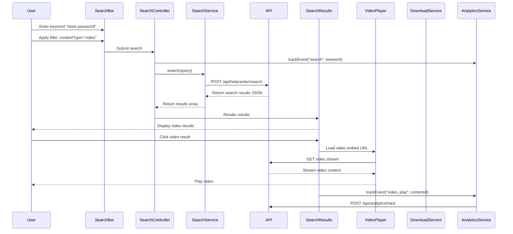

# Low-Level Design: Help Center Content Delivery and Search

**Epic ID:** QE-5265

---

## a. Architecture Mapping

- **Search Interface** → AngularJS Component (`searchBar`) with Controller (`SearchController`)
- **Search Service** → AngularJS Service (`SearchService`) for keyword search and filtering via REST API
- **Content Repository Integration** → AngularJS Service (`ContentService`) extended to support multi-format content retrieval
- **Video Player Component** → AngularJS Directive (`videoPlayer`) wrapping third-party video embed (YouTube/Vimeo)
- **Download Service** → AngularJS Service (`DownloadService`) for file delivery via CDN
- **Analytics Tracker** → AngularJS Service (`AnalyticsService`) for event tracking integration

**Recommended Folder Structure:**
```
/app
  /modules
    /helpCenter
      /controllers
        searchController.js
      /services
        searchService.js
        contentService.js
        downloadService.js
        analyticsService.js
      /directives
        videoPlayer.js
      /components
        searchBar.js
        searchResults.js
      /views
        search.html
        searchResults.html
```

---

## b. Component Specifications

| Name | Artifact Type | Responsibility | Key Dependencies |
|------|---------------|----------------|------------------|
| `searchBar` | Component | Renders search input with filter options (category, content type) | `SearchController` |
| `SearchController` | Controller | Manages search query state and triggers search operations | `SearchService`, `AnalyticsService`, `$scope` |
| `SearchService` | Service | Executes keyword search with filters via REST API | `$http`, `$q` |
| `ContentService` | Service | Fetches content by ID/type (text, FAQ, video, download) | `$http`, `$q` |
| `DownloadService` | Service | Initiates file downloads from CDN | `$window`, `$http` |
| `videoPlayer` | Directive | Embeds and controls video playback (YouTube/Vimeo iframe) | None |
| `AnalyticsService` | Service | Tracks user interactions (searches, views, downloads, video plays) | `$http`, external analytics SDK |
| `searchResults` | Component | Displays search results with inline content rendering | `ContentService`, `DownloadService` |

---

## c. Data Model

**SearchQuery Object:**
```javascript
{
  keyword: String,
  categoryFilter: String, // "all", "getting-started", "faqs", "troubleshooting"
  contentTypeFilter: String, // "all", "article", "faq", "video", "download"
  page: Number,
  pageSize: Number
}
```

**SearchResult Object:**
```javascript
{
  id: String,
  title: String,
  summary: String,
  contentType: String, // "article", "faq", "video", "download"
  categoryId: String,
  url: String, // API endpoint or CDN URL
  videoEmbedUrl: String, // for video content type
  fileSize: String, // for download content type
  relevanceScore: Number
}
```

**AnalyticsEvent Object:**
```javascript
{
  eventType: String, // "search", "view", "download", "video_play"
  contentId: String,
  userId: String,
  timestamp: Date,
  metadata: Object // additional context (e.g., search keyword, video duration)
}
```

---

## d. Data Flow

User enters search keyword and applies filters (category, content type) in `searchBar` component → `SearchController` calls `SearchService.search(query)` → Service makes POST request to `/api/helpcenter/search` with query parameters → Search results returned and rendered in `searchResults` component → User selects a result → For text/FAQ: content displayed inline via `ContentService.getContentById(id)` → For video: `videoPlayer` directive loads video embed URL → For download: `DownloadService.initiateDownload(fileUrl)` triggers file download → All interactions logged via `AnalyticsService.trackEvent(event)` → Analytics sent to `/api/analytics/track` for aggregation and reporting.

---

## e. Primary Sequence Diagram



---

## f. Implementation Notes

- Use AngularJS `ng-model` for two-way binding of search input and filter selections
- Implement debouncing on search input using `$timeout` to reduce API calls (300ms delay)
- Use `$sce.trustAsResourceUrl()` for safe video embed URL binding in `videoPlayer` directive
- Leverage `$window.open()` or `<a download>` attribute for file downloads via `DownloadService`
- Integrate third-party analytics SDK (e.g., Google Analytics) via `AnalyticsService` wrapper for event tracking

---

## g. Error Handling

Interceptor-based error handling with try/catch blocks in services; user notified via Bootstrap toast notifications for search failures or content load errors.

---

## h. Security Notes

Requires token-based auth via existing SSO for API access; HTTPS-only for all content delivery and downloads; validate file types server-side before download initiation.