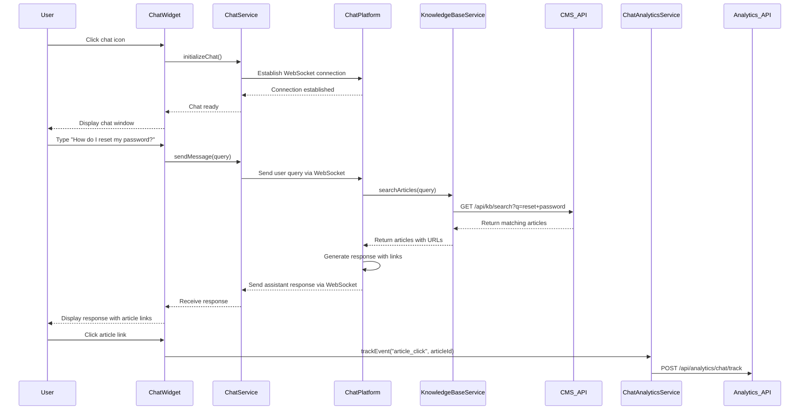

# Low-Level Design: Interactive Chat Assistant Integration

**Epic ID:** QE-5266

---

## a. Architecture Mapping

- **Chat Widget UI** → AngularJS Directive (`chatWidget`) for rendering chat interface on Help Center page
- **Chat Assistant Service** → AngularJS Service (`ChatService`) for WebSocket/REST communication with chat platform
- **Knowledge Base API Integration** → AngularJS Service (`KnowledgeBaseService`) for article retrieval and contextual linking
- **Analytics & Monitoring** → AngularJS Service (`ChatAnalyticsService`) for interaction tracking
- **Support Staff Dashboard** → Separate AngularJS Module (`supportDashboard`) with Controller (`DashboardController`) for monitoring

**Recommended Folder Structure:**
```
/app
  /modules
    /helpCenter
      /directives
        chatWidget.js
      /services
        chatService.js
        knowledgeBaseService.js
        chatAnalyticsService.js
      /views
        chatWidget.html
    /supportDashboard
      /controllers
        dashboardController.js
      /services
        dashboardService.js
      /views
        dashboard.html
```

---

## b. Component Specifications

| Name | Artifact Type | Responsibility | Key Dependencies |
|------|---------------|----------------|------------------|
| `chatWidget` | Directive | Renders chat UI overlay with open/close/minimize controls | `ChatService`, `$scope` |
| `ChatService` | Service | Manages WebSocket connection to chat platform and message exchange | `$websocket` or `$http`, `$q` |
| `KnowledgeBaseService` | Service | Queries CMS/knowledge base for relevant articles based on chat context | `$http`, `$q` |
| `ChatAnalyticsService` | Service | Logs chat interactions (queries, responses, article clicks) for analytics | `$http` |
| `supportDashboard` | Module | Root module for support staff monitoring dashboard | `ngRoute`, `ui.bootstrap` |
| `DashboardController` | Controller | Manages dashboard state and displays aggregated chat analytics | `DashboardService`, `$scope` |
| `DashboardService` | Service | Fetches aggregated chat interaction data for support staff | `$http`, `$q` |

---

## c. Data Model

**ChatMessage Object:**
```javascript
{
  id: String,
  sessionId: String,
  sender: String, // "user" or "assistant"
  message: String,
  timestamp: Date,
  contextLinks: Array // Array of {title: String, url: String} for article links
}
```

**ChatSession Object:**
```javascript
{
  sessionId: String,
  userId: String,
  startTime: Date,
  endTime: Date,
  messages: Array, // Array of ChatMessage objects
  status: String // "active", "closed"
}
```

**AnalyticsData Object:**
```javascript
{
  sessionId: String,
  totalQueries: Number,
  articlesProvided: Number,
  articleClicks: Number,
  sessionDuration: Number, // in seconds
  userSatisfaction: String // optional feedback
}
```

---

## d. Data Flow

User clicks chat icon on Help Center page → `chatWidget` directive initializes and opens chat window → `ChatService` establishes WebSocket connection to chat platform → User types query and submits → Message sent via `ChatService.sendMessage(query)` → Chat platform processes query using NLP → Platform queries `KnowledgeBaseService.searchArticles(query)` via REST API → Relevant articles returned with contextual links → Assistant response with links sent back to user via WebSocket → Response rendered in chat window → User clicks article link → `ChatAnalyticsService.trackEvent("article_click", articleId)` logs interaction → Support staff access aggregated data via `supportDashboard` module calling `DashboardService.getAnalytics()`.

---

## e. Primary Sequence Diagram



---

## f. Implementation Notes

- Use `angular-websocket` library or native WebSocket API wrapped in AngularJS service for real-time communication
- Implement reconnection logic with exponential backoff in `ChatService` for WebSocket disconnections
- Use `$sce.trustAsHtml()` for rendering assistant responses with embedded article links safely
- Apply CSS transitions for chat widget open/close animations; ensure z-index layering for overlay
- Integrate third-party chat platform SDK (e.g., Dialogflow, IBM Watson) via `ChatService` abstraction layer

---

## g. Error Handling

WebSocket connection errors handled with automatic retry and user notification; API failures caught via interceptor with fallback to "Unable to connect" message displayed in chat.

---

## h. Security Notes

Requires token-based auth via existing SSO; no sensitive user data transmitted in chat messages; HTTPS and WSS (secure WebSocket) only; sanitize all user input before sending to chat platform.