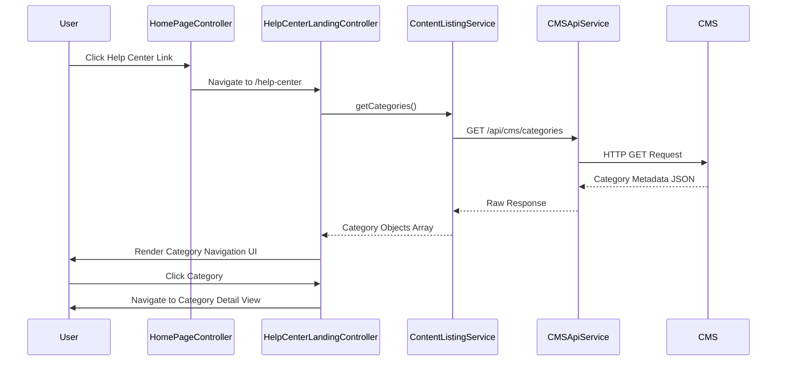

# Low-Level Design: Help Center Integration - Home Page

**Epic ID:** QE-5279

**Technology Stack:** AngularJS 1.x, JavaScript ES6, HTML5, CSS3, Bootstrap, REST APIs, MVC Architecture

---

## a. Architecture Mapping

- **Home Page Navigation** → AngularJS Module: `app.homepage`, Controller: `HomePageController`
- **Help Center Entry Point** → Directive: `helpCenterLink` (navigation component)
- **Help Center Landing Page** → Module: `app.helpCenter`, Controller: `HelpCenterLandingController`, Template: `help-center-landing.html`
- **Category Navigation Component** → Directive: `categoryNav`, Controller: `CategoryNavController`
- **Content Listing Service** → Factory: `ContentListingService` (REST API wrapper)
- **CMS Integration** → Service: `CMSApiService` (HTTP client for content repository)

**Recommended Folder Structure:**
```
/app
  /modules
    /homepage
      homepage.module.js
      homepage.controller.js
      /directives
        help-center-link.directive.js
    /help-center
      help-center.module.js
      help-center-landing.controller.js
      category-nav.controller.js
      /directives
        category-nav.directive.js
      /services
        content-listing.service.js
        cms-api.service.js
      /views
        help-center-landing.html
  /common
    /services
  /assets
    /css
    /images
```

---

## b. Component Specifications

| Name | Artifact Type | Responsibility | Key Dependencies |
|------|---------------|----------------|------------------|
| `app.homepage` | Module | Home page module with Help Center entry point | `ui.router`, `app.helpCenter` |
| `HomePageController` | Controller | Manages Home Page state and navigation | `$scope`, `$state` |
| `helpCenterLink` | Directive | Renders Help Center navigation link/button | `$state` |
| `app.helpCenter` | Module | Help Center feature module | `ui.router`, `ngResource` |
| `HelpCenterLandingController` | Controller | Manages landing page state, fetches categories | `$scope`, `ContentListingService` |
| `CategoryNavController` | Controller | Handles category selection and navigation | `$scope`, `$state` |
| `categoryNav` | Directive | Renders category navigation UI | `CategoryNavController` |
| `ContentListingService` | Factory | Fetches category metadata and content summaries from CMS | `CMSApiService`, `$q` |
| `CMSApiService` | Service | HTTP client for CMS REST API calls | `$http`, `$log` |

---

## c. Data Model

**Category Object:**
```javascript
{
  id: String,              // Unique category identifier
  name: String,            // Display name (e.g., "Getting Started")
  description: String,     // Brief category description
  icon: String,            // Icon URL or class name
  contentCount: Number,    // Number of articles in category
  slug: String             // URL-friendly identifier
}
```

**ContentSummary Object:**
```javascript
{
  id: String,              // Unique content identifier
  title: String,           // Article/content title
  categoryId: String,      // Parent category ID
  type: String,            // "article", "video", "download"
  summary: String,         // Short description
  url: String              // Content URL or route
}
```

---

## d. Data Flow

User clicks the Help Center link on the Home Page → Browser navigates to `/help-center` route → `HelpCenterLandingController` initializes and calls `ContentListingService.getCategories()` → Service invokes `CMSApiService` REST endpoint (`GET /api/cms/categories`) → CMS returns category metadata with content counts → Service transforms response into Category objects → Controller binds categories to `$scope.categories` → `categoryNav` directive renders category tiles with icons and counts → User clicks a category → `CategoryNavController` transitions to category detail view using `$state.go('helpCenter.category', {slug: category.slug})` → Category-specific content is loaded and displayed.

---

## e. Primary Sequence Diagram



---

## f. Implementation Notes

- Use AngularJS `ui.router` for state management with lazy-loaded Help Center module to optimize Home Page load time.
- Implement `ContentListingService` as a factory with `$resource` or `$http` for REST API calls; cache category data using `$cacheFactory` to meet 2-second load requirement.
- Apply Bootstrap responsive grid (col-xs/sm/md/lg) and CSS3 media queries for mobile-first responsive design.
- Use AngularJS DI to inject services into controllers; follow controller-as syntax for cleaner scope management.
- Implement HTTP interceptor for global error handling and loading states; ensure WCAG 2.1 AA compliance with ARIA labels on navigation elements.

---

## g. Error Handling

HTTP interceptor captures API failures, displays user-friendly error messages via Bootstrap alert component, and logs errors to console; fallback to cached category data if CMS is unavailable.

---

## h. Security Notes

Standard input validation and secure API calls assumed; all CMS API calls over HTTPS with existing SSO token-based authentication.