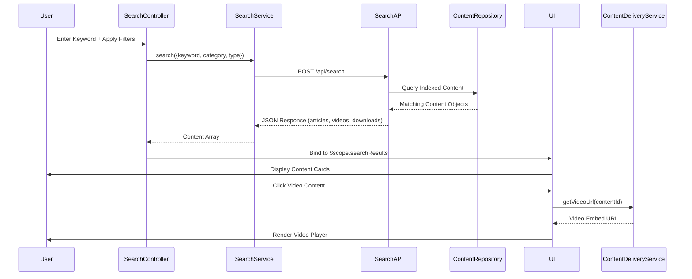

# Low-Level Design: Multi-Format Help Content Delivery with Search

**Epic ID:** QE-5280

**Technology Stack:** AngularJS 1.x, JavaScript ES6, HTML5, CSS3, Bootstrap, REST APIs, MVC Architecture

---

## a. Architecture Mapping

- **Help Center UI** → AngularJS Module: `app.helpCenter`, Controller: `HelpContentController`
- **Search Component** → Directive: `contentSearch`, Controller: `SearchController`
- **Filter Component** → Directive: `contentFilter`, Controller: `FilterController`
- **Content Delivery Service** → Factory: `ContentDeliveryService` (REST API wrapper)
- **Search Service** → Factory: `SearchService` (search API integration)
- **Video Player Component** → Directive: `videoPlayer` (embedded video rendering)
- **Download Manager** → Service: `DownloadService` (file download handling)
- **Content Repository Integration** → Service: `ContentApiService` (HTTP client for CMS)

**Recommended Folder Structure:**
```
/app
  /modules
    /help-center
      /controllers
        help-content.controller.js
        search.controller.js
        filter.controller.js
      /directives
        content-search.directive.js
        content-filter.directive.js
        video-player.directive.js
      /services
        content-delivery.service.js
        search.service.js
        download.service.js
        content-api.service.js
      /views
        help-content.html
        search-results.html
```

---

## b. Component Specifications

| Name | Artifact Type | Responsibility | Key Dependencies |
|------|---------------|----------------|------------------|
| `HelpContentController` | Controller | Manages content display state and user interactions | `$scope`, `ContentDeliveryService`, `SearchService` |
| `SearchController` | Controller | Handles search query input and result display | `$scope`, `SearchService`, `$timeout` |
| `FilterController` | Controller | Manages category and content type filters | `$scope`, `$state` |
| `contentSearch` | Directive | Renders search input with autocomplete | `SearchController` |
| `contentFilter` | Directive | Renders filter dropdowns for category/type | `FilterController` |
| `videoPlayer` | Directive | Embeds and controls video playback | `$sce`, `ContentDeliveryService` |
| `ContentDeliveryService` | Factory | Fetches content (articles, videos, downloads) from CMS/CDN | `ContentApiService`, `$q`, `$cacheFactory` |
| `SearchService` | Factory | Executes keyword search with filters against search API | `$http`, `$q` |
| `DownloadService` | Service | Handles secure file downloads with progress tracking | `$http`, `$window` |
| `ContentApiService` | Service | HTTP client for content repository REST API | `$http`, `$log` |

---

## c. Data Model

**Content Object:**
```javascript
{
  id: String,              // Unique content identifier
  title: String,           // Content title
  type: String,            // "article", "video", "download"
  category: String,        // Category name or ID
  description: String,     // Content summary
  url: String,             // Content URL (article link, video embed URL, download URL)
  thumbnailUrl: String,    // Thumbnail image URL (for videos)
  fileSize: String,        // File size (for downloads, e.g., "2.5 MB")
  duration: String,        // Video duration (e.g., "5:30")
  keywords: Array,         // Array of keyword strings for search indexing
  createdDate: Date        // Content creation timestamp
}
```

**SearchQuery Object:**
```javascript
{
  keyword: String,         // User search keyword
  category: String,        // Selected category filter (optional)
  contentType: String,     // Selected content type filter (optional)
  page: Number,            // Pagination page number
  pageSize: Number         // Results per page
}
```

---

## d. Data Flow

User enters search keyword in `contentSearch` directive or selects category/type filter → `SearchController` calls `SearchService.search(query)` with filters → Service sends REST request to search API (`POST /api/search`) with query parameters → Search API queries indexed content repository and returns matching Content objects → Service caches results and returns to controller → Controller binds results to `$scope.searchResults` → UI renders content cards (articles, video thumbnails, download links) using ng-repeat → User clicks video content → `videoPlayer` directive fetches embed URL via `ContentDeliveryService` and renders player using `$sce.trustAsResourceUrl()` → User clicks download link → `DownloadService` initiates secure HTTPS download via `$window.open()` or blob download → Analytics event logged for each interaction.

---

## e. Primary Sequence Diagram



---

## f. Implementation Notes

- Use AngularJS `$http` with interceptors for all API calls; implement request caching via `$cacheFactory` to meet 2-second load time requirement.
- Apply debouncing on search input using `$timeout` (300ms delay) to reduce API calls during typing.
- Use `$sce.trustAsResourceUrl()` for video embed URLs to prevent XSS; validate all URLs server-side before returning to client.
- Implement lazy loading for video thumbnails using `ng-src` with placeholder images; use CDN URLs for all static content.
- Bootstrap grid and CSS3 flexbox for responsive content card layout; ensure WCAG 2.1 AA compliance with keyboard navigation and ARIA labels.

---

## g. Error Handling

HTTP interceptor captures API errors (search, content delivery), displays Bootstrap alert with retry option, and logs to console; fallback to cached results if search API is unavailable.

---

## h. Security Notes

All content delivery over HTTPS; token-based authentication via existing SSO for API access; server-side validation of all file downloads to prevent unauthorized access.