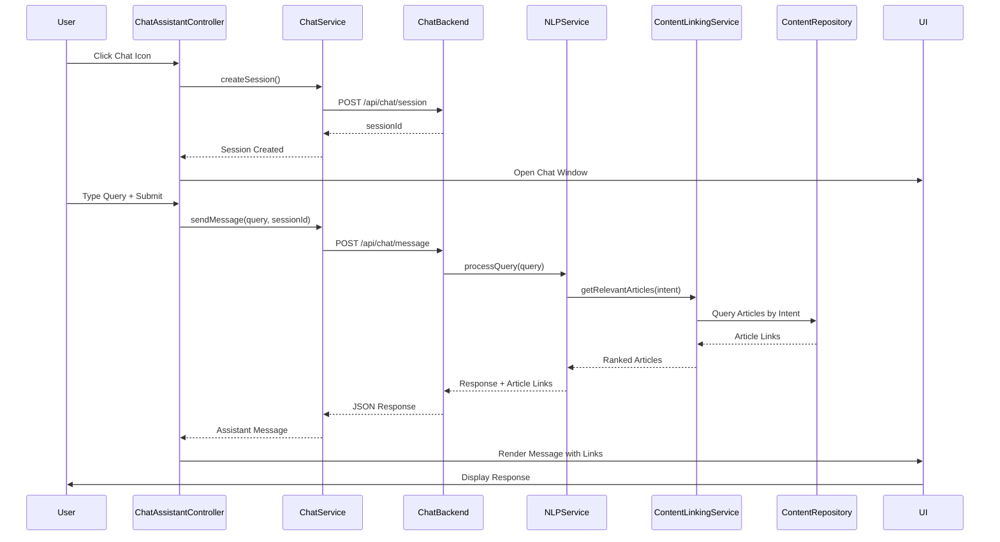

# Low-Level Design: Interactive Chat Assistant

**Epic ID:** QE-5281

**Technology Stack:** AngularJS 1.x, JavaScript ES6, HTML5, CSS3, Bootstrap, REST APIs, MVC Architecture

---

## a. Architecture Mapping

- **Help Center Landing Page** → AngularJS Module: `app.helpCenter`, Controller: `HelpCenterLandingController`
- **Chat Assistant UI Component** → Directive: `chatAssistant`, Controller: `ChatAssistantController`
- **Chat Window** → Template: `chat-assistant.html` with Bootstrap modal/fixed panel
- **Chat Backend Service** → Factory: `ChatService` (WebSocket or REST API wrapper)
- **NLP/Query Processing** → Service: `NLPService` (integration with NLP engine API)
- **Help Content Repository Integration** → Service: `ContentLinkingService` (article retrieval and linking)
- **Analytics Integration** → Service: `ChatAnalyticsService` (interaction logging)

**Recommended Folder Structure:**
```
/app
  /modules
    /help-center
      /controllers
        chat-assistant.controller.js
      /directives
        chat-assistant.directive.js
      /services
        chat.service.js
        nlp.service.js
        content-linking.service.js
        chat-analytics.service.js
      /views
        chat-assistant.html
```

---

## b. Component Specifications

| Name | Artifact Type | Responsibility | Key Dependencies |
|------|---------------|----------------|------------------|
| `chatAssistant` | Directive | Renders chat UI window with open/close controls | `ChatAssistantController`, `$timeout` |
| `ChatAssistantController` | Controller | Manages chat session state, message history, user input | `$scope`, `ChatService`, `ChatAnalyticsService` |
| `ChatService` | Factory | Sends user queries to chat backend and receives responses | `$http`, `$q`, `$websocket` (optional) |
| `NLPService` | Service | Processes user queries via NLP engine API to extract intent and retrieve relevant articles | `$http`, `ContentLinkingService` |
| `ContentLinkingService` | Service | Fetches help article links based on query intent from content repository | `$http`, `$log` |
| `ChatAnalyticsService` | Service | Logs chat interactions (queries, responses, clicks) to analytics platform | `$http` |

---

## c. Data Model

**ChatMessage Object:**
```javascript
{
  id: String,              // Unique message identifier
  sender: String,          // "user" or "assistant"
  text: String,            // Message text content
  timestamp: Date,         // Message timestamp
  articleLinks: Array,     // Array of linked article objects (for assistant messages)
  sessionId: String        // Chat session identifier
}
```

**ArticleLink Object:**
```javascript
{
  id: String,              // Article identifier
  title: String,           // Article title
  url: String,             // Article URL or route
  relevanceScore: Number   // NLP relevance score (0-1)
}
```

**ChatSession Object:**
```javascript
{
  sessionId: String,       // Unique session identifier
  userId: String,          // User identifier (optional, for logged-in users)
  startTime: Date,         // Session start timestamp
  messages: Array,         // Array of ChatMessage objects
  status: String           // "active", "closed"
}
```

---

## d. Data Flow

User clicks chat icon on Help Center landing page → `chatAssistant` directive opens chat window with 2-second load time → `ChatAssistantController` initializes new session via `ChatService.createSession()` → User types query and submits → Controller calls `ChatService.sendMessage(query)` → Service sends POST request to chat backend (`POST /api/chat/message`) with query and sessionId → Backend invokes `NLPService` to process query → NLP engine analyzes query, extracts intent, and calls `ContentLinkingService.getRelevantArticles(intent)` → Service queries content repository for matching articles → Backend returns response with message text and article links → `ChatService` receives response and updates controller → Controller appends assistant message with article links to `$scope.messages` → UI renders message with clickable article links → `ChatAnalyticsService` logs interaction metadata to analytics platform → User clicks article link → Browser navigates to article; click event logged to analytics.

---

## e. Primary Sequence Diagram



---

## f. Implementation Notes

- Use AngularJS directive with isolated scope for `chatAssistant` to ensure reusability; implement chat window as Bootstrap fixed-bottom panel or modal.
- Use `$http` for REST API calls to chat backend; consider WebSocket (`$websocket` or `socket.io-client`) for real-time message streaming if required.
- Implement session management with sessionId stored in `$scope` or `sessionStorage`; use `$timeout` for typing indicators and message animations.
- Apply CSS3 transitions for smooth chat window open/close; ensure WCAG 2.1 AA compliance with keyboard navigation (Tab, Enter, Esc) and ARIA live regions for screen readers.
- Use AngularJS `ng-repeat` with `track by message.id` for efficient message list rendering; implement auto-scroll to latest message using `$timeout` and `scrollIntoView()`.

---

## g. Error Handling

HTTP interceptor captures chat API errors, displays inline error message in chat window with retry button, and logs errors to console; fallback to static help links if NLP service is unavailable.

---

## h. Security Notes

All chat communication over HTTPS with token-based authentication via existing SSO; no sensitive user data (passwords, payment info) exposed in chat; input sanitization on both client and server to prevent XSS.