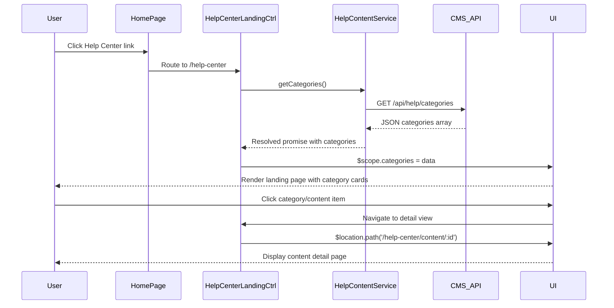

# Low-Level Design: Help Center Integration - Home Page Entry Point and Landing Page

**Epic ID:** QE-5294

---

## a. Architecture Mapping

- **Home Page Module** → AngularJS Module (`app.homePage`) with updated navigation template
- **Help Center Entry Point** → Directive (`helpCenterEntryPoint`) injected into Home Page navigation
- **Help Center Landing Page** → AngularJS Module (`app.helpCenter`) with dedicated route
- **Category Navigation** → Controller (`CategoryNavigationCtrl`) managing category state
- **Content Display** → Component (`contentCardList`) rendering category previews
- **Responsive Layout** → CSS3 media queries + Bootstrap grid in templates
- **Content API Integration** → Service (`HelpContentService`) fetching categorized content from CMS

**Recommended Folder Structure:**
```
/app
  /modules
    /home-page
      home-page.module.js
      home-page.controller.js
      home-page.html
    /help-center
      help-center.module.js
      help-center.routes.js
      help-center-landing.controller.js
      help-center-landing.html
      category-navigation.controller.js
      content-card-list.component.js
  /services
    help-content.service.js
  /directives
    help-center-entry-point.directive.js
  /styles
    help-center.css
```

---

## b. Component Specifications

| Component Name | Artifact Type | Responsibility | Key Dependencies |
|---|---|---|---|
| `app.homePage` | Module | Hosts Home Page with Help Center entry point | `ui.router`, `helpCenterEntryPoint` directive |
| `helpCenterEntryPoint` | Directive | Renders Help Center link/button in Home Page navigation | None |
| `app.helpCenter` | Module | Main Help Center module with routing and landing page | `ui.router`, `HelpContentService` |
| `HelpCenterLandingCtrl` | Controller | Manages landing page state, fetches categories, handles user interactions | `HelpContentService`, `$scope` |
| `CategoryNavigationCtrl` | Controller | Manages category selection and filtering | `$scope`, `$location` |
| `contentCardList` | Component | Displays category content cards with preview/links | Bindings: `categories` |
| `HelpContentService` | Factory | Fetches categorized help content from CMS REST API | `$http`, `$q` |

---

## c. Data Model

**Category Object:**
```javascript
{
  id: String,
  name: String, // "Getting Started", "FAQs", "Troubleshooting"
  description: String,
  iconUrl: String,
  contentItems: Array<ContentItem>
}
```

**ContentItem Object:**
```javascript
{
  id: String,
  title: String,
  type: String, // "article", "faq", "video"
  summary: String,
  url: String,
  thumbnailUrl: String
}
```

---

## d. Data Flow

User navigates to Home Page → Home Page renders with `helpCenterEntryPoint` directive displaying Help Center link in navigation → User clicks link → `ui.router` transitions to `/help-center` route → `HelpCenterLandingCtrl` initializes and calls `HelpContentService.getCategories()` → Service makes GET request to CMS REST API (`/api/help/categories`) → API returns JSON array of Category objects with nested ContentItems → Controller stores categories in `$scope.categories` → `contentCardList` component renders category cards using Bootstrap grid and CSS3 media queries for responsive layout → User clicks category or content item → Controller navigates to detail view using `$location.path()`.

---

## e. Primary Sequence Diagram



---

## f. Implementation Notes

- Use AngularJS `ui.router` for state-based routing with lazy-loaded templates for Help Center module.
- Inject `HelpContentService` via AngularJS DI; service uses `$http` with promise-based API calls and `$q` for error handling.
- Apply Bootstrap grid classes (`col-xs-12`, `col-md-4`) and CSS3 media queries for responsive layout across desktop/tablet/mobile.
- Use `ng-repeat` with `track by category.id` for efficient category card rendering.
- Implement ARIA labels (`aria-label`, `role="navigation"`) and keyboard navigation (`tabindex`, `ng-keypress`) for WCAG 2.1 AA compliance.

---

## g. Error Handling

HTTP interceptor captures API errors, logs to console, and displays user-friendly notification using `$rootScope.$broadcast('apiError')` with fallback UI message.

---

## h. Security Notes

Requires HTTPS-only delivery; CMS API secured via existing token-based authentication with session validation on each request.