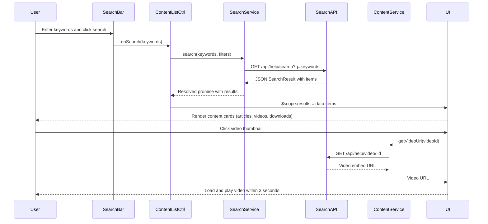

# Low-Level Design: Help Center Content Access and Search

**Epic ID:** QE-5295

---

## a. Architecture Mapping

- **Search & Content UI** → AngularJS Module (`app.helpCenter.content`) with search input component and content list view
- **Search Input** → Component (`searchBar`) with two-way binding and debounce
- **Content List** → Controller (`ContentListCtrl`) managing search results and content display
- **Content Item Renderers** → Directives (`articleCard`, `videoPlayer`, `downloadLink`) for each content type
- **Search Service** → Factory (`SearchService`) calling search API with keyword queries
- **Content Delivery Service** → Factory (`ContentService`) fetching content metadata and URLs
- **Video Playback** → Directive (`videoEmbed`) wrapping third-party video player
- **File Download** → Service (`DownloadService`) generating signed URLs for secure file access

**Recommended Folder Structure:**
```
/app
  /modules
    /help-center
      /content
        content.module.js
        content-list.controller.js
        content-list.html
        search-bar.component.js
  /services
    search.service.js
    content.service.js
    download.service.js
  /directives
    article-card.directive.js
    video-embed.directive.js
    download-link.directive.js
  /styles
    content.css
```

---

## b. Component Specifications

| Component Name | Artifact Type | Responsibility | Key Dependencies |
|---|---|---|---|
| `app.helpCenter.content` | Module | Manages content browsing and search functionality | `ui.router`, `SearchService`, `ContentService` |
| `searchBar` | Component | Captures user search input with debounce, triggers search on Enter/button click | Bindings: `onSearch` callback |
| `ContentListCtrl` | Controller | Manages search state, fetches results, handles content type filtering | `SearchService`, `ContentService`, `$scope` |
| `articleCard` | Directive | Renders text article preview with title, summary, and link | Scope: `article` object |
| `videoEmbed` | Directive | Embeds video player with accessibility controls and 3-second load target | Scope: `videoUrl`, integrates third-party player API |
| `downloadLink` | Directive | Renders download button with secure signed URL from DownloadService | Scope: `fileId`, `DownloadService` |
| `SearchService` | Factory | Sends keyword queries to search API, returns ranked results | `$http`, `$q` |
| `ContentService` | Factory | Fetches content metadata by ID or category from CMS API | `$http`, `$q` |
| `DownloadService` | Factory | Generates signed URLs for file downloads via backend API | `$http` |

---

## c. Data Model

**SearchQuery Object:**
```javascript
{
  keywords: String,
  filters: Object, // { contentType: ["article", "video", "faq", "download"], category: String }
  page: Number,
  limit: Number
}
```

**SearchResult Object:**
```javascript
{
  totalResults: Number,
  items: Array<ContentItem>
}
```

**ContentItem Object:**
```javascript
{
  id: String,
  type: String, // "article", "faq", "video", "download"
  title: String,
  summary: String,
  url: String, // For articles/FAQs
  videoUrl: String, // For videos
  fileId: String, // For downloads
  thumbnailUrl: String
}
```

---

## d. Data Flow

User enters keywords in `searchBar` component → Component debounces input (300ms) and calls `onSearch` callback → `ContentListCtrl` receives query and calls `SearchService.search(keywords, filters)` → Service sends GET request to `/api/help/search?q=keywords&type=article,video,faq,download` → API returns JSON SearchResult with ranked items → Controller updates `$scope.results` → View renders content items using type-specific directives (`articleCard`, `videoEmbed`, `downloadLink`) → User clicks video → `videoEmbed` directive loads player from third-party platform with signed URL → User clicks download → `DownloadService.getSignedUrl(fileId)` calls `/api/help/download/:fileId` → API returns signed URL → Browser initiates HTTPS download.

---

## e. Primary Sequence Diagram



---

## f. Implementation Notes

- Use `ng-model` with `ng-model-options="{ debounce: 300 }"` in `searchBar` for debounced search input.
- `SearchService` uses `$http.get()` with query params; implement client-side caching via `$cacheFactory` for repeated queries.
- `videoEmbed` directive wraps third-party player (e.g., YouTube IFrame API, Vimeo Player) with `$sce.trustAsResourceUrl()` for secure URL binding.
- `DownloadService` calls backend API to generate time-limited signed URLs; use `window.open()` or hidden `<a>` element with `download` attribute for file download.
- Apply `ng-repeat` with `track by item.id` for efficient result list rendering; use `ng-switch` on `item.type` to select appropriate directive.

---

## g. Error Handling

HTTP interceptor catches API errors; display inline error messages using `ng-show` with `$scope.errorMessage` and retry button for failed requests.

---

## h. Security Notes

All API calls over HTTPS; video URLs validated via `$sce`; download URLs are signed with expiration tokens generated server-side; standard input validation on search queries.