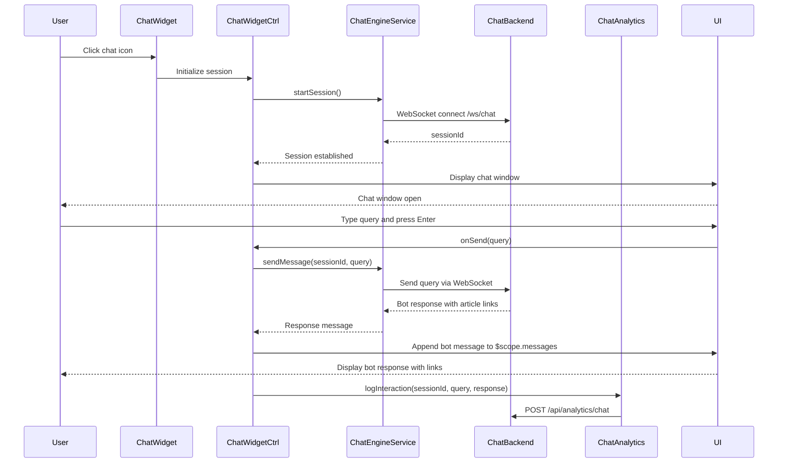

# Low-Level Design: Interactive Chat Assistant

**Epic ID:** QE-5296

---

## a. Architecture Mapping

- **Chat Assistant UI** → AngularJS Component (`chatWidget`) with collapsible window and message list
- **Chat Window Controller** → Controller (`ChatWidgetCtrl`) managing session state and message flow
- **Chat Engine Integration** → Service (`ChatEngineService`) handling WebSocket/HTTPS connection to backend chat service
- **Message Display** → Directive (`messageList`) rendering user and bot messages with timestamps
- **Input Handler** → Component (`chatInput`) capturing user queries with Enter key support
- **NLP/Query Processing** → Backend service consumed via REST API (not AngularJS artifact)
- **Analytics Tracking** → Service (`ChatAnalyticsService`) logging interactions to monitoring system

**Recommended Folder Structure:**
```
/app
  /modules
    /help-center
      /chat
        chat.module.js
        chat-widget.component.js
        chat-widget.controller.js
        chat-widget.html
        chat-input.component.js
        message-list.directive.js
  /services
    chat-engine.service.js
    chat-analytics.service.js
  /styles
    chat-widget.css
```

---

## b. Component Specifications

| Component Name | Artifact Type | Responsibility | Key Dependencies |
|---|---|---|---|
| `chatWidget` | Component | Renders collapsible chat window with open/close toggle and message area | `ChatWidgetCtrl`, `ChatEngineService` |
| `ChatWidgetCtrl` | Controller | Manages chat session lifecycle, message array, user input, and bot responses | `ChatEngineService`, `ChatAnalyticsService`, `$scope` |
| `chatInput` | Component | Captures user text input with Enter key submission and character limit | Bindings: `onSend` callback |
| `messageList` | Directive | Displays scrollable message history with user/bot message styling | Scope: `messages` array |
| `ChatEngineService` | Factory | Establishes WebSocket or HTTPS connection to chat backend, sends queries, receives responses | `$websocket` or `$http`, `$q` |
| `ChatAnalyticsService` | Factory | Logs chat interactions (queries, responses, session duration) to analytics API | `$http` |

---

## c. Data Model

**ChatSession Object:**
```javascript
{
  sessionId: String,
  userId: String,
  startTime: Date,
  messages: Array<Message>,
  isActive: Boolean
}
```

**Message Object:**
```javascript
{
  id: String,
  sender: String, // "user" or "bot"
  text: String,
  timestamp: Date,
  links: Array<Link> // Optional: links to help articles
}
```

**Link Object:**
```javascript
{
  title: String,
  url: String
}
```

---

## d. Data Flow

User clicks chat icon on Help Center page → `chatWidget` component initializes and `ChatWidgetCtrl` calls `ChatEngineService.startSession()` → Service establishes WebSocket connection to `/ws/chat` or opens HTTPS polling to `/api/chat/session` → Backend returns `sessionId` → User types query in `chatInput` and presses Enter → Component calls `onSend(query)` → Controller appends user message to `$scope.messages` and calls `ChatEngineService.sendMessage(sessionId, query)` → Service sends query to backend → Backend NLP module processes query, retrieves relevant help articles, and returns bot response with links → Service receives response and resolves promise → Controller appends bot message with links to `$scope.messages` → `messageList` directive updates view with new message → `ChatAnalyticsService.logInteraction()` sends interaction data to `/api/analytics/chat` for monitoring.

---

## e. Primary Sequence Diagram



---

## f. Implementation Notes

- Use `angular-websocket` library or native WebSocket with AngularJS `$rootScope.$apply()` for real-time message updates; fallback to HTTPS polling if WebSocket unavailable.
- Inject `ChatEngineService` and `ChatAnalyticsService` via DI; services use `$http` for REST calls and `$q` for promise-based async handling.
- Apply `ng-repeat` with `track by message.id` for efficient message list rendering; use `ng-class` to style user vs. bot messages differently.
- Implement auto-scroll to bottom of `messageList` using `$timeout` and `scrollTop` manipulation after message append.
- Add ARIA live region (`aria-live="polite"`) to message list for screen reader announcements; ensure keyboard focus management with `tabindex` and `ng-keypress`.

---

## g. Error Handling

WebSocket connection errors trigger fallback to HTTPS polling; failed message sends display retry button; all errors logged via `ChatAnalyticsService` with user notification toast.

---

## h. Security Notes

WebSocket and HTTPS connections secured via existing token-based authentication; all messages transmitted over WSS/HTTPS; input sanitized server-side to prevent XSS.