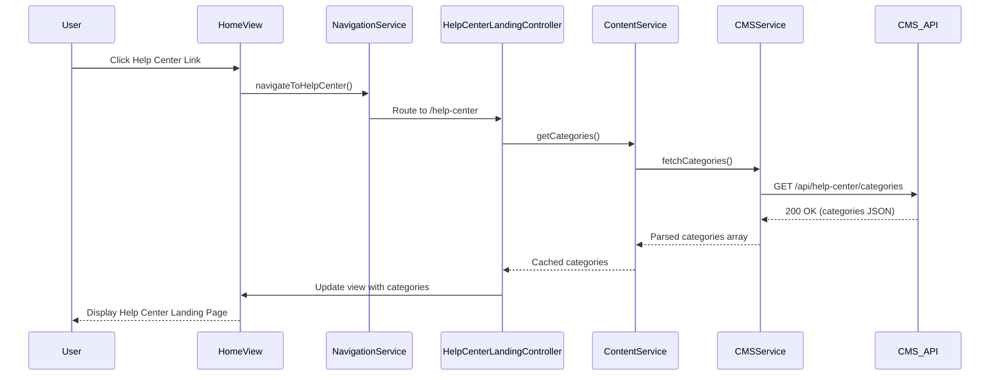

# Low-Level Design: Help Center Integration - Home Page Entry Point and Landing Page

**Epic ID:** QE-5309

**Technology Stack:** AngularJS 1.x, JavaScript ES6, HTML5, CSS3, Bootstrap, REST APIs, MVC Architecture

---

## a. Architecture Mapping

- **Home Page Component** → AngularJS Module: `homeModule`, Controller: `HomeController`
- **Help Center Entry Point** → Directive: `helpCenterLink` (navigation bar integration)
- **Help Center Landing Page** → Module: `helpCenterModule`, Controller: `HelpCenterLandingController`, View: `help-center-landing.html`
- **Navigation Service** → Factory: `NavigationService` (routing and state management)
- **Content Categories Component** → Controller: `CategoryController`, Service: `ContentService`
- **CMS Integration** → Service: `CMSService` (REST API calls to content repository)
- **Responsive UI Layer** → Bootstrap grid system + custom CSS3 media queries

**Recommended Folder Structure:**
```
/app
  /modules
    /home
      home.module.js
      home.controller.js
    /help-center
      help-center.module.js
      help-center-landing.controller.js
      category.controller.js
  /services
    navigation.service.js
    content.service.js
    cms.service.js
  /directives
    help-center-link.directive.js
  /views
    /help-center
      help-center-landing.html
  /assets
    /css
      help-center.css
```

---

## b. Component Specifications

| Name | Artifact Type | Responsibility | Key Dependencies |
|------|---------------|----------------|------------------|
| `homeModule` | Module | Main home page module registration | `ngRoute`, `helpCenterModule` |
| `HomeController` | Controller | Manages home page state and navigation triggers | `NavigationService` |
| `helpCenterLink` | Directive | Renders Help Center entry point in navigation bar | `NavigationService` |
| `helpCenterModule` | Module | Help Center feature module registration | `ngRoute`, `CMSService` |
| `HelpCenterLandingController` | Controller | Manages landing page state, category display | `ContentService`, `CMSService` |
| `CategoryController` | Controller | Handles category selection and navigation | `ContentService`, `$state` |
| `NavigationService` | Factory | Provides routing and state transition methods | `$location`, `$state` |
| `ContentService` | Service | Fetches and caches category metadata | `CMSService`, `$q` |
| `CMSService` | Service | REST API integration with content repository | `$http`, `$q` |

---

## c. Data Model

**Category Object:**
```javascript
{
  id: String,              // Unique category identifier
  name: String,            // Display name (e.g., "Getting Started")
  description: String,     // Brief category description
  iconUrl: String,         // Category icon URL
  contentCount: Number,    // Number of articles in category
  order: Number            // Display order
}
```

**HelpCenterConfig Object:**
```javascript
{
  categories: Array<Category>,  // List of available categories
  landingPageTitle: String,     // Page title
  landingPageSubtitle: String   // Page subtitle
}
```

---

## d. Data Flow

User navigates to Home Page → `HomeController` renders view with `helpCenterLink` directive in navigation bar → User clicks Help Center link → `NavigationService.navigateToHelpCenter()` triggers route change to `/help-center` → `HelpCenterLandingController` initializes and calls `ContentService.getCategories()` → `ContentService` invokes `CMSService.fetchCategories()` which makes REST API call to CMS → Response parsed and cached → Categories rendered in responsive grid using Bootstrap → User selects category → `CategoryController` handles click event and routes to category detail view.

---

## e. Primary Sequence Diagram



---

## f. Implementation Notes

- Use AngularJS `$routeProvider` for routing; define `/help-center` route with `HelpCenterLandingController` and template.
- Implement dependency injection for all services and controllers using explicit array notation for minification safety.
- Use `$http` service with promise chaining for REST API calls; implement response caching in `ContentService` using `$cacheFactory`.
- Apply Bootstrap responsive grid (`col-xs-*`, `col-md-*`) for category layout; add custom CSS3 media queries for fine-tuned mobile optimization.
- Ensure WCAG 2.1 AA compliance: add `aria-label` attributes, support keyboard navigation with `tabindex`, and test with screen readers.

---

## g. Error Handling

Use `$http` interceptor to catch API errors (404, 500, timeouts); display user-friendly error messages via toast notification service and provide retry option.

---

## h. Security Notes

Requires HTTPS for all API calls; standard input validation and secure API calls assumed; no authentication required for public Help Center content.