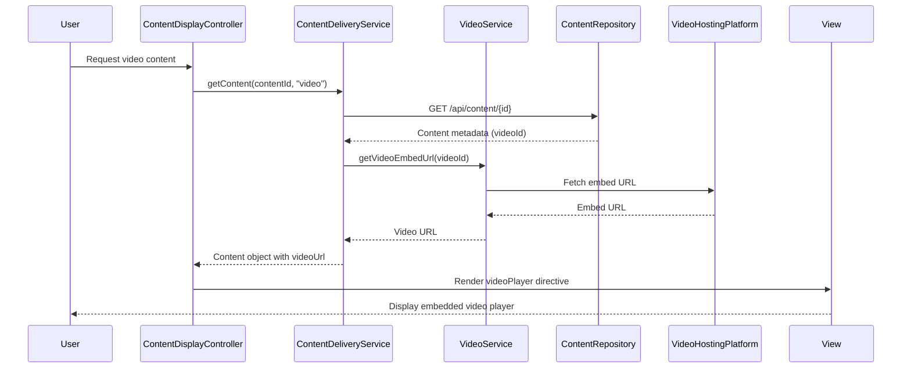

# Low-Level Design: Help Center Content Delivery - Multi-Format Support

**Epic ID:** QE-5310

**Technology Stack:** AngularJS 1.x, JavaScript ES6, HTML5, CSS3, Bootstrap, REST APIs, MVC Architecture

---

## a. Architecture Mapping

- **Content Display Component** → Module: `contentModule`, Controller: `ContentDisplayController`, View: `content-display.html`
- **Text Article Renderer** → Directive: `textArticle` (renders HTML/Markdown content)
- **Video Player Component** → Directive: `videoPlayer` (embeds video player)
- **Download Manager** → Service: `DownloadService` (handles file download requests)
- **Content Delivery Service** → Service: `ContentDeliveryService` (orchestrates content retrieval)
- **Video Integration** → Service: `VideoService` (fetches video embed URLs)
- **CDN Integration** → Service: `CDNService` (retrieves downloadable file URLs)
- **Error Handler** → Factory: `ErrorHandlerService` (centralized error management)

**Recommended Folder Structure:**
```
/app
  /modules
    /content
      content.module.js
      content-display.controller.js
  /services
    content-delivery.service.js
    video.service.js
    cdn.service.js
    download.service.js
    error-handler.service.js
  /directives
    text-article.directive.js
    video-player.directive.js
  /views
    /content
      content-display.html
  /assets
    /css
      content-display.css
```

---

## b. Component Specifications

| Name | Artifact Type | Responsibility | Key Dependencies |
|------|---------------|----------------|------------------|
| `contentModule` | Module | Content feature module registration | `ngRoute`, `ngSanitize` |
| `ContentDisplayController` | Controller | Manages content display logic based on type | `ContentDeliveryService`, `ErrorHandlerService` |
| `textArticle` | Directive | Renders sanitized HTML/Markdown text content | `$sce`, `$sanitize` |
| `videoPlayer` | Directive | Embeds video player with responsive iframe | `VideoService`, `$sce` |
| `ContentDeliveryService` | Service | Orchestrates content retrieval by type | `$http`, `VideoService`, `CDNService`, `$q` |
| `VideoService` | Service | Fetches video embed URLs from content repository | `$http`, `$q` |
| `CDNService` | Service | Retrieves CDN URLs for downloadable files | `$http`, `$q` |
| `DownloadService` | Service | Initiates file downloads via CDN URLs | `$window` |
| `ErrorHandlerService` | Factory | Handles API failures and displays user messages | `ToastService` |

---

## c. Data Model

**Content Object:**
```javascript
{
  id: String,              // Unique content identifier
  type: String,            // "text", "video", or "download"
  title: String,           // Content title
  body: String,            // HTML content (for text type)
  videoUrl: String,        // Embed URL (for video type)
  downloadUrl: String,     // CDN URL (for download type)
  fileSize: Number,        // File size in bytes (for download type)
  fileName: String,        // File name (for download type)
  metadata: Object         // Additional metadata (author, date, etc.)
}
```

**ContentResponse Object:**
```javascript
{
  content: Content,        // Content object
  status: String,          // "success" or "error"
  errorMessage: String     // Error details if status is "error"
}
```

---

## d. Data Flow

User requests content (text/video/download) → `ContentDisplayController` calls `ContentDeliveryService.getContent(contentId, type)` → Service retrieves metadata from Content Repository via REST API → For text: HTML/JSON returned and sanitized via `$sce` → For video: `VideoService` fetches embed URL, `videoPlayer` directive renders responsive iframe → For downloads: `CDNService` retrieves CDN URL, `DownloadService.initiateDownload()` triggers browser download → On error: `ErrorHandlerService` intercepts failure, displays toast notification with retry option → UI updates with content or error message.

---

## e. Primary Sequence Diagram



---

## f. Implementation Notes

- Use `ngSanitize` module and `$sce.trustAsHtml()` for safe HTML rendering in text articles; sanitize all user-facing content.
- Implement `videoPlayer` directive with responsive iframe using Bootstrap embed classes (`embed-responsive`, `embed-responsive-16by9`).
- Use `$http` service with timeout configuration (3s for video, 2s for text/downloads) to meet performance requirements.
- Implement `DownloadService` using `$window.open(cdnUrl, '_blank')` or anchor element with `download` attribute for file downloads.
- All API calls must use HTTPS; enforce via `$httpProvider` interceptor that validates protocol.

---

## g. Error Handling

Use `$http` interceptor to catch 404, 500, and timeout errors; `ErrorHandlerService` displays toast notifications with meaningful messages and retry/alternative content options.

---

## h. Security Notes

Requires HTTPS for all content delivery; video embed URLs sanitized via `$sce.trustAsResourceUrl()`; standard input validation and secure API calls assumed.