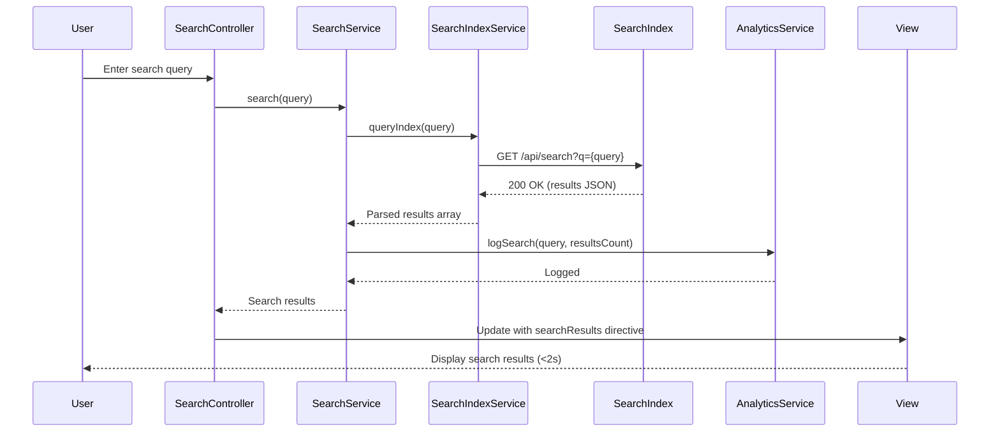

# Low-Level Design: Self-Service Support - Search and Chat Assistant

**Epic ID:** QE-5311

**Technology Stack:** AngularJS 1.x, JavaScript ES6, HTML5, CSS3, Bootstrap, REST APIs, MVC Architecture

---

## a. Architecture Mapping

- **Search Component** → Module: `searchModule`, Controller: `SearchController`, View: `search.html`
- **Search Input** → Directive: `searchBox` (keyword input with autocomplete)
- **Search Results Display** → Directive: `searchResults` (renders result list)
- **Chat Assistant Component** → Module: `chatModule`, Controller: `ChatController`, View: `chat-widget.html`
- **Chat Window** → Directive: `chatWindow` (interactive chat interface)
- **Search Service** → Service: `SearchService` (queries search index)
- **Chat Assistant Service** → Service: `ChatAssistantService` (processes chat messages)
- **Analytics Tracker** → Service: `AnalyticsService` (logs interactions)
- **Search Index Integration** → Service: `SearchIndexService` (REST API to search system)
- **Chat Engine Integration** → Service: `ChatEngineService` (REST API to chat platform)

**Recommended Folder Structure:**
```
/app
  /modules
    /search
      search.module.js
      search.controller.js
    /chat
      chat.module.js
      chat.controller.js
  /services
    search.service.js
    chat-assistant.service.js
    analytics.service.js
    search-index.service.js
    chat-engine.service.js
  /directives
    search-box.directive.js
    search-results.directive.js
    chat-window.directive.js
  /views
    /search
      search.html
    /chat
      chat-widget.html
  /assets
    /css
      search.css
      chat.css
```

---

## b. Component Specifications

| Name | Artifact Type | Responsibility | Key Dependencies |
|------|---------------|----------------|------------------|
| `searchModule` | Module | Search feature module registration | `ngRoute` |
| `SearchController` | Controller | Manages search state, query submission, results display | `SearchService`, `AnalyticsService` |
| `searchBox` | Directive | Renders search input with debounce and autocomplete | `SearchService` |
| `searchResults` | Directive | Displays paginated search results | None |
| `chatModule` | Module | Chat assistant feature module registration | `ngRoute` |
| `ChatController` | Controller | Manages chat session, message history, user input | `ChatAssistantService`, `AnalyticsService` |
| `chatWindow` | Directive | Renders interactive chat interface with message bubbles | None |
| `SearchService` | Service | Orchestrates search queries and result processing | `SearchIndexService`, `$q` |
| `ChatAssistantService` | Service | Processes chat messages and retrieves automated responses | `ChatEngineService`, `$q` |
| `AnalyticsService` | Service | Logs search queries, chat interactions, and user actions | `$http` |
| `SearchIndexService` | Service | REST API integration with search indexing system | `$http`, `$q` |
| `ChatEngineService` | Service | REST API integration with chat platform | `$http`, `$q` |

---

## c. Data Model

**SearchQuery Object:**
```javascript
{
  query: String,           // User search keyword
  timestamp: Date,         // Query timestamp
  filters: Object          // Optional filters (category, type)
}
```

**SearchResult Object:**
```javascript
{
  id: String,              // Content identifier
  title: String,           // Result title
  snippet: String,         // Content excerpt
  url: String,             // Link to full content
  relevanceScore: Number,  // Search ranking score
  type: String             // Content type (article, video, FAQ)
}
```

**ChatMessage Object:**
```javascript
{
  id: String,              // Message identifier
  sender: String,          // "user" or "assistant"
  text: String,            // Message content
  timestamp: Date,         // Message timestamp
  links: Array<String>     // Related resource links
}
```

**ChatSession Object:**
```javascript
{
  sessionId: String,       // Unique session identifier
  messages: Array<ChatMessage>,  // Message history
  startTime: Date,         // Session start timestamp
  active: Boolean          // Session status
}
```

---

## d. Data Flow

User enters search query in `searchBox` directive → Input debounced (300ms) → `SearchController` calls `SearchService.search(query)` → `SearchIndexService` makes REST API call to search system → Results returned within 2s → `AnalyticsService.logSearch(query)` tracks interaction → Results rendered via `searchResults` directive. For chat: User opens chat widget → `ChatController` initializes session via `ChatAssistantService.startSession()` → User sends message → `ChatEngineService` processes message via REST API to chat platform → Automated response with resource links returned → `AnalyticsService.logChatInteraction()` tracks message → Response displayed in `chatWindow` directive → User clicks link to navigate to content.

---

## e. Primary Sequence Diagram



---

## f. Implementation Notes

- Implement `searchBox` directive with `ng-model-options="{ debounce: 300 }"` to reduce API calls and improve performance.
- Use `$http` service with 2s timeout for search queries; implement response caching in `SearchService` using `$cacheFactory` for repeated queries.
- Implement `chatWindow` directive with scrollable message container; use `$anchorScroll` to auto-scroll to latest message.
- Use WebSocket or long-polling for real-time chat updates if required; otherwise use REST API with polling interval (5s).
- Inject `AnalyticsService` into both `SearchController` and `ChatController`; log all user interactions asynchronously without blocking UI.

---

## g. Error Handling

Use `$http` interceptor to catch API errors and timeouts; display inline error messages in search results or chat window with retry option.

---

## h. Security Notes

Requires HTTPS for all API calls; no sensitive data exposure in search queries or chat messages; standard input validation and secure API calls assumed.