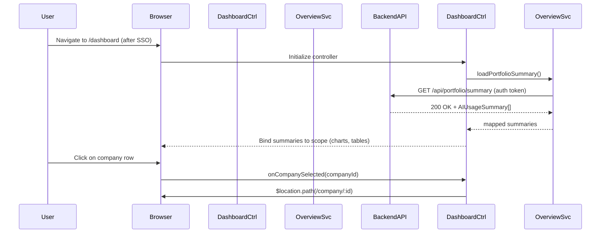

# AI Portfolio Management Dashboard – LLD (Epic QE-5349)

## a. Architecture Mapping (brief)
- Portfolio AI Overview Dashboard → `app.portfolioDashboard` module, `PortfolioDashboardCtrl` controller, `portfolioOverviewService` service.
- Cloud Provider Integrations (AWS/Azure/GCP) → `cloudIntegrationService` service, `cloudAdapterFactory` factory.
- Role & Access Management → `rbacService` service, `UserAdminCtrl` controller.
- Alerts & Notifications (budget, data freshness) → `alertService` service, `NotificationCtrl` controller.
- Reporting & Exports (PDF/Excel) → `reportService` service, `ReportCtrl` controller.
- Drill-down Company Analytics → `CompanyDetailCtrl` controller, `companyDetailService` service, `companyUsageDirective` directive.
- Benchmarking & Simulation Tools → `BenchmarkCtrl` controller, `benchmarkService` service.
- Authentication & SSO Integration → `authService` service, HTTP interceptor.

**Recommended folder structure**
- `app/`
  - `app.module.js`
  - `core/`
    - `services/auth.service.js`
    - `services/rbac.service.js`
    - `services/cloud-integration.service.js`
    - `services/alert.service.js`
    - `services/report.service.js`
    - `services/benchmark.service.js`
    - `factories/cloud-adapter.factory.js`
    - `interceptors/http-auth.interceptor.js`
  - `dashboard/`
    - `portfolio-dashboard.controller.js`
    - `portfolio-dashboard.view.html`
  - `company-detail/`
    - `company-detail.controller.js`
    - `company-detail.view.html`
    - `company-usage.directive.js`
  - `admin/`
    - `user-admin.controller.js`
    - `admin.view.html`
  - `reports/`
    - `report.controller.js`
    - `report.view.html`
  - `notifications/`
    - `notification.controller.js`
    - `notification.view.html`
  - `assets/css/`
    - `styles.css`

## b. Component Specifications (table)

| Name | Artifact Type | Responsibility (1 line) | Key Dependencies |
| --- | --- | --- | --- |
| `app.portfolioDashboard` | Module | Root AngularJS module wiring routes, core services, and feature modules. | `ngRoute`, `ui.bootstrap`, core services |
| `PortfolioDashboardCtrl` | Controller | Drive main AI portfolio dashboard view, load summary KPIs and charts. | `portfolioOverviewService`, `alertService`, `$routeParams` |
| `portfolioOverviewService` | Service | Fetch aggregated AI usage/spend and data freshness per company. | `$http`, `authService`, `API_CONFIG` |
| `cloudIntegrationService` | Service | Orchestrate data ingestion status from AWS/Azure/GCP APIs per company. | `$http`, `authService`, `cloudAdapterFactory` |
| `cloudAdapterFactory` | Factory | Provide provider-specific adapter instances (AWS/Azure/GCP) with uniform interface. | None (returns adapter objects using config) |
| `UserAdminCtrl` | Controller | Manage users, roles, and company-level access assignments. | `rbacService`, `authService`, `$uibModal` |
| `rbacService` | Service | Handle role-based access checks, permission mapping, and assignments. | `$http`, `authService`, `SESSION_STORE` |
| `NotificationCtrl` | Controller | Display alerts (budget, data freshness, system warnings) to users. | `alertService`, `$interval` |
| `alertService` | Service | Evaluate thresholds and fetch/subscribe to alert events from backend. | `$http`, `authService`, `portfolioOverviewService` |
| `ReportCtrl` | Controller | Coordinate generation and download of PDF/Excel reports from backend. | `reportService`, `$window` |
| `reportService` | Service | Request server-side exports and return downloadable URLs/blobs. | `$http`, `authService` |
| `CompanyDetailCtrl` | Controller | Present drill-down AI usage for a single company (by dept/project). | `companyDetailService`, `$routeParams` |
| `companyDetailService` | Service | Retrieve detailed metrics for one company, including freshness metadata. | `$http`, `authService` |
| `companyUsageDirective` | Directive | Render reusable charts/tables for AI usage per dimension. | `portfolioOverviewService`, `chart.js` wrapper |
| `BenchmarkCtrl` | Controller | Provide UI for cross-company benchmarking and scenario simulations. | `benchmarkService`, `portfolioOverviewService` |
| `benchmarkService` | Service | Compute benchmarks, scenarios, and cost-saving projections via APIs. | `$http`, `authService` |
| `authService` | Service | Wrap SSO token handling, login state, and attach tokens to requests. | `$http`, `$window`, `SESSION_STORE` |
| `httpAuthInterceptor` | Interceptor | Inject auth headers, handle 401s, and broadcast auth events. | `$q`, `authService`, `$rootScope` |
| `appRoutes` | Config | Define routes for dashboard, company detail, admin, and reports. | `$routeProvider` |
| `styles.css` | CSS | Provide Bootstrap-aligned styling for responsive dashboard UI. | Bootstrap base CSS |

## c. Data Model (brief)

- `User` (JS object)
  - `id: string`
  - `name: string`
  - `email: string`
  - `role: 'EnterpriseAdmin' | 'OperatingPartner' | 'DealPartner' | 'GeneralPartner'`
  - `companyIds: string[]` (companies user can access)

- `Company` (JS object)
  - `id: string`
  - `name: string`
  - `sector: string`
  - `currency: string`
  - `country: string`

- `AIUsageSummary` (JS object)
  - `companyId: string`
  - `totalSpend: number` (USD)
  - `usageHours: number`
  - `lastUpdatedUtc: string` (ISO timestamp)
  - `isFresh: boolean`
  - `budgetThreshold: number`
  - `isBudgetBreached: boolean`

- `AIUsageDetail` (JS object)
  - `companyId: string`
  - `dimension: 'department' | 'project'`
  - `items: AIUsageDetailItem[]`

- `AIUsageDetailItem` (JS object)
  - `id: string`
  - `name: string`
  - `spend: number`
  - `usageHours: number`
  - `providerBreakdown: ProviderUsage[]`

- `ProviderUsage` (JS object)
  - `provider: 'AWS' | 'Azure' | 'GCP' | 'Other'`
  - `spend: number`
  - `usageHours: number`

- `Alert` (JS object)
  - `id: string`
  - `companyId: string`
  - `type: 'BUDGET_THRESHOLD' | 'STALE_DATA'`
  - `severity: 'info' | 'warning' | 'critical'`
  - `message: string`
  - `createdAtUtc: string`

- `BenchmarkSnapshot` (JS object)
  - `companyId: string`
  - `peerGroup: string`
  - `spendPerUnit: number`
  - `adoptionScore: number`
  - `industryAverageSpendPerUnit: number`

- `SimulationScenario` (JS object)
  - `id: string`
  - `name: string`
  - `baselineSpend: number`
  - `projectedSpend: number`
  - `parameters: object` (e.g., `vendorMix`, `usageReductionPercent`)

## d. Data Flow (one paragraph)

User logs into the AI Portfolio Management Dashboard via SSO, triggering `authService` to store tokens, then navigates to the main dashboard route where `PortfolioDashboardCtrl` initializes and asks `portfolioOverviewService` to load portfolio-level AI usage summaries, which in turn calls backend REST APIs through `$http` (using `httpAuthInterceptor` for auth headers); the returned JSON is transformed into `AIUsageSummary` objects, bound to the HTML5/Bootstrap view for charts and tables, and user interactions such as filtering or selecting a company invoke controller methods that call `companyDetailService` or `benchmarkService`, which call REST APIs again and update the bound models, causing AngularJS two-way binding to refresh the UI without full page reloads.

## e. Primary Sequence Diagram (ONE only)

## f. Implementation Notes (brief)
- Use AngularJS 1.x modules per feature area, wiring dependencies via DI (`$inject`) with minification-safe arrays.
- Implement REST calls with `$http` returning ES6 Promises, composing responses with `.then` and mapping to typed JS objects.
- Centralize API base URLs and endpoints in `API_CONFIG` constant to avoid duplication and ease environment changes.
- Use Bootstrap grid and responsive utilities for card-based KPIs and tables, with AngularJS directives for reusable charts.
- Apply route guards in controllers (using `rbacService`) to hide or redirect unauthorized views based on user role.

## g. Error Handling (ONE line)

Client-side errors handled via a centralized `$http` interceptor and controller-level `.catch` blocks that surface concise Bootstrap alerts and log diagnostics to the backend.

## h. Security Notes (ONE line)

Standard input validation and secure API calls assumed, with SSO-based authentication, role-based authorization enforced in `rbacService`, and all REST calls made over TLS with bearer tokens.
