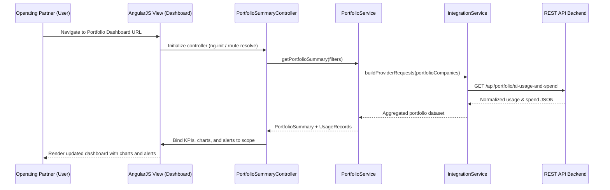

# LLD – AI Portfolio Management Dashboard (Epic QE-5364)

## a. Architecture Mapping (brief)

- Global AI Dashboard Shell → `app.aiDashboard` AngularJS module, `DashboardLayoutController`, layout directives.
- Portfolio Summary View → `PortfolioSummaryController`, `portfolio-summary` directive, `PortfolioService`.
- Company Drill-down View → `CompanyDetailController`, `company-detail` directive, `CompanyService`.
- AI Usage & Spend Analytics → `AnalyticsService`, `UsageChartController`, `ai-usage-chart` directive.
- Budget Threshold Alerts → `AlertService`, `AlertController`, `ai-alert-banner` directive.
- Integrations with Cloud Providers (AWS/Azure/GCP) → `IntegrationService`, `CloudProviderFactory`.
- Role-Based Access Control (RBAC) → `AuthService`, `RbacService`, `authInterceptor` (HTTP interceptor).
- Reporting (PDF/Excel exports) → `ReportService`, `ReportController`.
- Notifications (email / in-app) → `NotificationService`, `notification-toast` directive.
- Data Freshness & Health Indicators → `HealthService`, `data-freshness-badge` directive.

Recommended folder structure:
- `app/`
  - `core/` (config, routing, interceptors, constants)
  - `services/` (portfolio, company, analytics, integration, auth, rbac, report, notification, health)
  - `components/`
    - `dashboard/` (summary, widgets, alerts)
    - `company-detail/`
    - `reports/`
  - `directives/` (charts, tables, badges, toasts)
  - `views/` (html templates)
  - `assets/` (styles, images)

---

## b. Component Specifications (table format)

| Name | Artifact Type | Responsibility (1 line) | Key Dependencies |
|------|---------------|-------------------------|------------------|
| app.aiDashboard | AngularJS Module | Root module wiring routes, core services, and layout components | `ngRoute`, `ngResource`, feature modules |
| DashboardLayoutController | Controller | Controls global layout, navigation, and high-level filters | `PortfolioService`, `$location` |
| PortfolioSummaryController | Controller | Loads and presents consolidated AI usage and spend across portfolio | `PortfolioService`, `AnalyticsService` |
| CompanyDetailController | Controller | Shows drill-down AI usage for a single company by department/project | `CompanyService`, `AnalyticsService`, `$routeParams` |
| UsageChartController | Controller | Binds processed analytics data to chart directives/widgets | `AnalyticsService` |
| AlertController | Controller | Manages display and acknowledgement of budget and data-freshness alerts | `AlertService`, `NotificationService` |
| ReportController | Controller | Handles generation and download of PDF/Excel reports from current dashboard state | `ReportService`, `$window` |
| AuthController | Controller | Manages login/logout and triggers SSO or token acquisition flows | `AuthService` |
| PortfolioService | Service | Fetches portfolio-level AI usage, spend, and summary KPIs via REST APIs | `$http`, `IntegrationService` |
| CompanyService | Service | Fetches company-level and department/project-level usage and spend details | `$http`, `IntegrationService` |
| AnalyticsService | Service | Transforms raw usage/spend into charts, benchmarks, and derived metrics | none (pure JS + lodash/moment if used) |
| AlertService | Service | Evaluates thresholds and retrieves alert state for companies and portfolio | `$http`, `PortfolioService` |
| IntegrationService | Service | Normalizes data from AWS/Azure/GCP integration endpoints into common schema | `$http`, `CloudProviderFactory` |
| CloudProviderFactory | Factory | Provides provider-specific API endpoint configuration and mapping rules | none (static config) |
| AuthService | Service | Manages auth tokens, SSO integration, and current-user session info | `$http`, `$window`, `$q` |
| RbacService | Service | Evaluates role-based permissions and filters accessible companies/features | `AuthService` |
| ReportService | Service | Generates report payloads and triggers server-side PDF/Excel exports | `$http` |
| NotificationService | Service | Centralized in-app toast and optional email notification triggering | none (UI only) |
| HealthService | Service | Calculates and exposes data freshness indicators and health flags | `PortfolioService`, `CompanyService` |
| ai-usage-chart | Directive | Renders AI usage/spend charts for portfolio or company scopes | `UsageChartController`, chart lib (e.g., Chart.js) |
| portfolio-summary | Directive | Composes summary KPIs, charts, and alerts into the main dashboard widget | `PortfolioSummaryController` |
| company-detail | Directive | Container for company drill-down widget set and navigation | `CompanyDetailController` |
| ai-alert-banner | Directive | Displays budget threshold and data freshness alerts with concise messaging | `AlertController` |
| data-freshness-badge | Directive | Shows data age indicator with tooltip on hover | `HealthService` |
| notification-toast | Directive | Displays ephemeral toast notifications for alerts, exports, errors | `NotificationService` |
| authInterceptor | HTTP Interceptor | Injects auth tokens into API requests and handles 401/403 responses | `$q`, `AuthService`, `$injector` |
| routingConfig | Config | Defines routes for dashboard, company detail, reports, and auth | `$routeProvider` |

---

## c. Data Model (brief)

Core JS objects/models (ES6-style, but implemented as plain objects or constructor functions):

- `User`
  - `id: string`
  - `name: string`
  - `email: string`
  - `role: 'EnterpriseAdmin' | 'OperatingPartner' | 'DealPartner' | 'GeneralPartner'`
  - `assignedCompanyIds: string[]`

- `Company`
  - `id: string`
  - `name: string`
  - `sector: string`
  - `country: string`
  - `aiBudgetMonthly: number`
  - `aiSpendMonthly: number`
  - `cloudProviders: string[]` // e.g., [`'AWS'`, `'Azure'`, `'GCP'`]
  - `lastDataSyncAt: string` // ISO timestamp

- `UsageRecord`
  - `companyId: string`
  - `provider: 'AWS' | 'Azure' | 'GCP' | string`
  - `serviceName: string`
  - `department: string`
  - `project: string`
  - `usageMetric: string` // e.g., "GPU_HOURS", "API_CALLS"
  - `usageValue: number`
  - `spendAmount: number`
  - `periodStart: string` // ISO date
  - `periodEnd: string` // ISO date

- `PortfolioSummary`
  - `totalCompanies: number`
  - `totalMonthlySpend: number`
  - `totalMonthlyBudget: number`
  - `avgUtilizationRate: number`
  - `aiAdoptionIndex: number`
  - `benchmarkComparisons: BenchmarkEntry[]`

- `BenchmarkEntry`
  - `dimension: string` // e.g., "sector", "companySize"
  - `portfolioValue: number`
  - `industryAverage: number`

- `Alert`
  - `id: string`
  - `companyId: string`
  - `type: 'BUDGET_THRESHOLD' | 'DATA_FRESHNESS'`
  - `severity: 'LOW' | 'MEDIUM' | 'HIGH'`
  - `message: string`
  - `createdAt: string`
  - `acknowledged: boolean`

- `ReportRequest`
  - `id: string`
  - `scope: 'PORTFOLIO' | 'COMPANY'`
  - `companyId?: string`
  - `format: 'PDF' | 'XLSX'`
  - `filters: object`
  - `requestedByUserId: string`
  - `requestedAt: string`

- `Report`
  - `id: string`
  - `requestId: string`
  - `downloadUrl: string`
  - `status: 'PENDING' | 'READY' | 'FAILED'`
  - `generatedAt: string`

---

## d. Data Flow (one paragraph)

When a user logs into the AI Portfolio Management Dashboard, the AngularJS view triggers the appropriate route and controller (e.g., `PortfolioSummaryController`), which uses `RbacService` to determine accessible companies and then calls `PortfolioService` to fetch consolidated AI usage and spend data via REST APIs; `IntegrationService` normalizes provider-specific payloads, `AnalyticsService` derives KPIs and benchmarks, and the controllers bind this data to HTML5/Bootstrap views composed of directives (such as `portfolio-summary`, `ai-usage-chart`, and `data-freshness-badge`), after which AngularJS digest cycles update the UI in real time as responses arrive, with alerts and notifications pushed to the `ai-alert-banner` and `notification-toast` components.

---

## e. Primary Sequence Diagram (ONE only)

---

## f. Implementation Notes (brief)

- Use a single `app.aiDashboard` AngularJS module with feature sub-modules and DI for controllers/services/directives.
- Implement REST calls using `$http` with ES6-style promises (`$q`) and centralize API base URLs in a config constant.
- Normalize all provider responses in `IntegrationService` to a common `UsageRecord` structure before analytics.
- Use reusable directives for charts and badges, binding via isolated scopes for clear component contracts.
- Secure all routes with a resolve that checks `AuthService`/`RbacService` before loading dashboard views.

---

## g. Error Handling (ONE line)

Use an `$http` interceptor to handle API errors globally, logging details and surfacing user-friendly toast messages via `NotificationService`.

---

## h. Security Notes (ONE line)

Enforce role-based access control on all AngularJS routes and REST calls, with tokens stored securely and all communication over TLS; standard input validation and secure API calls assumed.
