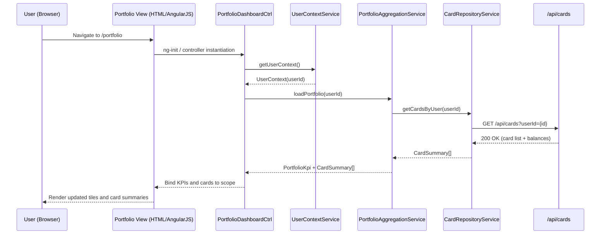

# QE-5376 – Credit Card Portfolio Dashboard LLD

## a. Architecture Mapping (brief)
- Portfolio Dashboard UI → AngularJS module `ccPortfolioDashboard`, controller `PortfolioDashboardCtrl`, service `PortfolioAggregationService`.
- Auth/User Context Service → AngularJS service `UserContextService` consuming REST `/api/user/context`.
- Cards Data Source/Repository → AngularJS service `CardRepositoryService` consuming REST `/api/cards`.
- KPI Computation (monthly spend, total limit, available credit, outstanding) → AngularJS service `KpiComputationService`.
- Responsive Layout & Widgets → AngularJS directives `ccKpiTile`, `ccCardSummaryPanel` with Bootstrap-based HTML/CSS.

**Recommended folder structure**
- `app/portfolio/portfolio.module.js`
- `app/portfolio/portfolio.controller.js`
- `app/portfolio/portfolio.services.js`
- `app/portfolio/portfolio.directives.js`
- `app/portfolio/portfolio.templates.html`
- `assets/css/portfolio-dashboard.css`

## b. Component Specifications

| Name                     | Artifact Type  | Responsibility (1 line)                                           | Key Dependencies                                   |
|--------------------------|----------------|--------------------------------------------------------------------|----------------------------------------------------|
| ccPortfolioDashboard     | Module         | Root module wiring controllers, services, and directives for dashboard | AngularJS `ngRoute`, `ngResource`                  |
| PortfolioDashboardCtrl   | Controller     | Orchestrates loading of portfolio KPIs and binds data to views    | UserContextService, PortfolioAggregationService    |
| UserContextService       | Service        | Retrieves authenticated user context and card ownership metadata  | `$http`, `/api/user/context` REST API              |
| CardRepositoryService    | Service        | Fetches card list, limits, balances, and recent transactions      | `$http`, `/api/cards`, `/api/cards/{id}` APIs      |
| PortfolioAggregationService | Service    | Aggregates per-card data into portfolio KPIs and normalizes payloads | CardRepositoryService, KpiComputationService   |
| KpiComputationService    | Service        | Computes monthly spend, total credit limit, available credit, outstanding | None (pure JS)                          |
| ccKpiTile                | Directive      | Renders a single KPI tile with responsive layout                  | PortfolioDashboardCtrl scope, Bootstrap CSS        |
| ccCardSummaryPanel       | Directive      | Renders grid/list of cards with key summary info and navigation   | PortfolioDashboardCtrl scope, Bootstrap components |
| ApiErrorInterceptor      | Factory        | Intercepts HTTP errors and maps them to user-friendly messages    | `$q`, `$injector`, `$log`                          |

## c. Data Model (brief)
- `UserContext`: `{ userId: string, name: string, segment: string, preferredCurrency: string }`
- `CardSummary`: `{ cardId: string, maskedNumber: string, issuer: string, creditLimit: number, availableCredit: number, outstandingAmount: number, currency: string }`
- `PortfolioKpi`: `{ monthSpend: number, totalCreditLimit: number, totalAvailableCredit: number, totalOutstandingAmount: number, currency: string }`
- `DashboardState`: `{ isLoading: boolean, errorCode: string|null, cards: CardSummary[], kpi: PortfolioKpi|null, lastRefreshedAt: Date }`

## d. Data Flow (one paragraph)
When the user opens the portfolio dashboard, the AngularJS route loads `PortfolioDashboardCtrl`, which first calls `UserContextService` to get the logged-in user ID, then invokes `PortfolioAggregationService` to fetch all cards via `CardRepositoryService` and compute a `PortfolioKpi` with `KpiComputationService`; once the REST API responses return, the controller updates `DashboardState` on `$scope`, triggering `ccKpiTile` and `ccCardSummaryPanel` directives to re-render the responsive HTML5/Bootstrap view with the latest KPIs and card summaries.

## e. Primary Sequence Diagram (ONE only)

## f. Implementation Notes (brief)
- Use a dedicated AngularJS module `ccPortfolioDashboard` with dependency injection for all services and controllers.
- Prefer ES6 classes (transpiled if needed) for services like `PortfolioAggregationService` and `KpiComputationService` to keep logic cohesive.
- Use `$http` with centralized `ApiErrorInterceptor` for consistent REST API integration and error mapping.
- Apply one-way bindings (`::`) for static labels and limit digest cycles in high-KPI sections.
- Leverage Bootstrap grid system and mobile-first CSS to ensure responsive dashboard behavior without complex JS layout logic.

## g. Error Handling (ONE line)
HTTP errors are handled via a centralized `$http` interceptor that logs details and shows a concise toast/banner message on the dashboard.

## h. Security Notes (ONE line)
Standard input validation and secure API calls assumed, with all portfolio data scoped to the authenticated user context returned by the backend.
