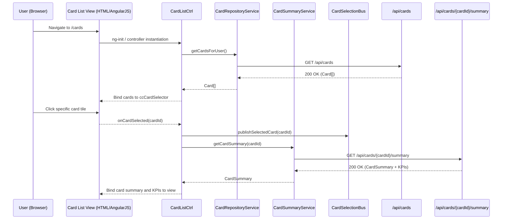

# QE-5377 – Multiple Credit Card Management LLD

## a. Architecture Mapping (brief)
- Card List & Selection UI → AngularJS module `ccCardManager`, controller `CardListCtrl`, directive `ccCardSelector`.
- Card Summary Service → AngularJS service `CardSummaryService` consuming REST `/api/cards/{cardId}/summary`.
- Card Data Repository → AngularJS service `CardRepositoryService` wrapping base card APIs.
- Dashboard KPI Aggregator → AngularJS service `CardKpiAggregatorService` feeding selected-card KPIs.
- Shared Dashboard Integration → AngularJS factory `CardSelectionBus` (pub/sub) to broadcast selected card across views.

**Recommended folder structure**
- `app/cards/cards.module.js`
- `app/cards/cards.controller.js`
- `app/cards/cards.services.js`
- `app/cards/cards.directives.js`
- `app/cards/cards.templates.html`

## b. Component Specifications

| Name                  | Artifact Type  | Responsibility (1 line)                                            | Key Dependencies                             |
|-----------------------|----------------|---------------------------------------------------------------------|----------------------------------------------|
| ccCardManager         | Module         | Groups card management controllers, services, and directives       | AngularJS `ngResource`, `ccPortfolioDashboard` |
| CardListCtrl          | Controller     | Loads user cards, handles card selection/filtering, updates view   | CardRepositoryService, CardSelectionBus      |
| CardSummaryService    | Service        | Retrieves per-card credit limit, available credit, and outstanding | `$http`, `/api/cards/{cardId}/summary`       |
| CardRepositoryService | Service        | Provides list of cards and base metadata for the current user      | `$http`, `/api/cards`                        |
| CardKpiAggregatorService | Service    | Aligns dashboard KPIs with the currently selected card             | CardSummaryService                           |
| CardSelectionBus      | Factory        | Publishes and subscribes to card selection events across modules   | `$rootScope`                                 |
| ccCardSelector        | Directive      | Renders card list/tiles with click handlers for selection          | CardListCtrl scope, Bootstrap list/tile UI   |
| ccCardMiniSummary     | Directive      | Shows compact panel of selected card KPIs for reuse in header      | CardKpiAggregatorService, CardSelectionBus   |
| ApiErrorInterceptor   | Factory        | Normalizes HTTP error responses and exposes them to controllers    | `$q`, `$injector`, `$log`                    |

## c. Data Model (brief)
- `Card`: `{ cardId: string, alias: string, maskedNumber: string, issuer: string, isPrimary: boolean }`
- `CardSummary`: `{ cardId: string, creditLimit: number, availableCredit: number, outstandingAmount: number, currency: string, lastUpdated: Date }`
- `CardSelectionState`: `{ selectedCardId: string|null, filterText: string, cards: Card[], isLoading: boolean }`
- `CardKpi`: `{ cardId: string, spendThisMonth: number, utilizationPercent: number, currency: string }`

## d. Data Flow (one paragraph)
When the user opens the cards area, the route instantiates `CardListCtrl`, which calls `CardRepositoryService` to fetch the user’s `Card[]` and binds them to `ccCardSelector`; upon user click on a card tile, `CardListCtrl` updates `CardSelectionState.selectedCardId` and emits through `CardSelectionBus`, then `CardKpiAggregatorService` invokes `CardSummaryService` via REST to get the latest `CardSummary`/`CardKpi`, and subscribed directives like `ccCardMiniSummary` and any hosting dashboard controllers update their views with the selected card’s metrics.

## e. Primary Sequence Diagram (ONE only)

## f. Implementation Notes (brief)
- Use a dedicated module `ccCardManager` and separate services file to keep card-specific logic modular and testable.
- Use ES6 arrow functions and `const/let` within services/controllers to keep code concise and predictable.
- Implement `CardSelectionBus` with `$rootScope.$emit/$on` or `$broadcast` pattern, but restrict events to a defined namespace.
- Configure `$httpProvider.interceptors` with `ApiErrorInterceptor` to centralize REST error handling for all card APIs.
- Ensure card list templates use `track by card.cardId` in `ng-repeat` to optimize DOM updates when switching cards.

## g. Error Handling (ONE line)
Client-side errors are handled through a shared `$http` interceptor and fallback messages shown inline on the card list and summary panels.

## h. Security Notes (ONE line)
Standard input validation and secure API calls assumed, with server enforcing that only cards linked to the authenticated user are returned for listing and summary.
