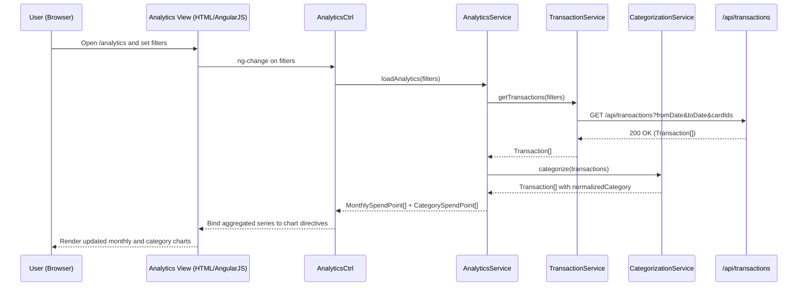

# QE-5378 – Credit Card Spend Analytics LLD

## a. Architecture Mapping (brief)
- Analytics View (trends and charts) → AngularJS module `ccAnalytics`, controller `AnalyticsCtrl`, directive `ccAnalyticsChart`.
- Analytics Service → AngularJS service `AnalyticsService` orchestrating transaction retrieval and aggregation.
- Transactions Data Service → AngularJS service `TransactionService` wrapping `/api/transactions` REST APIs.
- Categorization Engine → AngularJS service `CategorizationService` applying category mappings to transactions.
- Visualization Layer → AngularJS directive `ccChartContainer` integrating with charting library (e.g., Chart.js) for monthly and category charts.

**Recommended folder structure**
- `app/analytics/analytics.module.js`
- `app/analytics/analytics.controller.js`
- `app/analytics/analytics.services.js`
- `app/analytics/analytics.directives.js`
- `app/analytics/analytics.templates.html`

## b. Component Specifications

| Name                  | Artifact Type  | Responsibility (1 line)                                           | Key Dependencies                                      |
|-----------------------|----------------|--------------------------------------------------------------------|-------------------------------------------------------|
| ccAnalytics           | Module         | Groups analytics-related controllers, services, and directives    | AngularJS `ngResource`, `ccPortfolioDashboard`        |
| AnalyticsCtrl         | Controller     | Manages filters (date, card, categories) and triggers analytics load | AnalyticsService, $routeParams, CardSelectionBus   |
| AnalyticsService      | Service        | Coordinates fetching, categorization, and aggregation of transactions | TransactionService, CategorizationService         |
| TransactionService    | Service        | Fetches transaction data for user/cards within selected period    | `$http`, `/api/transactions` REST API                |
| CategorizationService | Service        | Maps transactions to spending categories using provided rules     | Static mapping config or `/api/categories`           |
| ccAnalyticsChart      | Directive      | Renders analytics charts based on bound aggregated datasets       | AnalyticsCtrl scope, charting library wrapper        |
| ccChartContainer      | Directive      | Provides reusable chart container (title, legend, responsiveness) | ccAnalyticsChart, Bootstrap grid                     |
| ApiErrorInterceptor   | Factory        | Handles HTTP failures and exposes analytics error state           | `$q`, `$injector`, `$log`                             |

## c. Data Model (brief)
- `AnalyticsFilter`: `{ fromDate: Date, toDate: Date, cardIds: string[], categories: string[] }`
- `Transaction`: `{ id: string, cardId: string, amount: number, currency: string, txnDate: Date, merchant: string, rawCategory: string, normalizedCategory: string }`
- `MonthlySpendPoint`: `{ month: string, totalAmount: number, currency: string }`
- `CategorySpendPoint`: `{ category: string, totalAmount: number, currency: string }`
- `AnalyticsState`: `{ filters: AnalyticsFilter, monthlySeries: MonthlySpendPoint[], categorySeries: CategorySpendPoint[], isLoading: boolean, errorCode: string|null }`

## d. Data Flow (one paragraph)
When the user navigates to the analytics view or adjusts filters, `AnalyticsCtrl` updates `AnalyticsState.filters` and calls `AnalyticsService`, which retrieves raw `Transaction[]` from `TransactionService` using REST, passes them through `CategorizationService` to populate `normalizedCategory`, aggregates them into monthly and category buckets, returns the aggregated series to the controller, and the bound directives `ccAnalyticsChart` and `ccChartContainer` redraw responsive charts to reflect the updated trends and card-wise/category-wise spending.

## e. Primary Sequence Diagram (ONE only)

## f. Implementation Notes (brief)
- Implement `ccAnalytics` as a feature module that depends on shared modules for card selection and user context.
- Use ES6 array helpers (`map`, `reduce`, `filter`) inside `AnalyticsService` to aggregate large transaction sets efficiently.
- Keep `TransactionService` thin and focused on HTTP concerns, with URLs and query parameter construction centralized.
- Leverage a reusable `ccChartContainer` directive to standardize chart look and responsiveness across analytics views.
- Configure `ApiErrorInterceptor` to set an error flag on `AnalyticsState` so the UI can show a non-intrusive error banner when analytics fail to load.

## g. Error Handling (ONE line)
Analytics HTTP and processing errors are surfaced via a shared interceptor and exposed to `AnalyticsCtrl`, which toggles a single error banner in the analytics view.

## h. Security Notes (ONE line)
Standard input validation and secure API calls assumed, with backend enforcing that only transactions for cards owned by the authenticated user are returned for analytics.
