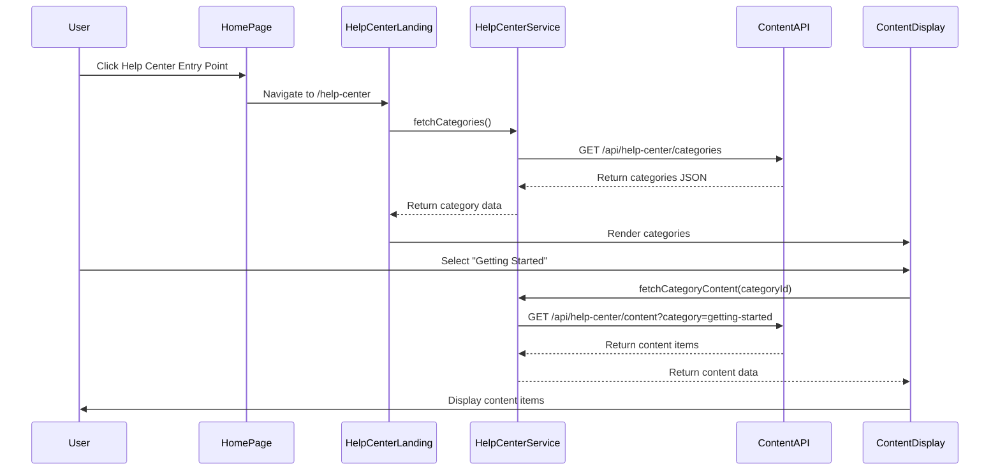

# Low-Level Design: Help Center Integration Home Page

## a. Architecture Mapping

- **Home Page Module** → AngularJS Module (`app.homePage`)
- **Help Center Entry Point** → AngularJS Directive (`helpCenterEntryDirective`)
- **Help Center Landing Page** → AngularJS Module + Controller (`app.helpCenter`, `HelpCenterLandingController`)
- **Category Navigation** → AngularJS Component (`categoryNavigationComponent`)
- **Search Interface** → AngularJS Controller + Service (`SearchController`, `SearchService`)
- **Content Display Area** → AngularJS Component (`contentDisplayComponent`)

**Recommended Folder Structure:**
```
/app
  /modules
    /home-page
    /help-center
      /controllers
      /services
      /directives
      /components
  /shared
    /services
    /components
```

## b. Component Specifications

| Name | Artifact Type | Responsibility | Key Dependencies |
|------|---------------|----------------|------------------|
| helpCenterEntryDirective | Directive | Renders Help Center entry point button/link on Home Page | $location |
| HelpCenterLandingController | Controller | Manages landing page state, category selection, and search initialization | HelpCenterService, SearchService, $scope |
| HelpCenterService | Factory | Fetches categorized content structure from CMS via REST API | $http, $q |
| categoryNavigationComponent | Component | Displays category list (Getting Started, FAQs, Troubleshooting) and handles selection | HelpCenterService |
| SearchController | Controller | Handles search query input and triggers search execution | SearchService, $scope |
| SearchService | Factory | Executes keyword-based search against content repository via REST API | $http, $q |
| contentDisplayComponent | Component | Renders selected category content or search results with error handling | HelpCenterService, ErrorHandlerService |
| ErrorHandlerService | Factory | Displays user-friendly error messages with alternatives when resources unavailable | $log |

## c. Data Model

**HelpCenterCategory (JS Object):**
- `id`: String
- `name`: String (e.g., "Getting Started", "FAQs", "Troubleshooting")
- `description`: String
- `contentItems`: Array of ContentItem

**ContentItem (JS Object):**
- `id`: String
- `title`: String
- `type`: String (e.g., "article", "faq")
- `url`: String
- `summary`: String

**SearchQuery (JS Object):**
- `keyword`: String
- `filters`: Object (optional)

**SearchResult (JS Object):**
- `results`: Array of ContentItem
- `totalCount`: Number

## d. Data Flow

User visits Home Page and clicks Help Center entry point (directive) → $location navigates to Help Center Landing Page → HelpCenterLandingController initializes and calls HelpCenterService to fetch categories via REST API → Categories rendered by categoryNavigationComponent → User either selects a category (triggers contentDisplayComponent to fetch and display category content) or enters search query (SearchController calls SearchService REST API) → contentDisplayComponent receives data and updates view → If API fails, ErrorHandlerService displays fallback message with alternatives → All interactions tracked via analytics service.

## e. Primary Sequence Diagram



## f. Implementation Notes

- Use AngularJS 1.x component architecture with one-way data binding for category and content components
- Implement dependency injection for all services ($http, $q, $location, $log)
- Use $http interceptors for global error handling and loading states
- Leverage Bootstrap responsive grid (col-xs, col-sm, col-md) for mobile/tablet/desktop layouts
- Implement lazy loading for content items to optimize initial page load (2-second target)

## g. Error Handling

HTTP interceptor captures API failures, ErrorHandlerService displays user-friendly messages with alternative content suggestions, and logs errors for monitoring.

## h. Security Notes

Standard input validation and secure API calls assumed; HTTPS enforced for all REST API endpoints.