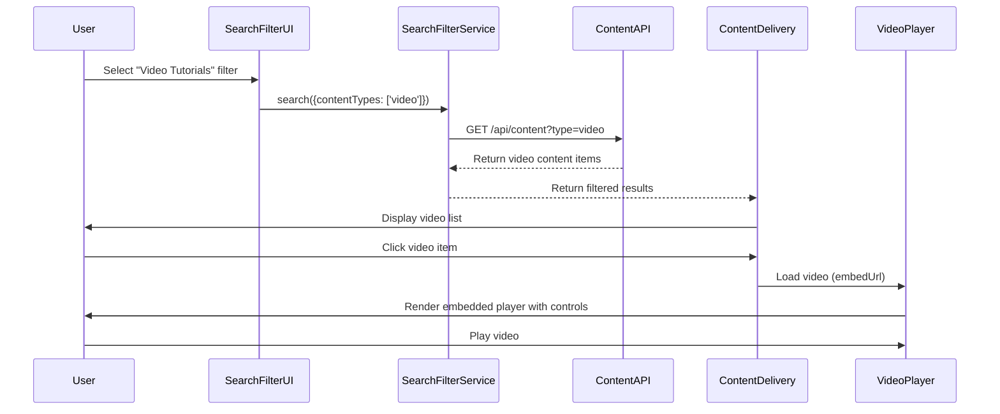

# Low-Level Design: Multi-format Content Delivery

## a. Architecture Mapping

- **Content Delivery Interface** → AngularJS Module + Controller (`app.contentDelivery`, `ContentDeliveryController`)
- **Search & Filter Engine** → AngularJS Service + Controller (`SearchFilterService`, `SearchFilterController`)
- **Content Repository Integration** → AngularJS Factory (`ContentRepositoryService`)
- **Video Player** → AngularJS Directive (`videoPlayerDirective`)
- **Download Manager** → AngularJS Service (`DownloadService`)

**Recommended Folder Structure:**
```
/app
  /modules
    /content-delivery
      /controllers
      /services
      /directives
      /components
  /shared
    /services
    /filters
```

## b. Component Specifications

| Name | Artifact Type | Responsibility | Key Dependencies |
|------|---------------|----------------|------------------|
| ContentDeliveryController | Controller | Manages content type selection and rendering logic | ContentRepositoryService, $scope, $filter |
| ContentRepositoryService | Factory | Fetches text articles, FAQs, video metadata, and downloadable files via REST API | $http, $q |
| SearchFilterService | Factory | Executes search queries with filters (content type, category) against content repository | $http, $q |
| SearchFilterController | Controller | Handles user input for search and filter selections | SearchFilterService, $scope |
| videoPlayerDirective | Directive | Embeds video player (YouTube/Vimeo iframe) with accessibility controls | $sce, $window |
| DownloadService | Factory | Initiates secure file downloads via CDN URLs with progress tracking | $http, $window |
| contentTypeFilterComponent | Component | Displays filter UI for content types (article, video, download) | SearchFilterService |
| ErrorHandlerService | Factory | Displays error messages and alternative content when resources unavailable | $log |

## c. Data Model

**ContentItem (JS Object):**
- `id`: String
- `title`: String
- `type`: String (e.g., "article", "video", "download")
- `url`: String
- `description`: String
- `thumbnailUrl`: String (for videos)
- `fileSize`: Number (for downloads, in bytes)
- `mimeType`: String (for downloads)

**VideoContent (extends ContentItem):**
- `embedUrl`: String (trusted URL for iframe)
- `duration`: Number (seconds)
- `captionsAvailable`: Boolean

**DownloadContent (extends ContentItem):**
- `downloadUrl`: String (CDN HTTPS URL)
- `fileName`: String

**SearchFilter (JS Object):**
- `keyword`: String
- `contentTypes`: Array of String
- `categories`: Array of String

## d. Data Flow

User accesses Help Center and selects content type filter or enters search query → SearchFilterController calls SearchFilterService with filters → Service queries ContentRepositoryService REST API → API returns matching ContentItem objects → ContentDeliveryController receives data and determines rendering strategy based on type → For articles, HTML rendered directly; for videos, videoPlayerDirective embeds player with trusted URL; for downloads, DownloadService initiates secure file transfer via CDN → If resource unavailable, ErrorHandlerService displays fallback message with alternatives → All interactions logged to analytics.

## e. Primary Sequence Diagram



## f. Implementation Notes

- Use $sce.trustAsResourceUrl() for video embed URLs to prevent XSS
- Implement content type strategy pattern in ContentDeliveryController to handle article/video/download rendering
- Use AngularJS $http with responseType: 'blob' for download file handling
- Leverage Bootstrap media objects and responsive embeds for video display
- Cache search results in SearchFilterService using $cacheFactory for 5-minute TTL

## g. Error Handling

$http interceptor captures API errors; ErrorHandlerService provides type-specific fallback messages (e.g., "Video unavailable, try related articles") with retry option.

## h. Security Notes

HTTPS-only for all content delivery; video embed URLs sanitized via $sce; download URLs signed with expiring tokens from CDN.