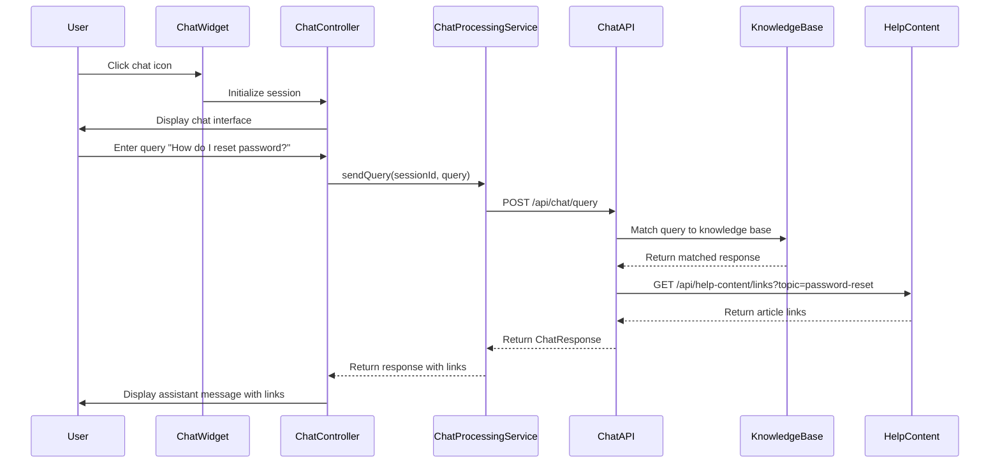

# Low-Level Design: Interactive Chat Assistant

## a. Architecture Mapping

- **Chat Assistant Interface** → AngularJS Directive + Controller (`chatAssistantDirective`, `ChatAssistantController`)
- **Chat Processing Engine** → AngularJS Service (`ChatProcessingService`)
- **Knowledge Base Integration** → AngularJS Factory (`KnowledgeBaseService`)
- **Help Content Repository Integration** → AngularJS Factory (`HelpContentService`)
- **Analytics & Monitoring** → AngularJS Service (`ChatAnalyticsService`)

**Recommended Folder Structure:**
```
/app
  /modules
    /chat-assistant
      /controllers
      /services
      /directives
      /components
  /shared
    /services
```

## b. Component Specifications

| Name | Artifact Type | Responsibility | Key Dependencies |
|------|---------------|----------------|------------------|
| chatAssistantDirective | Directive | Renders chat widget UI on Help Center landing page with open/close toggle | ChatAssistantController, $compile |
| ChatAssistantController | Controller | Manages chat session state, message history, and user input | ChatProcessingService, ChatAnalyticsService, $scope |
| ChatProcessingService | Factory | Sends user queries to chat engine API and processes responses | $http, $q, KnowledgeBaseService |
| KnowledgeBaseService | Factory | Queries knowledge base for matching responses to user queries via REST API | $http, $q |
| HelpContentService | Factory | Fetches contextual help article links to include in chat responses | $http, $q |
| ChatAnalyticsService | Factory | Logs chat interactions (queries, responses, session duration) for analytics | $http, $log |
| chatMessageComponent | Component | Renders individual chat messages (user/assistant) with timestamps | None |
| chatInputComponent | Component | Handles user input field with submit button and keyboard support | ChatAssistantController |

## c. Data Model

**ChatSession (JS Object):**
- `sessionId`: String (UUID)
- `startTime`: Date
- `messages`: Array of ChatMessage
- `isActive`: Boolean

**ChatMessage (JS Object):**
- `id`: String
- `sender`: String (e.g., "user", "assistant")
- `text`: String
- `timestamp`: Date
- `links`: Array of HelpLink (optional)

**HelpLink (JS Object):**
- `title`: String
- `url`: String

**ChatQuery (JS Object):**
- `sessionId`: String
- `query`: String
- `timestamp`: Date

**ChatResponse (JS Object):**
- `responseText`: String
- `links`: Array of HelpLink
- `confidence`: Number (0-1)

## d. Data Flow

User clicks chat widget on Help Center landing page → chatAssistantDirective opens chat interface → ChatAssistantController initializes session → User enters query in chatInputComponent → Controller calls ChatProcessingService.sendQuery() → Service sends query to chat engine API → Engine queries KnowledgeBaseService for matching response → If match found, HelpContentService fetches relevant article links → ChatResponse returned to Controller → chatMessageComponent renders assistant response with links → ChatAnalyticsService logs interaction → Process repeats for subsequent queries; session ends on window close or timeout.

## e. Primary Sequence Diagram



## f. Implementation Notes

- Use WebSocket or long-polling via $http for real-time chat if required; otherwise standard REST API calls
- Implement AngularJS directive with isolated scope for chat widget to ensure reusability
- Store chat session in $sessionStorage (lightweight, supports 10,000 concurrent sessions)
- Use Bootstrap modal or custom CSS for chat widget overlay with z-index management
- Implement ARIA labels and keyboard navigation (Tab, Enter, Esc) for WCAG 2.1 AA compliance

## g. Error Handling

$http interceptor handles API failures; ChatController displays "Assistant temporarily unavailable, please browse help articles" with fallback links.

## h. Security Notes

HTTPS-only for chat API; no sensitive user data collected or transmitted; session IDs generated client-side using UUID v4.