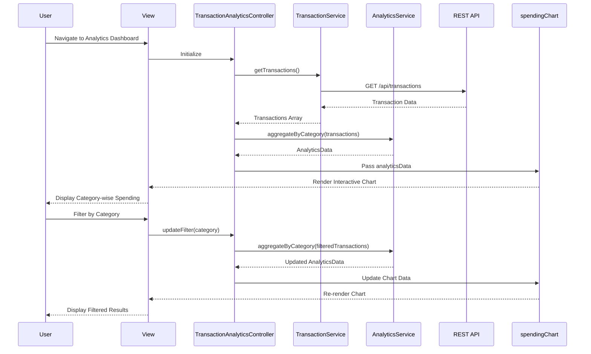

# Low-Level Design: Transaction Monitoring and Spending Analytics

**Epic ID:** QE-5455

## a. Architecture Mapping

- **User Interface** → AngularJS Module (`transactionAnalyticsModule`) + Main Controller (`TransactionAnalyticsController`)
- **Transaction Service** → AngularJS Service (`TransactionService`) for API communication
- **Categorization Engine** → AngularJS Factory (`CategorizationFactory`) for client-side category mapping logic
- **Analytics Service** → AngularJS Service (`AnalyticsService`) for aggregation and computation
- **Data Store** → Backend REST API endpoints (GET /api/transactions, GET /api/categories)
- **Visualization Component** → AngularJS Directive (`spendingChart`) wrapping Chart.js or D3.js

**Recommended Folder Structure:**
```
app/
├── modules/
│   └── transaction-analytics/
│       ├── controllers/
│       │   └── transaction-analytics.controller.js
│       ├── services/
│       │   ├── transaction.service.js
│       │   └── analytics.service.js
│       ├── factories/
│       │   └── categorization.factory.js
│       ├── directives/
│       │   └── spending-chart.directive.js
│       ├── views/
│       │   └── transaction-analytics.html
│       └── transaction-analytics.module.js
└── assets/
    └── css/
        └── transaction-analytics.css
```

## b. Component Specifications

| Component Name | Artifact Type | Responsibility | Key Dependencies |
|----------------|---------------|----------------|------------------|
| TransactionAnalyticsController | Controller | Orchestrates transaction loading, category filtering, date range selection, and chart rendering | TransactionService, AnalyticsService, $scope |
| TransactionService | Service | Fetches transaction data from REST API and manages transaction state | $http, $q |
| AnalyticsService | Service | Aggregates transactions by category, computes spending totals and patterns | CategorizationFactory |
| CategorizationFactory | Factory | Maps transactions to predefined categories (Food & Dining, Fuel, Shopping, Travel, Entertainment, Utilities, Healthcare, Education, Miscellaneous) | None |
| spendingChart | Directive | Renders interactive category-wise spending visualizations using Chart.js | Chart.js library |

## c. Data Model

**Transaction Object:**
```javascript
{
  transactionId: String,
  cardId: String,
  cardName: String,
  merchantName: String,
  amount: Number,
  currency: String,
  transactionDate: Date,
  category: String,
  description: String
}
```

**CategorySpending Object:**
```javascript
{
  categoryName: String,
  totalAmount: Number,
  transactionCount: Number,
  percentage: Number
}
```

**AnalyticsData Object:**
```javascript
{
  totalSpending: Number,
  categoryBreakdown: Array<CategorySpending>,
  dateRange: { startDate: Date, endDate: Date },
  topCategory: String
}
```

## d. Data Flow

User navigates to the Transaction Analytics view, triggering TransactionAnalyticsController initialization. The controller invokes TransactionService.getTransactions() which makes a GET request to /api/transactions. Retrieved transaction data is passed to AnalyticsService.aggregateByCategory(), which uses CategorizationFactory to ensure proper category assignment and computes spending totals per category. The aggregated AnalyticsData is bound to $scope and passed to the spendingChart directive, which renders an interactive pie/bar chart. User interactions (category filter, date range change) trigger re-aggregation and chart updates via two-way data binding.

## e. Primary Sequence Diagram



## f. Implementation Notes

- Use AngularJS Dependency Injection to inject TransactionService, AnalyticsService, and CategorizationFactory into TransactionAnalyticsController
- Implement TransactionService using $http with promise-based API calls; use $q for error handling and chaining
- Leverage ES6 arrow functions and const/let for cleaner service and factory implementations
- Integrate Chart.js via custom AngularJS directive with isolated scope for reusability and encapsulation
- Use Bootstrap grid system and responsive utilities for mobile-friendly dashboard layout

## g. Error Handling

HTTP interceptor-based error handling with user-friendly toast notifications for API failures; try/catch blocks in AnalyticsService for data processing errors.

## h. Security Notes

Requires token-based authentication via existing SSO; transaction data must be fetched over HTTPS with proper authorization headers.