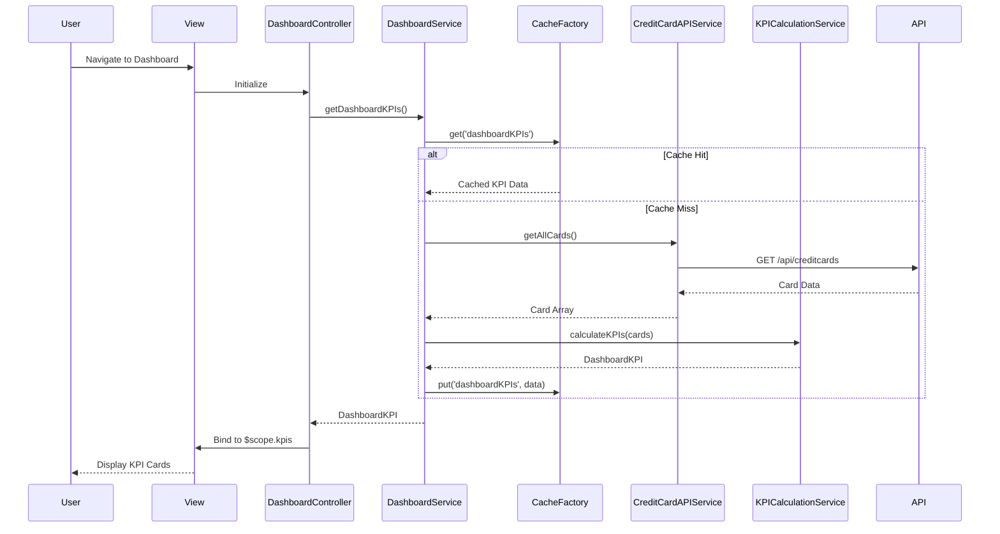

# Low-Level Design: Credit Card Dashboard KPI Display

## a. Architecture Mapping

**Component → Artifact Mapping:**
- User Interface → `DashboardController` + `views/dashboard.html`
- Dashboard Service → `DashboardService` (Factory)
- KPI Calculation Engine → `KPICalculationService` (Service)
- Cache Layer → `CacheFactory` (Factory, singleton)
- Credit Card Data Source → `CreditCardAPIService` (Service)

**Recommended Folder Structure:**
```
app/
  dashboard/
    dashboard.module.js
    dashboard.controller.js
    dashboard.service.js
    kpi-calculation.service.js
    views/dashboard.html
  shared/
    services/
      credit-card-api.service.js
    factories/
      cache.factory.js
```

## b. Component Specifications

| Name | Artifact Type | Responsibility | Key Dependencies |
|------|--------------|----------------|------------------|
| DashboardController | Controller | Orchestrate dashboard view, bind KPI data to UI, handle user interactions | DashboardService, $scope |
| DashboardService | Factory | Coordinate data retrieval, cache management, and KPI calculation | KPICalculationService, CacheFactory, CreditCardAPIService |
| KPICalculationService | Service | Calculate monthly spend, available credit, outstanding amounts, aggregate multi-card metrics | None (pure calculation logic) |
| CacheFactory | Factory | Store and retrieve cached dashboard data with TTL management | $cacheFactory |
| CreditCardAPIService | Service | Fetch credit card details, balances, and limits from backend REST API | $http |
| appDashboardCard | Directive | Render individual KPI card with responsive layout | None |

## c. Data Model

```js
CreditCard = {
  id: String,
  cardNumber: String,
  cardHolderName: String,
  totalCreditLimit: Number,
  outstandingAmount: Number,
  availableCredit: Number,
  monthlySpend: Number
}

DashboardKPI = {
  totalMonthlySpend: Number,
  totalCreditLimit: Number,
  totalAvailableCredit: Number,
  totalOutstandingAmount: Number,
  cards: Array<CreditCard>
}
```

## d. Data Flow

User navigates to dashboard → View loads and DashboardController initializes → Controller calls DashboardService.getDashboardKPIs() → Service checks CacheFactory for cached data; if miss, calls CreditCardAPIService.getAllCards() → API Service makes REST GET to /api/creditcards → Response returns card data → KPICalculationService computes available credit (limit - outstanding) and aggregates metrics → Service caches result and returns to Controller → Controller binds DashboardKPI to $scope → View renders KPI cards with appDashboardCard directive showing monthly spend, total limit, available credit, and outstanding amounts.

## e. Primary Sequence Diagram



## f. Implementation Notes

- DI via `$inject` array annotation for minification safety (e.g., `DashboardController.$inject = ['$scope', 'DashboardService']`)
- All API calls centralized in CreditCardAPIService using `$http`; Controllers never call APIs directly
- ES6: use `const`/`let`, arrow functions in service methods, template literals for dynamic strings
- Cache TTL set to 5 minutes via `CacheFactory` to balance freshness and performance
- Bootstrap grid system for responsive KPI card layout (col-xs-12, col-sm-6, col-md-3)

## g. Error Handling

HTTP interceptor captures API errors; display user-friendly toast notifications via shared NotificationService; retry logic for transient failures.

## h. Security Notes

Requires token-based authentication via existing SSO; validate all API responses; mask sensitive card number digits in UI.