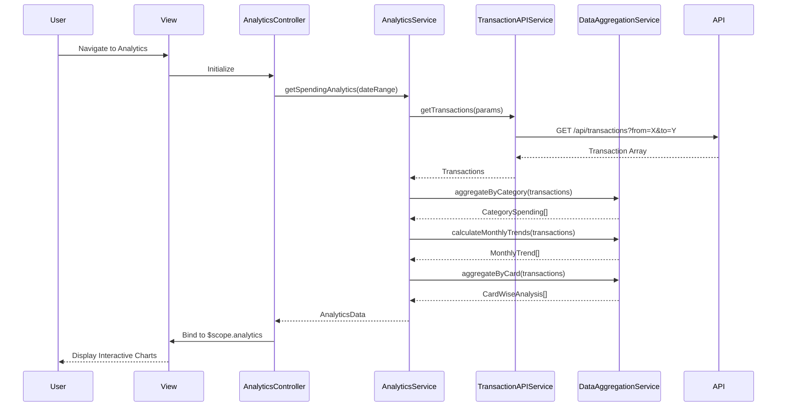

# Low-Level Design: Spending Analytics & Visualization

## a. Architecture Mapping

**Component → Artifact Mapping:**
- User Interface → `AnalyticsController` + `views/analytics.html`
- Analytics Service → `AnalyticsService` (Service)
- Data Aggregation Engine → `DataAggregationService` (Service)
- Visualization Library → `appSpendingChart` (Directive wrapping Chart.js)
- Transaction Data Store → `TransactionAPIService` (Service)

**Recommended Folder Structure:**
```
app/
  analytics/
    analytics.module.js
    analytics.controller.js
    analytics.service.js
    data-aggregation.service.js
    views/analytics.html
  shared/
    services/
      transaction-api.service.js
    directives/
      spending-chart.directive.js
```

## b. Component Specifications

| Name | Artifact Type | Responsibility | Key Dependencies |
|------|--------------|----------------|------------------|
| AnalyticsController | Controller | Manage analytics view state, handle filter selections, bind chart data | AnalyticsService, $scope |
| AnalyticsService | Service | Orchestrate data retrieval and aggregation for analytics | DataAggregationService, TransactionAPIService |
| DataAggregationService | Service | Aggregate transactions by category, calculate monthly trends, group by card | None (pure aggregation logic) |
| TransactionAPIService | Service | Fetch transaction data from backend REST API with date range filters | $http |
| appSpendingChart | Directive | Render interactive charts using Chart.js library with category/trend data | Chart.js |
| appCategoryFilter | Directive | Provide UI controls for filtering by category, date range, and card | None |

## c. Data Model

```js
Transaction = {
  id: String,
  cardId: String,
  amount: Number,
  category: String,
  date: Date,
  merchantName: String,
  description: String
}

CategorySpending = {
  category: String,
  totalAmount: Number,
  transactionCount: Number,
  percentage: Number
}

MonthlyTrend = {
  month: String,
  totalSpend: Number,
  categoryBreakdown: Array<CategorySpending>
}

CardWiseAnalysis = {
  cardId: String,
  cardName: String,
  totalSpend: Number,
  categories: Array<CategorySpending>
}

AnalyticsData = {
  categorySpending: Array<CategorySpending>,
  monthlyTrends: Array<MonthlyTrend>,
  cardWiseAnalysis: Array<CardWiseAnalysis>,
  categories: Array<String>
}
```

## d. Data Flow

User navigates to analytics page → View loads and AnalyticsController initializes → Controller calls AnalyticsService.getSpendingAnalytics(dateRange, filters) → Service calls TransactionAPIService.getTransactions(params) → API Service makes REST GET to /api/transactions with query params → Response returns transaction array → DataAggregationService processes transactions: classifies into nine categories (Food & Dining, Fuel, Shopping, Travel, Entertainment, Utilities, Healthcare, Education, Miscellaneous), calculates monthly trends, aggregates by card → Service returns AnalyticsData to Controller → Controller binds data to $scope → View renders interactive charts via appSpendingChart directive (category pie chart, monthly trend line chart, card-wise bar chart) → User interacts with filters → Controller updates data and charts refresh.

## e. Primary Sequence Diagram



## f. Implementation Notes

- DI via `$inject` array for all components (e.g., `AnalyticsService.$inject = ['TransactionAPIService', 'DataAggregationService']`)
- Chart.js wrapped in appSpendingChart directive with isolated scope; chart type passed as attribute
- ES6: use `const`/`let`, array methods (map, filter, reduce) for aggregation, arrow functions
- DataAggregationService uses pure functions for testability; category classification via lookup map
- Responsive charts using Chart.js responsive config; Bootstrap grid for multi-chart layout

## g. Error Handling

HTTP interceptor handles API errors; display error messages via toast notifications; graceful degradation if aggregation fails.

## h. Security Notes

Standard input validation and secure API calls assumed; token-based auth for transaction data access.