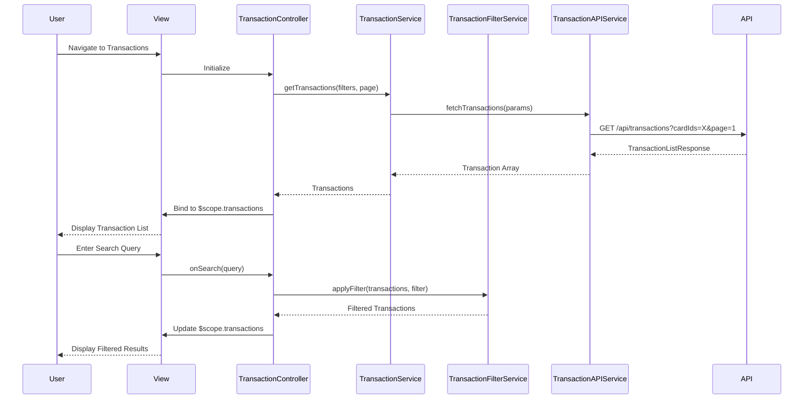

# Low-Level Design: Credit Card Transaction Management

## a. Architecture Mapping

**Component → Artifact Mapping:**
- User Interface → `TransactionController` + `views/transactions.html`
- Transaction Management Service → `TransactionService` (Service)
- Search & Filter Engine → `TransactionFilterService` (Service)
- Transaction Data Store → `TransactionAPIService` (Service)
- Credit Card Systems → External API integration via `TransactionAPIService`

**Recommended Folder Structure:**
```
app/
  transactions/
    transactions.module.js
    transactions.controller.js
    transactions.service.js
    transaction-filter.service.js
    views/transactions.html
    views/transaction-detail.html
  shared/
    services/
      transaction-api.service.js
    directives/
      transaction-list.directive.js
```

## b. Component Specifications

| Name | Artifact Type | Responsibility | Key Dependencies |
|------|--------------|----------------|------------------|
| TransactionController | Controller | Manage transaction list view, handle search/filter actions, pagination | TransactionService, TransactionFilterService, $scope |
| TransactionService | Service | Coordinate transaction retrieval, manage state, handle multi-card data | TransactionAPIService |
| TransactionFilterService | Service | Apply search and filter logic (date range, amount, category, card, merchant) | None (pure filter logic) |
| TransactionAPIService | Service | Fetch transactions from backend REST API with query parameters | $http |
| appTransactionList | Directive | Render paginated transaction list with sortable columns | None |
| appTransactionDetail | Directive | Display detailed transaction information in modal or detail view | None |
| appSearchBar | Directive | Provide search input with debounced query execution | $timeout |

## c. Data Model

```js
Transaction = {
  id: String,
  cardId: String,
  cardName: String,
  amount: Number,
  currency: String,
  category: String,
  merchantName: String,
  merchantLocation: String,
  transactionDate: Date,
  postingDate: Date,
  description: String,
  status: String,
  referenceNumber: String
}

TransactionFilter = {
  cardIds: Array<String>,
  categories: Array<String>,
  dateFrom: Date,
  dateTo: Date,
  amountMin: Number,
  amountMax: Number,
  searchQuery: String
}

TransactionListResponse = {
  transactions: Array<Transaction>,
  totalCount: Number,
  page: Number,
  pageSize: Number
}
```

## d. Data Flow

User navigates to transactions page → View loads and TransactionController initializes → Controller calls TransactionService.getTransactions(filters, page, pageSize) → Service calls TransactionAPIService.fetchTransactions(params) → API Service makes REST GET to /api/transactions with query params (cardIds, dateRange, pagination) → Response returns TransactionListResponse → Service returns data to Controller → Controller binds transactions to $scope → View renders transaction list via appTransactionList directive with sortable columns → User enters search query or applies filters → Controller updates TransactionFilter object → TransactionFilterService applies client-side filtering if needed → Controller refreshes transaction list → User clicks transaction row → appTransactionDetail directive displays full transaction details in modal.

## e. Primary Sequence Diagram



## f. Implementation Notes

- DI via `$inject` array for all services and controllers (e.g., `TransactionController.$inject = ['$scope', 'TransactionService', 'TransactionFilterService']`)
- API calls centralized in TransactionAPIService; support pagination, sorting, and server-side filtering via query params
- ES6: use `const`/`let`, template literals for building API URLs, arrow functions in service methods
- Search debounced with $timeout (300ms delay) to reduce API calls during typing
- Infinite scroll or paginated table for large transaction volumes; Bootstrap table with responsive design

## g. Error Handling

HTTP interceptor captures API failures; display user-friendly error messages; implement retry mechanism for network timeouts.

## h. Security Notes

Requires token-based authentication via existing SSO; validate all inputs; mask sensitive transaction details; enforce HTTPS for API calls.