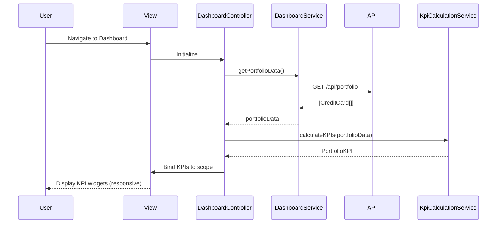

# Low-Level Design: Credit Card Portfolio Dashboard

**Epic ID:** QE-5515

---

## a. Architecture Mapping

- **Dashboard Screen** → `DashboardController` + `views/dashboard.html`
- **KPI Widgets (Monthly Spend, Credit Limit, Available Credit, Outstanding)** → `kpiWidget` Directive (reusable)
- **Dashboard Data Retrieval** → `DashboardService` (API calls for portfolio data)
- **KPI Calculation Logic** → `KpiCalculationService` (business logic for aggregations)
- **Authentication Check** → `AuthInterceptor` (cross-cutting concern)
- **Feature Grouping** → `app.dashboard` Module

**Recommended Folder Structure:**
```
app/
  dashboard/
    dashboard.module.js
    dashboard.controller.js
    dashboard.service.js
    kpi-calculation.service.js
    dashboard.routes.js
    views/dashboard.html
  shared/
    directives/kpi-widget.directive.js
    interceptors/auth.interceptor.js
```

---

## b. Component Specifications

| Name | Artifact Type | Responsibility | Key Dependencies |
|------|---------------|----------------|------------------|
| `DashboardController` | Controller | Orchestrates dashboard view, fetches portfolio data, binds KPIs to UI | `DashboardService`, `KpiCalculationService` |
| `DashboardService` | Service | Fetches credit card portfolio data from REST API | `$http`, `AuthInterceptor` |
| `KpiCalculationService` | Service | Computes monthly spend, total credit limit, available credit, outstanding amounts from raw card data | None |
| `kpiWidget` | Directive | Renders individual KPI tile (value, label, trend indicator) with responsive layout | None |
| `AuthInterceptor` | Interceptor | Attaches authentication tokens to outgoing API requests | `$httpProvider` |
| `app.dashboard` | Module | Groups all dashboard-related artifacts and declares dependencies | `ui.router`, `app.shared` |

---

## c. Data Model

```js
CreditCard = {
  id: String,
  cardNumber: String,
  balance: Number,
  creditLimit: Number,
  availableCredit: Number,
  monthlySpend: Number
}

PortfolioKPI = {
  totalMonthlySpend: Number,
  totalCreditLimit: Number,
  totalAvailableCredit: Number,
  totalOutstanding: Number,
  cards: Array<CreditCard>
}
```

---

## d. Data Flow

User navigates to the dashboard → `dashboard.html` loads → `DashboardController` initializes and calls `DashboardService.getPortfolioData()` → Service issues GET request to `/api/portfolio` → API returns array of credit cards with balances and limits → `KpiCalculationService` aggregates data into `PortfolioKPI` object (sum monthly spend, credit limits, available credit, outstanding) → Controller binds KPI values to scope → `kpiWidget` directives render each KPI tile responsively → User sees real-time portfolio health metrics.

---

## e. Primary Sequence Diagram



---

## f. Implementation Notes

- DI via constructor injection with `$inject` array annotation for minification safety
- API calls centralized in `DashboardService`; controller never calls `$http` directly
- ES6: use `const`/`let`, arrow functions in service methods, template literals for API URLs
- Responsive design: Bootstrap grid classes in `kpiWidget` directive template; mobile-first breakpoints
- Use `$q` promises for async operations; avoid callback nesting

---

## g. Error Handling

Centralized `$http` interceptor catches API failures; user-facing errors surfaced via a shared notification service.

---

## h. Security Notes

Requires token-based auth via existing SSO; `AuthInterceptor` attaches bearer token to all API requests.