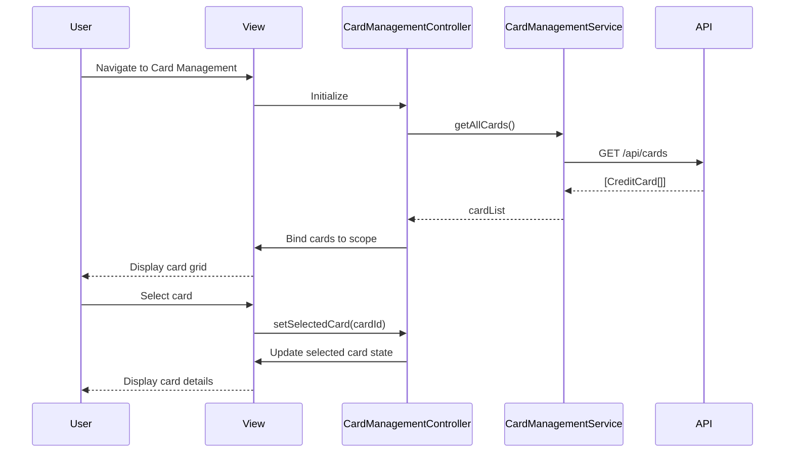

# Low-Level Design: Multi-Card Management Interface

**Epic ID:** QE-5516

---

## a. Architecture Mapping

- **Card Management Screen** → `CardManagementController` + `views/card-management.html`
- **Card List Display** → `cardList` Directive (renders card grid/list)
- **Card Detail View** → `cardDetail` Directive (expandable card info)
- **Card Data Retrieval & Aggregation** → `CardManagementService` (API calls for card data)
- **Card Comparison Logic** → `CardComparisonService` (business logic for card-wise analysis)
- **Card Selection/Filtering** → `cardFilter` Directive (UI controls for filtering)
- **Feature Grouping** → `app.cardManagement` Module

**Recommended Folder Structure:**
```
app/
  card-management/
    card-management.module.js
    card-management.controller.js
    card-management.service.js
    card-comparison.service.js
    card-management.routes.js
    views/card-management.html
  shared/
    directives/card-list.directive.js
    directives/card-detail.directive.js
    directives/card-filter.directive.js
```

---

## b. Component Specifications

| Name | Artifact Type | Responsibility | Key Dependencies |
|------|---------------|----------------|------------------|
| `CardManagementController` | Controller | Manages card list state, handles card selection, triggers comparison and filtering | `CardManagementService`, `CardComparisonService` |
| `CardManagementService` | Service | Fetches all credit cards for user from REST API, handles card data aggregation | `$http` |
| `CardComparisonService` | Service | Computes card-wise spend analysis, compares performance metrics across cards | None |
| `cardList` | Directive | Renders grid/list of credit cards with summary info (card number, balance, limit) | None |
| `cardDetail` | Directive | Displays detailed view of selected card (transactions, spend breakdown, utilization) | None |
| `cardFilter` | Directive | Provides UI controls for filtering cards by type, status, or spend range | None |
| `app.cardManagement` | Module | Groups all card management artifacts and declares dependencies | `ui.router`, `app.shared` |

---

## c. Data Model

```js
CreditCard = {
  id: String,
  cardNumber: String,
  cardType: String,
  balance: Number,
  creditLimit: Number,
  availableCredit: Number,
  monthlySpend: Number,
  status: String,
  lastTransactionDate: Date
}

CardComparison = {
  cardId: String,
  utilizationRate: Number,
  spendTrend: String,
  rewardsEarned: Number
}
```

---

## d. Data Flow

User navigates to card management screen → `card-management.html` loads → `CardManagementController` initializes and calls `CardManagementService.getAllCards()` → Service issues GET request to `/api/cards` → API returns array of up to 20 credit cards → Controller binds card array to scope → `cardList` directive renders card grid → User selects a card → Controller updates selected card state → `cardDetail` directive displays detailed card info → User applies filter via `cardFilter` directive → Controller filters card array → View updates to show filtered cards.

---

## e. Primary Sequence Diagram



---

## f. Implementation Notes

- DI via constructor injection with `$inject` array annotation for minification safety
- API calls centralized in `CardManagementService`; controller never calls `$http` directly
- ES6: use `const`/`let`, arrow functions for filtering logic, template literals for dynamic API endpoints
- Card filtering implemented client-side using AngularJS filters for performance (max 20 cards)
- Use `$q` promises for async card data retrieval

---

## g. Error Handling

Centralized `$http` interceptor catches API failures; user-facing errors surfaced via a shared notification service.

---

## h. Security Notes

Standard input validation and secure API calls assumed; user authentication enforced at service layer.