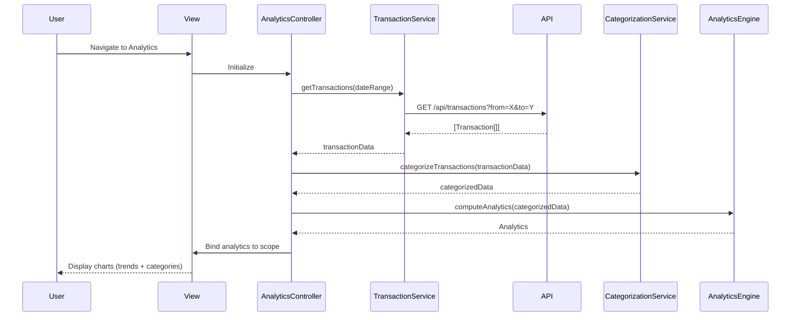

# Low-Level Design: Transaction Analytics & Spending Insights

**Epic ID:** QE-5517

---

## a. Architecture Mapping

- **Analytics Dashboard Screen** → `AnalyticsController` + `views/analytics.html`
- **Monthly Spend Trend Chart** → `spendTrendChart` Directive (line/bar chart visualization)
- **Category-wise Spending Chart** → `categoryChart` Directive (pie/donut chart for 9 categories)
- **Transaction Data Retrieval** → `TransactionService` (API calls for transaction data)
- **Categorization Logic** → `CategorizationService` (business logic for transaction classification)
- **Analytics Computation** → `AnalyticsEngine` Service (aggregates trends, patterns, insights)
- **Interactive Filtering** → `analyticsFilter` Directive (date range, category selection)
- **Feature Grouping** → `app.analytics` Module

**Recommended Folder Structure:**
```
app/
  analytics/
    analytics.module.js
    analytics.controller.js
    transaction.service.js
    categorization.service.js
    analytics-engine.service.js
    analytics.routes.js
    views/analytics.html
  shared/
    directives/spend-trend-chart.directive.js
    directives/category-chart.directive.js
    directives/analytics-filter.directive.js
```

---

## b. Component Specifications

| Name | Artifact Type | Responsibility | Key Dependencies |
|------|---------------|----------------|------------------|
| `AnalyticsController` | Controller | Orchestrates analytics view, fetches transaction data, triggers categorization and trend analysis | `TransactionService`, `CategorizationService`, `AnalyticsEngine` |
| `TransactionService` | Service | Fetches transaction data from REST API with date range and filtering support | `$http` |
| `CategorizationService` | Service | Classifies transactions into 9 predefined categories (Food & Dining, Fuel, Shopping, Travel, Entertainment, Utilities, Healthcare, Education, Miscellaneous) | None |
| `AnalyticsEngine` | Service | Computes monthly spend trends, category-wise aggregations, identifies spending patterns and anomalies | None |
| `spendTrendChart` | Directive | Renders interactive line/bar chart for monthly spending trends using charting library (e.g., Chart.js) | Chart.js |
| `categoryChart` | Directive | Renders pie/donut chart for category-wise spending breakdown | Chart.js |
| `analyticsFilter` | Directive | Provides UI controls for date range selection, category filtering, and drill-down | None |
| `app.analytics` | Module | Groups all analytics artifacts and declares dependencies | `ui.router`, `app.shared`, `chart.js` |

---

## c. Data Model

```js
Transaction = {
  id: String,
  date: Date,
  amount: Number,
  merchant: String,
  category: String,
  cardId: String,
  description: String
}

MonthlySpend = {
  month: String,
  totalSpend: Number,
  transactionCount: Number
}

CategorySpend = {
  category: String,
  totalSpend: Number,
  percentage: Number,
  transactionCount: Number
}

Analytics = {
  monthlyTrends: Array<MonthlySpend>,
  categoryBreakdown: Array<CategorySpend>,
  totalTransactions: Number
}
```

---

## d. Data Flow

User navigates to analytics dashboard → `analytics.html` loads → `AnalyticsController` initializes and calls `TransactionService.getTransactions(dateRange)` → Service issues GET request to `/api/transactions?from=X&to=Y` → API returns array of transactions → `CategorizationService` classifies each transaction into one of 9 categories → `AnalyticsEngine` aggregates data into monthly trends and category-wise totals → Controller binds `Analytics` object to scope → `spendTrendChart` and `categoryChart` directives render interactive visualizations → User applies filter via `analyticsFilter` directive → Controller re-computes analytics with filtered data → Charts update in real-time.

---

## e. Primary Sequence Diagram



---

## f. Implementation Notes

- DI via constructor injection with `$inject` array annotation for minification safety
- API calls centralized in `TransactionService`; controller never calls `$http` directly
- ES6: use `const`/`let`, arrow functions for categorization logic, template literals for dynamic API queries
- Charting library (Chart.js) integrated via directives; chart data bound to scope for reactivity
- Use `$q` promises for async transaction retrieval; categorization runs synchronously on client-side for performance

---

## g. Error Handling

Centralized `$http` interceptor catches API failures; user-facing errors surfaced via a shared notification service.

---

## h. Security Notes

Standard input validation and secure API calls assumed; transaction data filtered by authenticated user context at API layer.