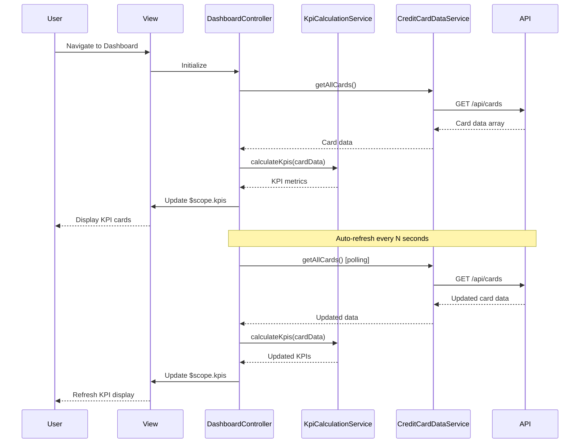

# Low-Level Design: Credit Card Analysis Dashboard

**Epic ID:** QE-5536

---

## a. Architecture Mapping

**Component → Artifact Mapping:**
- Dashboard UI → `DashboardController` + `views/dashboard.html`
- KPI Display Cards → Custom directive `appKpiCard`
- KPI Calculation Engine → `KpiCalculationService`
- Credit Card Data Retrieval → `CreditCardDataService`
- User Authentication → `AuthService` (shared)
- Real-time Data Refresh → `DataRefreshFactory` with `$interval`
- HTTP Interceptor → `AuthInterceptor` (shared/interceptors)

**Recommended Folder Structure:**
```
app/
  dashboard/
    dashboard.module.js
    dashboard.controller.js
    dashboard.routes.js
    views/dashboard.html
  services/
    kpi-calculation.service.js
    credit-card-data.service.js
    data-refresh.factory.js
  shared/
    directives/kpi-card.directive.js
    interceptors/auth.interceptor.js
    services/auth.service.js
```

---

## b. Component Specifications

| Name | Artifact Type | Responsibility | Key Dependencies |
|------|---------------|----------------|------------------|
| `DashboardController` | Controller | Orchestrates dashboard view, loads KPI data, manages refresh intervals | `KpiCalculationService`, `CreditCardDataService`, `DataRefreshFactory`, `$scope` |
| `appKpiCard` | Directive | Renders individual KPI card with title, value, and icon | None |
| `KpiCalculationService` | Service | Calculates monthly spend, total credit limit, available credit, outstanding amount from raw card data | `CreditCardDataService` |
| `CreditCardDataService` | Service | Fetches all user credit card data via REST API | `$http`, `AuthService` |
| `DataRefreshFactory` | Factory | Manages polling mechanism for real-time data refresh with configurable intervals | `$interval`, `KpiCalculationService` |
| `AuthService` | Service (shared) | Provides user authentication and token management | `$http` |
| `AuthInterceptor` | Interceptor | Attaches auth tokens to outgoing API requests | `AuthService` |
| `app.dashboard` | Module | Groups dashboard feature components | `ui.router`, `app.shared` |

---

## c. Data Model

```js
CreditCard = {
  cardId: String,
  cardNumber: String,
  cardType: String,
  creditLimit: Number,
  outstandingAmount: Number,
  availableCredit: Number
}

KpiData = {
  monthlySpend: Number,
  totalCreditLimit: Number,
  totalAvailableCredit: Number,
  totalOutstandingAmount: Number,
  lastUpdated: Date
}

DashboardConfig = {
  refreshInterval: Number,
  autoRefreshEnabled: Boolean
}
```

---

## d. Data Flow

User navigates to the dashboard view, triggering `DashboardController` initialization. The controller calls `CreditCardDataService.getAllCards()` to fetch all credit card data via REST API. Raw card data is passed to `KpiCalculationService.calculateKpis()`, which aggregates monthly spend (from recent transactions), sums total credit limits, calculates available credit (sum of credit limits minus sum of outstanding amounts), and computes total outstanding amount. Calculated KPI data is bound to `$scope.kpis` and rendered via `appKpiCard` directives in the view. `DataRefreshFactory` starts a polling interval that re-fetches and recalculates KPIs every N seconds, updating the UI automatically. User can manually trigger refresh via a button that calls the same data flow.

---

## e. Primary Sequence Diagram



---

## f. Implementation Notes

- Use constructor injection with `$inject` array for all controllers/services to ensure minification safety
- Centralize all API calls in `CreditCardDataService`; controllers never call `$http` directly
- Implement polling with `$interval` in `DataRefreshFactory`; ensure proper cleanup on `$scope.$on('$destroy')` to prevent memory leaks
- Use Bootstrap grid system (col-xs/sm/md/lg) for responsive KPI card layout across desktop/tablet/mobile
- Apply ES6 arrow functions and `const`/`let` in services; use template literals for dynamic API URLs

---

## g. Error Handling

HTTP interceptor captures API errors; service-level try/catch blocks handle calculation errors; user-facing error messages displayed via Bootstrap alert components.

---

## h. Security Notes

Requires token-based authentication via existing SSO; `AuthInterceptor` attaches bearer tokens to all API requests; sensitive card data masked in UI (last 4 digits only).