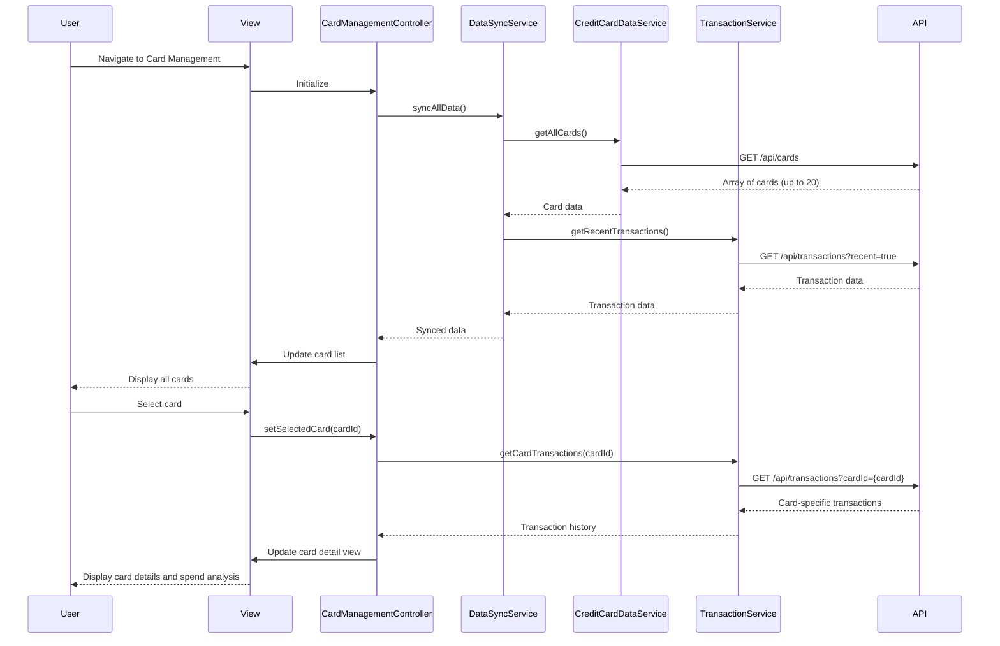

# Low-Level Design: Multiple Credit Card Management

**Epic ID:** QE-5537

---

## a. Architecture Mapping

**Component → Artifact Mapping:**
- Card Management UI → `CardManagementController` + `views/card-management.html`
- Card List Display → Custom directive `appCardList`
- Individual Card Details → Custom directive `appCardDetail`
- Card Data Retrieval → `CreditCardDataService`
- Transaction Retrieval → `TransactionService`
- Card Filtering/Search → `CardFilterService`
- Card Selection State → `CardStateFactory` (singleton)
- Data Synchronization → `DataSyncService`

**Recommended Folder Structure:**
```
app/
  card-management/
    card-management.module.js
    card-management.controller.js
    card-management.routes.js
    views/card-management.html
  services/
    credit-card-data.service.js
    transaction.service.js
    card-filter.service.js
    data-sync.service.js
  shared/
    directives/card-list.directive.js
    directives/card-detail.directive.js
    factories/card-state.factory.js
```

---

## b. Component Specifications

| Name | Artifact Type | Responsibility | Key Dependencies |
|------|---------------|----------------|------------------|
| `CardManagementController` | Controller | Manages card list view, handles card selection, triggers data sync, applies filters | `CreditCardDataService`, `TransactionService`, `CardStateFactory`, `CardFilterService`, `DataSyncService`, `$scope` |
| `appCardList` | Directive | Renders scrollable list of credit cards with summary info (card type, limit, balance) | `CardStateFactory` |
| `appCardDetail` | Directive | Displays detailed view of selected card including spend analysis and transaction history | `TransactionService` |
| `CreditCardDataService` | Service | Fetches all user credit cards (up to 20) via REST API | `$http`, `AuthService` |
| `TransactionService` | Service | Retrieves card-specific transaction data and monthly spend trends | `$http`, `AuthService` |
| `CardFilterService` | Service | Provides client-side filtering by card type, status, and search term | None |
| `CardStateFactory` | Factory | Maintains selected card state and active filters across views | None |
| `DataSyncService` | Service | Orchestrates data synchronization on login or manual refresh | `CreditCardDataService`, `TransactionService` |
| `app.cardManagement` | Module | Groups card management feature components | `ui.router`, `app.shared` |

---

## c. Data Model

```js
CreditCard = {
  cardId: String,
  cardNumber: String,
  cardType: String,
  issuer: String,
  creditLimit: Number,
  outstandingAmount: Number,
  availableCredit: Number,
  status: String,
  expiryDate: String
}

Transaction = {
  transactionId: String,
  cardId: String,
  amount: Number,
  category: String,
  merchant: String,
  transactionDate: Date,
  description: String
}

CardSpendSummary = {
  cardId: String,
  monthlySpend: Number,
  categoryBreakdown: Object,
  transactionCount: Number
}

FilterCriteria = {
  searchTerm: String,
  cardType: String,
  status: String
}
```

---

## d. Data Flow

User logs in or navigates to card management view, triggering `CardManagementController` initialization. Controller calls `DataSyncService.syncAllData()`, which fetches all credit cards via `CreditCardDataService.getAllCards()` and recent transactions via `TransactionService.getRecentTransactions()`. Card data is stored in `CardStateFactory` and rendered in `appCardList` directive. User selects a card from the list, updating `CardStateFactory.selectedCard`. The `appCardDetail` directive watches the selected card and calls `TransactionService.getCardTransactions(cardId)` to load card-specific transaction history and monthly spend trends. User applies filters (card type, status, search term) via UI controls; `CardFilterService.applyFilters()` processes filters client-side and updates the displayed card list without additional API calls. Manual refresh button triggers `DataSyncService.syncAllData()` to re-fetch all data and update the UI.

---

## e. Primary Sequence Diagram



---

## f. Implementation Notes

- Use `$inject` array annotation for dependency injection in all controllers and services
- Implement client-side filtering with ES6 `Array.filter()` and `Array.map()` for performance with up to 20 cards
- Store selected card and filter state in `CardStateFactory` singleton to persist across view changes
- Use `$q.all()` to parallelize card and transaction API calls during sync for faster load times
- Apply virtual scrolling or pagination for transaction history if count exceeds 1000 records per card

---

## g. Error Handling

HTTP interceptor captures API failures; service methods return rejected promises with error details; controller displays user-friendly error messages via Bootstrap modals.

---

## h. Security Notes

Requires token-based auth via existing SSO; card numbers displayed with masking (last 4 digits); all API calls include authorization headers via `AuthInterceptor`.