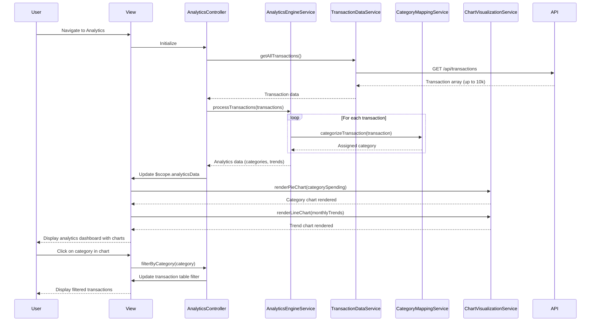

# Low-Level Design: Spending Analytics and Visualization

**Epic ID:** QE-5538

---

## a. Architecture Mapping

**Component → Artifact Mapping:**
- Analytics Dashboard UI → `AnalyticsController` + `views/analytics.html`
- Category Breakdown Chart → Custom directive `appCategoryChart`
- Monthly Trend Chart → Custom directive `appTrendChart`
- Transaction History Table → Custom directive `appTransactionTable`
- Analytics Calculation → `AnalyticsEngineService`
- Transaction Data Retrieval → `TransactionDataService`
- Chart Rendering → `ChartVisualizationService` (wraps Chart.js or D3.js)
- Category Mapping → `CategoryMappingService`

**Recommended Folder Structure:**
```
app/
  analytics/
    analytics.module.js
    analytics.controller.js
    analytics.routes.js
    views/analytics.html
  services/
    analytics-engine.service.js
    transaction-data.service.js
    chart-visualization.service.js
    category-mapping.service.js
  shared/
    directives/category-chart.directive.js
    directives/trend-chart.directive.js
    directives/transaction-table.directive.js
```

---

## b. Component Specifications

| Name | Artifact Type | Responsibility | Key Dependencies |
|------|---------------|----------------|------------------|
| `AnalyticsController` | Controller | Orchestrates analytics view, loads transaction data, triggers analytics calculations, manages chart rendering | `AnalyticsEngineService`, `TransactionDataService`, `$scope` |
| `appCategoryChart` | Directive | Renders interactive pie/donut chart showing category-wise spending breakdown across 9 categories | `ChartVisualizationService` |
| `appTrendChart` | Directive | Renders line/bar chart displaying monthly spend trends over time | `ChartVisualizationService` |
| `appTransactionTable` | Directive | Displays paginated, sortable transaction history with category labels | None |
| `AnalyticsEngineService` | Service | Processes transaction data to calculate category totals, monthly trends, and spending patterns | `CategoryMappingService` |
| `TransactionDataService` | Service | Fetches all user transactions via REST API with optional date range filters | `$http`, `AuthService` |
| `ChartVisualizationService` | Service | Wraps Chart.js library to generate responsive charts from data arrays | None |
| `CategoryMappingService` | Service | Maps transaction merchant/description to one of 9 predefined categories using rule engine | None |
| `app.analytics` | Module | Groups analytics feature components | `ui.router`, `app.shared`, `chart.js` |

---

## c. Data Model

```js
Transaction = {
  transactionId: String,
  cardId: String,
  amount: Number,
  category: String,
  merchant: String,
  transactionDate: Date,
  description: String
}

CategorySpend = {
  category: String,
  totalAmount: Number,
  transactionCount: Number,
  percentage: Number
}

MonthlyTrend = {
  month: String,
  year: Number,
  totalSpend: Number,
  categoryBreakdown: Array<CategorySpend>
}

AnalyticsData = {
  categorySpending: Array<CategorySpend>,
  monthlyTrends: Array<MonthlyTrend>,
  totalTransactions: Number,
  dateRange: Object
}

CategoryDefinition = {
  categoryName: String,
  keywords: Array<String>,
  color: String
}
```

**9 Predefined Categories:** Food & Dining, Fuel, Shopping, Travel, Entertainment, Utilities, Healthcare, Education, Miscellaneous

---

## d. Data Flow

User navigates to analytics view, triggering `AnalyticsController` initialization. Controller calls `TransactionDataService.getAllTransactions()` to fetch all user transactions (up to 10,000 records) via REST API. Raw transaction data is passed to `AnalyticsEngineService.processTransactions()`, which uses `CategoryMappingService.categorizeTransaction()` to assign each transaction to one of 9 categories based on merchant/description keywords. The engine calculates category-wise totals, computes monthly spend trends by grouping transactions by month/year, and generates percentage breakdowns. Processed analytics data is bound to `$scope.analyticsData`. The `appCategoryChart` directive watches `$scope.analyticsData.categorySpending` and calls `ChartVisualizationService.renderPieChart()` to display category breakdown. The `appTrendChart` directive watches `$scope.analyticsData.monthlyTrends` and calls `ChartVisualizationService.renderLineChart()` to show monthly trends. The `appTransactionTable` directive displays raw transaction history with category labels. User can interact with charts (hover, click) to drill down into specific categories or months, triggering filtered views.

---

## e. Primary Sequence Diagram



---

## f. Implementation Notes

- Use `$inject` array annotation for all services and controllers to ensure minification compatibility
- Implement transaction categorization with keyword matching using ES6 `String.includes()` and `Array.some()` for performance
- Leverage Chart.js library via `ChartVisualizationService` wrapper; configure responsive options for mobile/tablet/desktop
- Apply pagination (50 transactions per page) and virtual scrolling for transaction table to handle 10,000+ records efficiently
- Use `$q` promises for asynchronous transaction processing; consider Web Workers for heavy analytics calculations if performance degrades

---

## g. Error Handling

HTTP interceptor captures API errors; analytics engine handles missing/malformed transaction data with default category assignment; user notified via Bootstrap toast notifications for failures.

---

## h. Security Notes

Requires token-based auth via existing SSO; transaction data filtered server-side by authenticated user ID; no PII exposed in analytics aggregations.